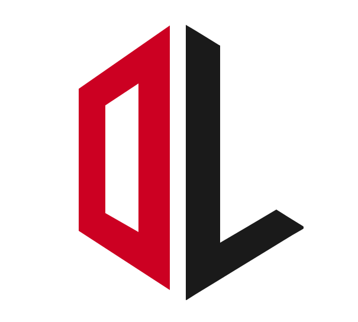
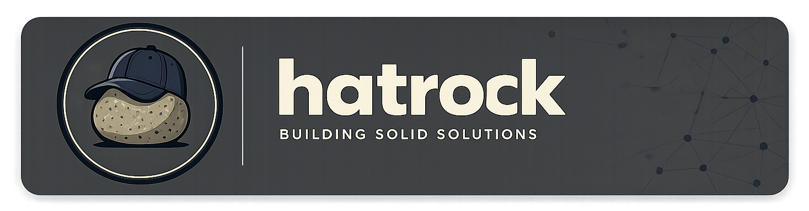

<p align="center">
  <picture>
    <source media="(prefers-color-scheme: dark)" srcset="docs/images/logo-animated-dark.svg">
    
  </picture>
</p>

<p align="center">
  <picture>
    <source media="(prefers-color-scheme: dark)" srcset="docs/images/wordmark-dark.svg">
    
  </picture>
</p>

<p align="center"><sub>Intelligence behind every lift.</sub></p>

<p align="center"></p>

<p align="center">
  <sub>Built by</sub><br/>
  
</p>

<div align="center">

  [](https://github.com/COS301-SE-2026/OptiLifts/actions)
  [](https://github.com/COS301-SE-2026/OptiLifts)
  [](https://github.com/COS301-SE-2026/OptiLifts/issues)
  [](https://github.com/COS301-SE-2026/OptiLifts/commits/main)
  [](LICENSE)
  [](https://github.com/COS301-SE-2026/OptiLifts)

</div>

<p align="center"></p>

##  The Problem

Traditional fitness applications act as digital notebooks - they record data without ever acting on it. The burden of calculating progressive overload, recovery, and periodisation is placed entirely on the user.

<table width="100%">
  <tr>
    <td width="33%" valign="top">
      <h3 align="center"> Plateau Effect</h3>
      <p align="center">Without a systematic approach to progressive overload, athletes stagnate - going weeks or months without measurable improvement.</p>
    </td>
    <td width="33%" valign="top">
      <h3 align="center"> Rigid Plans</h3>
      <p align="center">Pre-planned routines break down the moment life intervenes. Missed sessions leave users with no guidance on how to recover or adapt.</p>
    </td>
    <td width="33%" valign="top">
      <h3 align="center"> No Context-Awareness</h3>
      <p align="center">Apps ignore fatigue, schedule constraints, and recovery needs - forcing users to make complex athletic science decisions themselves.</p>
    </td>
  </tr>
</table>

<p align="center"></p>

##  The Solution

OptiLifts transforms manual strength training into an intelligent, automatic experience. The system addresses the "athletic plateau" by using historical workout data to generate personalised, optimised training programs - automatically adjusting when life gets in the way.

- **Progression Engine:** Analyses your history and recommends precise weight and rep increments using XGBoost-powered plateau detection.
- **Dynamic Scheduling:** Automatically re-prioritises or reschedules missed sessions to keep muscle groups balanced and recovery on track.
- **RPE Integration:** Captures your Rate of Perceived Exertion mid-session to adapt the workout in real time, preventing injury and burnout.
- **POPIA-Compliant Privacy:** A dedicated anonymisation layer strips personal identifiers before any data reaches the AI layer.

<p align="center"></p>

##  Tech Stack

| **Component** | **Technology** | **Description** |
| :--- | :--- | :--- |
| **Frontend** |  | React SPA with React Router, built and bundled by Vite with PWA support via vite-plugin-pwa. |
| **Core API** |  | ASP.NET Core with EF Core for data access and MediatR for clean CQRS-style command/query handling. |
| **AI Backend** |  | FastAPI service using LiteLLM as a unified LLM gateway, with Langfuse for LLM observability and tracing. |
| **Machine Learning** |  | XGBoost gradient-boosted model for plateau detection and progression recommendation. |
| **LLM** |  | Azure OpenAI - GPT-4o mini for natural language coaching, workout summarisation, and intelligent suggestions. |
| **Cloud Hosting** |  | Microsoft Azure - App Service, Container Registry, and managed PostgreSQL under Azure for Students. |
| **IaC** |  | Pulumi for defining and provisioning all Azure infrastructure as code. |
| **CI/CD** |  | GitHub Actions pipelines for automated testing, linting, and deployment on every push to `main`. |
| **Containerisation** |  | Docker Compose for local development orchestration of all services. |

<p align="center"></p>

##  Team

| | Name | Role | GitHub | LinkedIn |
| :---: | :--- | :--- | :---: | :---: |
|  | **Jordan Naidoo** | Team Lead (DevOps) | [](https://github.com/JordanNaidoo) | [](https://www.linkedin.com/in/jordan-naidoo/) |
|  | **Cailin Smith** | Frontend | [](https://github.com/CailinSmith) | [](https://www.linkedin.com/in/cailin-smith-cc1307/) |
|  | **Alex Lange** | Backend | [](https://github.com/AlexLange1st) | [](https://www.linkedin.com/in/alex-lange-7444b8358/) |
|  | **Edwin Küsel** | Backend | [](https://github.com/EdwinKusel1) | [](https://www.linkedin.com/in/edwin-kusel/) |
|  | **Alessandro Paravano** | Frontend | [](https://github.com/AlessandroParavano) | [](https://www.linkedin.com/in/aleparavano) |

<p align="center"></p>

##  Documentation

| Document | Link |
| :--- | :--- |
| Functional Requirements (SRS) | [View SRS](#) |
| Design Specification | [View Design](#) |
| GitHub Project Board | [View Board](https://github.com/orgs/COS301-SE-2026/projects) |

<p align="center"></p>

##  Getting Started

### 1. Install Prerequisites

Make sure you have Node, pnpm, .NET 8, Python 3.12, and Docker installed.

```bash
# Node.js
sudo apt-get install -y nodejs

# npm
sudo apt-get install -y npm

# pnpm
sudo npm install -g pnpm

# .NET 8
sudo apt-get install -y dotnet-sdk-8.0

# Python 3.12
sudo apt install -y python3 python3-venv python3-pip

# Docker (WSL)
sudo apt-get install -y docker.io
```

### 2. Environment Variables

Copy the example env file and fill in your values:

```bash
cp .env.example .env
```

### 3. Setup The Repo

Run from the root directory. Installs all Node modules, restores C# packages, installs the EF Core CLI, and builds the Python virtual environment:

```bash
pnpm run setup
```

### 4. Spin up the Database

Start Docker and run:

```bash
pnpm db
pnpm db:sync
```

### 5. Seed the Database

The API seeds the demo user automatically on startup using the C# seeder. Start the backend once after the schema is ready:

```bash
pnpm dev:backend
```

Then load the rest of the demo data from SQL:

```bash
pnpm db:seed:sql
```

### 6. Start Development

```bash
pnpm dev
```

### 7. Stop Or Reset The Database

Stop containers without deleting the data:

```bash
pnpm db:down
```

Stop containers and delete the persisted volume so the records are removed:

```bash
pnpm db:down:clean
```

<p align="center"></p>

##  Commands

| Command | What it does |
| :--- | :--- |
| `pnpm run setup` | Installs Node packages, .NET packages, and the Python virtual environment |
| `pnpm build` | Builds the project |
| `pnpm db` | Starts the local PostgreSQL and Redis Docker containers |
| `pnpm db:down` | Stops the local PostgreSQL and Redis Docker containers |
| `pnpm db:down:clean` | Stops containers and removes the database volume so all records are deleted |
| `pnpm db:sync` | Pushes the initial database schema to your local container |
| `pnpm db:seed:sql` | Loads the demo workout data from the SQL script |
| `pnpm dev` | Starts the Frontend, .NET Core API, and Python AI API all at once |
| `pnpm test` | Runs all tests at once |

<p align="center"></p>

##  Acknowledgements

- **EPI-USE** - our industry client, for the vision behind OptiLifts
- The open-source community for the incredible tools and libraries that make this possible
- Microsoft Azure for Students sponsorship

<p align="center"></p>
