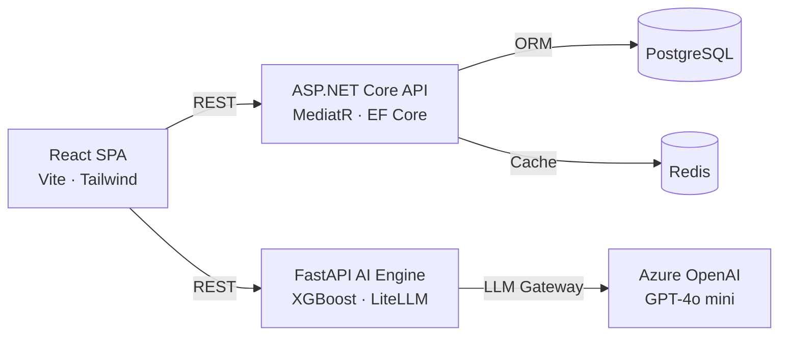
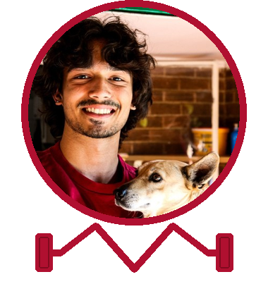
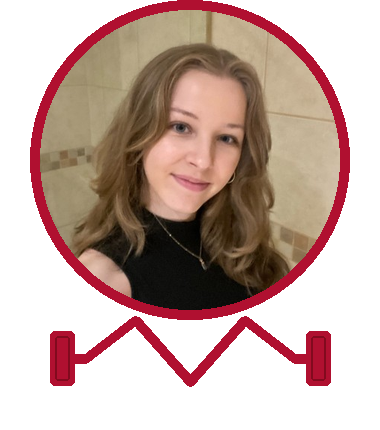
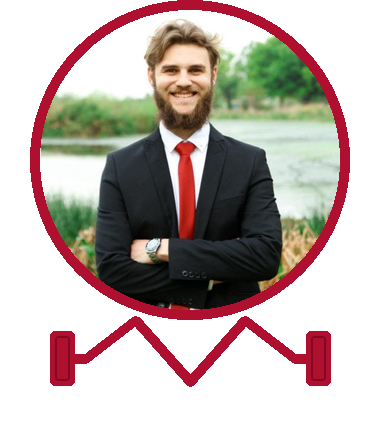
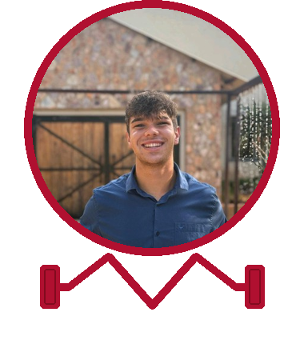
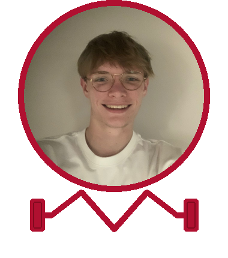

<p align="center">
  <picture>
    <source media="(prefers-color-scheme: dark)" srcset="docs/images/logo-animated-dark.svg">
    
  </picture>
</p>

<p align="center">
  <picture>
    <source media="(prefers-color-scheme: dark)" srcset="docs/images/wordmark-dark.svg">
    
  </picture>
</p>

<p align="center">
  <a href="https://readme-typing-svg.demolab.com">
    
  </a>
</p>

<p align="center"></p>

<p align="center">
  <sub>Built by</sub><br/>
  
</p>

<div align="center">

<!-- CI & Status -->
[](https://github.com/COS301-SE-2026/OptiLifts/actions)
[](https://github.com/COS301-SE-2026/OptiLifts)
[](https://github.com/COS301-SE-2026/OptiLifts/issues)
[](https://github.com/COS301-SE-2026/OptiLifts/commits/main)
[](LICENSE)
[](https://github.com/COS301-SE-2026/OptiLifts)

</div>

<p align="center"></p>

##  The Problem

Traditional fitness applications act as digital notebooks — they record data without ever acting on it. The burden of calculating progressive overload, recovery, and periodisation is placed entirely on the user.

<table width="100%">
  <tr>
    <td width="33%" valign="top">
      <h3 align="center"> Plateau Effect</h3>
      <p align="center">Without a systematic approach to progressive overload, athletes stagnate — going weeks or months without measurable improvement.</p>
    </td>
    <td width="33%" valign="top">
      <h3 align="center"> Rigid Plans</h3>
      <p align="center">Pre-planned routines break down the moment life intervenes. Missed sessions leave users with no guidance on how to recover or adapt.</p>
    </td>
    <td width="33%" valign="top">
      <h3 align="center"> No Context-Awareness</h3>
      <p align="center">Apps ignore fatigue, schedule constraints, and recovery needs — forcing users to make complex athletic science decisions themselves.</p>
    </td>
  </tr>
</table>

<p align="center"></p>

##  The Solution

OptiLifts is a workout management platform that uses AI to adapt your training before and during each session, offering intelligent suggestions to optimise your performance and ensure consistent progressive overload across every workout.

<table width="100%">
  <tr>
    <td width="33%" valign="top">
      <h3 align="center"> Progression Engine</h3>
      <p align="center">Analyses your history and recommends precise weight and rep increments using XGBoost-powered plateau detection.</p>
    </td>
    <td width="33%" valign="top">
      <h3 align="center"> Dynamic Scheduling</h3>
      <p align="center">Automatically re-prioritises or reschedules missed sessions to keep muscle groups balanced and recovery on track.</p>
    </td>
    <td width="33%" valign="top">
      <h3 align="center"> Real-Time Adaptation</h3>
      <p align="center">Captures your Rate of Perceived Exertion mid-session to adapt the workout in real time, preventing injury and burnout.</p>
    </td>
  </tr>
</table>

<p align="center"></p>

##  Architecture



<p align="center"></p>

##  Tech Stack

| **Component** | **Technology** | **Description** |
| :--- | :--- | :--- |
| **Frontend** |  | React SPA with React Router, built and bundled by Vite with PWA support. |
| **Core API** |  | ASP.NET Core with EF Core and MediatR for clean CQRS-style command/query handling. |
| **AI Backend** |  | FastAPI service using LiteLLM as a unified LLM gateway, with Langfuse for observability. |
| **Machine Learning** |  | XGBoost gradient-boosted model for plateau detection and progression recommendation. |
| **LLM** |  | Azure OpenAI — GPT-4o mini for natural language coaching and intelligent suggestions. |
| **Cloud Hosting** |  | Microsoft Azure — App Service, Container Registry, and managed PostgreSQL. |
| **IaC** |  | Pulumi for defining and provisioning all Azure infrastructure as code. |
| **CI/CD** |  | GitHub Actions pipelines for automated testing, linting, and deployment. |
| **Containerisation** |  | Docker Compose for local development orchestration of all services. |

<p align="center"></p>

##  The Team

<p align="center">Team Hatrock — five athletes, one codebase.</p>

<br>

<!-- Row 1: Jordan + Cailin centred at same card width as row 2 -->
<table width="100%">
  <tr>
    <td width="17%"></td>
    <td width="33%" align="center" valign="top">
      <br>
      
      <br><br>
      <strong>Jordan Naidoo</strong><br>
      <br><br>
      <sub>A final-year BSc Computer Science student focused on the leadership of the OptiLifts team, spearheading DevOps and getting his bench PR up for project day.</sub>
      <br><br><br>
      <a href="https://github.com/JordanNaidoo"></a>&nbsp;
      <a href="https://www.linkedin.com/in/jordan-naidoo/"></a>
      <br><br>
    </td>
    <td width="33%" align="center" valign="top">
      <br>
      
      <br><br>
      <strong>Cailin Smith</strong><br>
      <br><br>
      <sub>Final-year BSc Computer Science student coordinating frontend development and design for OptiLifts. Best 1RM: 160kg calf raise.</sub>
      <br><br><br>
      <a href="https://github.com/CailinSmith"></a>&nbsp;
      <a href="https://www.linkedin.com/in/cailin-smith-cc1307/"></a>
      <br><br>
    </td>
    <td width="17%"></td>
  </tr>
</table>

<!-- Row 2: Alex + Edwin + Alessandro -->
<table width="100%">
  <tr>
    <td width="33%" align="center" valign="top">
      <br>
      
      <br><br>
      <strong>Alex Lange</strong><br>
      <br><br>
      <sub>A 3rd year BSc Computer Science student with a focus on backend development for OptiLifts, and a lack of backend development in the gym.</sub>
      <br><br><br>
      <a href="https://github.com/AlexLange1st"></a>&nbsp;
      <a href="https://www.linkedin.com/in/alex-lange-7444b8358/"></a>
      <br><br>
    </td>
    <td width="33%" align="center" valign="top">
      <br>
      
      <br><br>
      <strong>Edwin Küsel</strong><br>
      <br><br>
      <sub>Final-year Computer Science student, focused on backend, with a passion for problem solving and hitting PRs.</sub>
      <br><br><br><br>
      <a href="https://github.com/EdwinKusel1"></a>&nbsp;
      <a href="https://www.linkedin.com/in/edwin-k%C3%BCsel-642b762a2/"></a>
      <br><br>
    </td>
    <td width="33%" align="center" valign="top">
      <br>
      
      <br><br>
      <strong>Alessandro Paravano</strong><br>
      <br><br>
      <sub>Final-year BSc Computer Science student handling frontend development for OptiLifts. Skips leg day in the gym, never skips a sprint.</sub>
      <br><br><br>
      <a href="https://github.com/AlessandroParavano"></a>&nbsp;
      <a href="https://www.linkedin.com/in/aleparavano"></a>
      <br><br>
    </td>
  </tr>
</table>

<p align="center"></p>

##  Documentation

<div align="center">

[](#)
[](#)
[](https://github.com/orgs/COS301-SE-2026/projects)

</div>

<p align="center"></p>

##  Getting Started

<details open>
<summary><strong>1. Install Prerequisites</strong></summary>
<br>

Make sure you have Node, pnpm, .NET 8, Python 3.12, and Docker installed.

```bash
sudo apt-get install -y nodejs npm dotnet-sdk-8.0 python3 python3-venv python3-pip docker.io
sudo npm install -g pnpm
```

</details>

<details>
<summary><strong>2. Environment Variables</strong></summary>
<br>

```bash
cp .env.example .env
```

Fill in your values in `.env`.

</details>

<details>
<summary><strong>3. Setup the Repo</strong></summary>
<br>

Installs all Node modules, restores C# packages, installs the EF Core CLI, and builds the Python virtual environment:

```bash
pnpm run setup
```

</details>

<details>
<summary><strong>4. Start the Database</strong></summary>
<br>

```bash
pnpm db
pnpm db:sync
```

</details>

<details>
<summary><strong>5. Seed the Database</strong></summary>
<br>

The API seeds the demo user automatically on startup. Start the backend once, then load the rest of the demo data:

```bash
pnpm dev:backend
pnpm db:seed:sql
```

</details>

<details>
<summary><strong>6. Start Development</strong></summary>
<br>

```bash
pnpm dev
```

Starts the frontend, .NET Core API, and Python AI API all at once.

</details>

<p align="center"></p>

##  Commands

| Command | What it does |
| :--- | :--- |
| `pnpm run setup` | Installs Node packages, .NET packages, and the Python virtual environment |
| `pnpm build` | Builds the project |
| `pnpm db` | Starts the local PostgreSQL and Redis Docker containers |
| `pnpm db:down` | Stops the local PostgreSQL and Redis Docker containers |
| `pnpm db:down:clean` | Stops containers and removes the database volume |
| `pnpm db:sync` | Pushes the initial database schema to your local container |
| `pnpm db:seed:sql` | Loads the demo workout data from the SQL script |
| `pnpm dev` | Starts the Frontend, .NET Core API, and Python AI API all at once |
| `pnpm test` | Runs all tests at once |

<p align="center"></p>

##  Acknowledgements

- **EPI-USE** — our industry client, for the vision behind OptiLifts
- The open-source community for the incredible tools and libraries that make this possible
- Microsoft Azure for Students sponsorship

<p align="center"></p>
