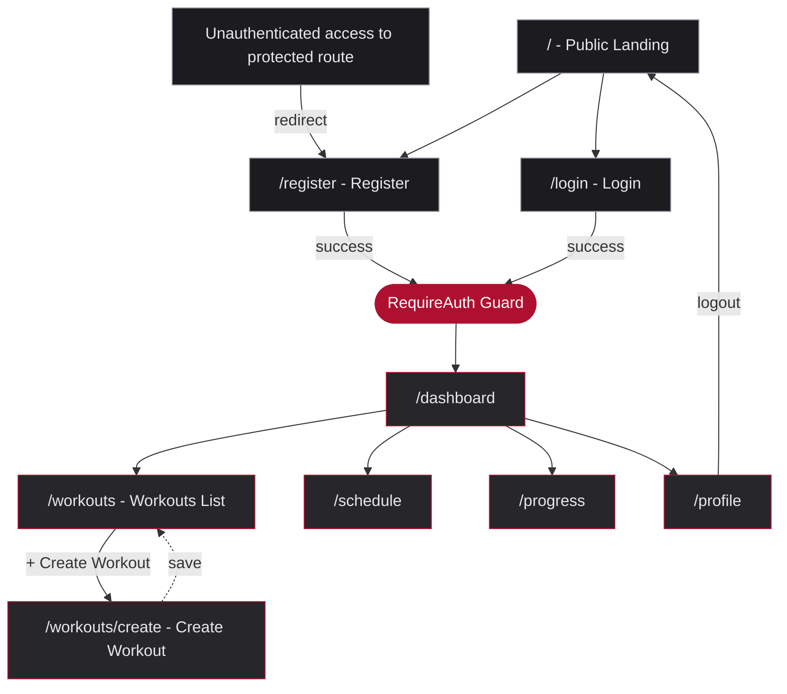
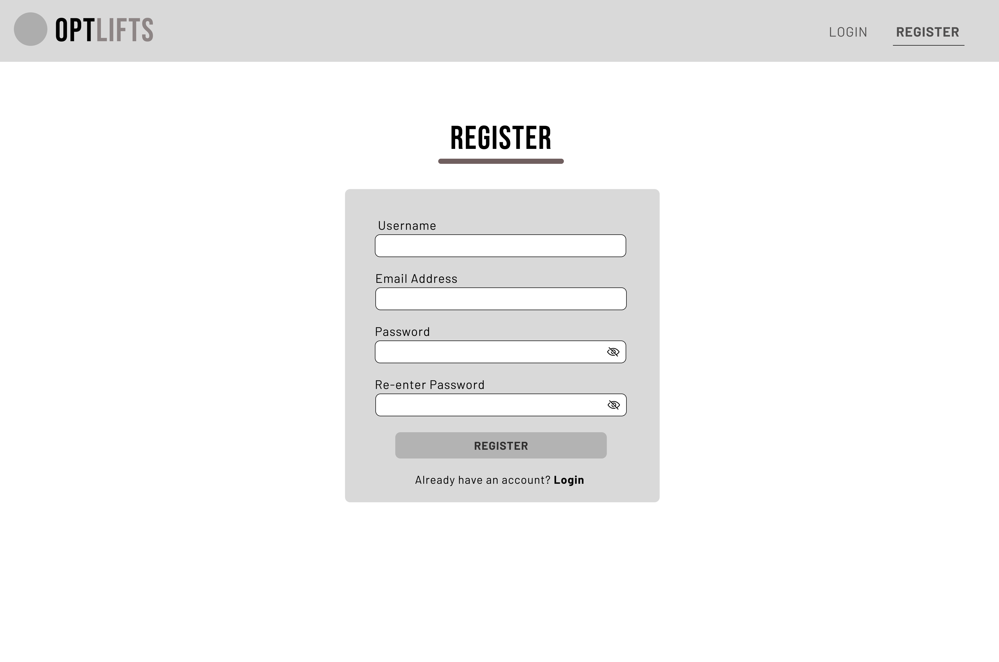
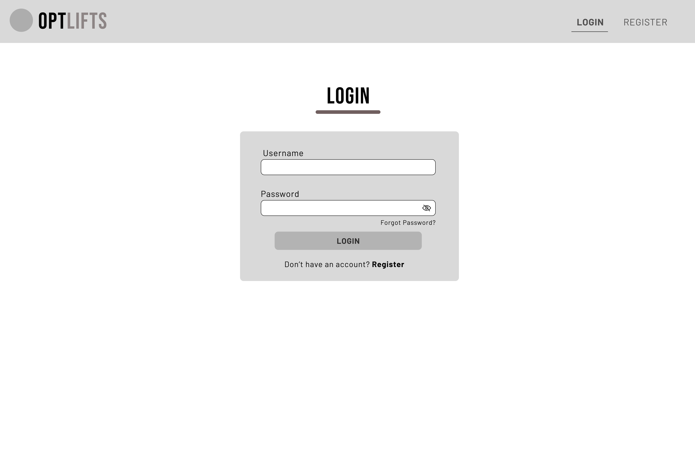
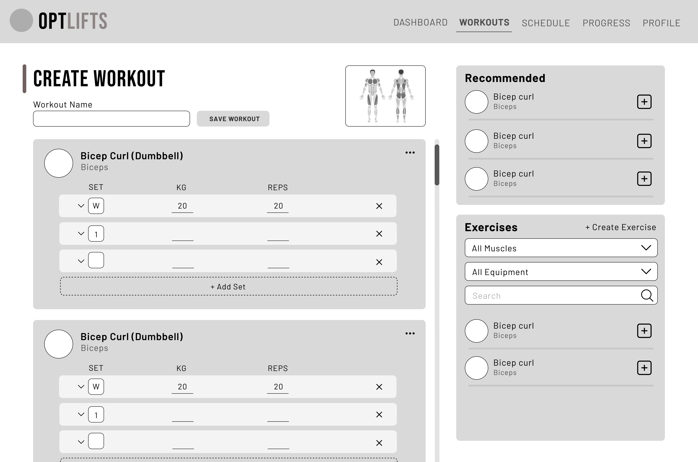
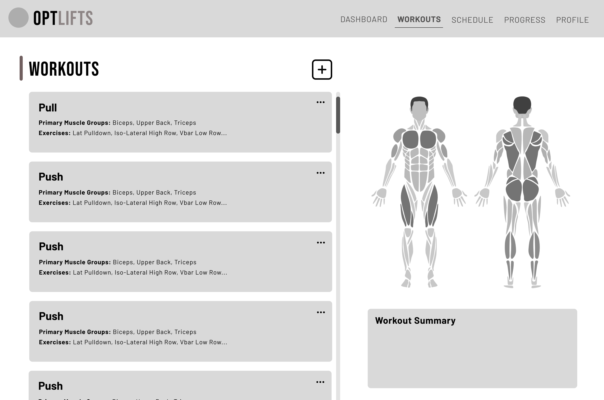

# Design Specification: OptiLifts

---

## 11. Theme Toggle

Theme state is managed via a `ThemeProvider` wrapping the app. shadcn's built-in dark mode support uses the `dark:` Tailwind variant. Theme tokens are defined as CSS custom properties in `globals.css` under `:root` (light) and `.dark` (dark), mapped to `tailwind.config.ts` via `theme.extend.colors`. The toggle uses shadcn's Switch or DropdownMenu component.

---

## 12. Wireframes

The following wireframes represent the key screens for Demo 1. All screens are mid-fidelity - layout and component placement are finalised; final visual polish is applied in the live implementation.

---

### 12.1 Navigation Flow

The navigation flow below reflects the actual routes defined in `App.tsx` and the nav links in `navbar.tsx`.

**Auth behaviour:**
- Unauthenticated users see Register and Login in the navbar
- Authenticated users see Dashboard, Workouts, Schedule, Progress, Profile and a Logout button
- Any direct navigation to a protected route while unauthenticated redirects to `/register`, preserving the intended destination in `location.state.from`
- Logout clears the session and returns the user to the public nav state

---

### 12.2 Screen Layouts

#### Screen 1 - Register

Primary registration screen. Allows a new user to create an account.

**Component Placement:**
- Header: logo left, LOGIN and REGISTER nav links right
- Body: centered card containing the registration form
- Form fields stacked vertically: Username, Email Address, Password, Re-enter Password
- REGISTER primary button below fields
- "Already have an account? Login" link below button

**User Interaction Points:**
- Username field - text input, validates on blur
- Email Address field - text input, validates format on blur
- Password field - text input with show/hide toggle
- Re-enter Password field - text input with show/hide toggle, validates match
- REGISTER button - submits form, disabled until all fields valid
- Login link - navigates to Login screen

**Annotations:**
- Password fields use eye icon toggle (Lucide `Eye` / `EyeOff`)
- Inline error appears directly below the relevant field on blur
- REGISTER button activates only when all fields pass validation
- On success: user is redirected to Dashboard

---

#### Screen 2 - Login

Allows an existing user to authenticate.

**Component Placement:**
- Header: logo left, LOGIN (active, underlined) and REGISTER nav links right
- Body: centered card containing the login form
- Form fields stacked vertically: Username, Password
- Forgot Password link right-aligned below password field
- LOGIN primary button below fields
- "Don't have an account? Register" link below button

**User Interaction Points:**
- Username field - text input
- Password field - text input with show/hide toggle
- Forgot Password link - initiates password reset flow
- LOGIN button - submits credentials
- Register link - navigates to Register screen

**Annotations:**
- Active nav link (LOGIN) shows 2px bottom border in accent colour
- Inline error displayed below fields on failed authentication attempt
- On success: user is redirected to Dashboard

---

#### Screen 3 - Create Workout

Allows the athlete to build a named workout by adding exercises with sets, reps, and weight.

**Component Placement:**
- Header: logo left, full navigation (DASHBOARD, WORKOUTS active, SCHEDULE, PROGRESS, PROFILE) right
- Left panel (70% width): workout name input + SAVE WORKOUT button at top, exercise cards below, each with set rows
- Right panel (30% width): muscle diagram at top, Recommended exercises section, Exercise library with filters and search below
- Each exercise card: exercise name + muscle group header, set rows with SET type / KG / REPS columns, "+ Add Set" at bottom
- Right panel exercise items: exercise name + muscle label + "+" add button

**User Interaction Points:**
- Workout Name field - text input, required for save to activate
- SAVE WORKOUT button - disabled until name + at least one exercise present
- Exercise card "..." menu - edit or remove exercise
- Set row fields - inline editable KG and REPS inputs
- Set row "x" button - removes that set row
- Set type dropdown - select set type (W = working, warmup, etc.)
- "+ Add Set" - appends a new set row to the exercise card
- Right panel "+" button - adds exercise to workout
- "+ Create Exercise" link - opens create exercise flow
- Muscle filter dropdown - filters exercise list by muscle group
- Equipment filter dropdown - filters exercise list by equipment
- Search field - searches exercise library by name

**Annotations:**
- Muscle diagram updates to highlight muscles targeted by added exercises
- Recommended section shows AI-suggested exercises based on current workout composition
- Save is disabled until workout has a name and at least one exercise
- Set rows are drag-reorderable within an exercise card
- Exercise cards are reorderable within the workout

---

#### Screen 4 - My Workouts

Shows the athlete's saved workouts as a scrollable list of cards.

**Component Placement:**
- Header: logo left, full navigation (DASHBOARD, WORKOUTS active, SCHEDULE, PROGRESS, PROFILE) right
- Page title "WORKOUTS" left-aligned with "+" icon button right-aligned
- Workout cards in a scrollable list, each spanning full width of the left panel
- Muscle diagram right panel showing combined muscle coverage
- Each card: workout name as heading, Primary Muscle Groups label + values, Exercises label + preview list

**User Interaction Points:**
- "+" button in header - navigates to Create Workout
- Workout card click - opens workout detail / edit view
- "..." menu on each card - reveals edit and delete options

**Annotations:**
- Muscle diagram highlights aggregate muscle groups across all visible workouts
- Exercise preview shows first 3 exercises then "..." to indicate more
- Cards use the standard card component styling (border, surface background, 22px padding)
- Delete option in "..." menu requires confirmation before removing the workout
