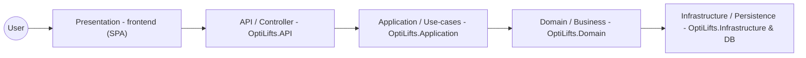

## Introduction

SAS introduction

## Index

- [Architectural Requirements](#architectural-requirements)
	- [Quality Requirements](#quality-requirements)
	- [Architectural Patterns](#architectural-patterns)
	- [Design Patterns](#design-patterns)
	- [Mapping Quality Requirements to Architectural Decisions](#mapping-quality-requirements-to-architectural-decisions)
	- [Constraints](#constraints)

- [Technology Requirements](#technology-requirements)
- [API Service Contracts](#api-service-contracts)
	- [Authentication and User Management](#authentication-and-user-management)
	- [Exercise Management](#exercise-management)
	- [Workouts](#workouts)
	- [Workout Exercises & Sets](#workout-exercises-and-sets)
	- [Global & Custom Exercises](#global-and-custom-exercises)
	- [Scheduling](#scheduling)
- [Deployment](#Deployment)
	- [Deployment Diagrams](#deployment-diagrams)
	- [CI/CD Pipeline Diagrams](#cicd-pipeline-diagrams)
	- [Rollback Strategy](#rollback-strategy)


## Architectural Requirements

### Quality Requirements

Quality requirments dictate the holistic quality of OptiLifts by specifying the performance, reliability, scalability, security, and maintainability expectations.
#### 1. Performance

* API Response Time: Standard CRUD operations in the ASP.NET Core API, such as fetching user profiles, loading a saved workout, and updating session data, must return a response within 200 milliseconds under normal server load.
* Algorithmic Efficiency: Core AI and scheduling tasks, specifically progressive overload recommendations and dynamic scheduling calculations, must execute and return results to the client within 2 seconds.
* Client-Side Rendering: The React SPA must achieve a Time to Interactive (TTI) of under 1.5 seconds on broadband connections to preserve a responsive, app-like experience.

#### 2. Reliability

* System Uptime: The Azure-hosted core backend services must be designed for 95% availability, using built-in redundancy and failover features where applicable.
* Offline Resilience: The SPA's PWA layer must cache active session state locally using browser storage and service-worker-backed caching. If the user loses connectivity during a workout, the system must allow the current workout to continue without data loss and synchronise the session payload within 1 minute of connection restoration.

#### 3. Scalability

* Elasticity: The backend must support auto-scaling or equivalent horizontal scaling controls to handle peak usage periods and support at least 500 concurrent active workout sessions without degrading the 200 millisecond API response baseline.
* Data Volume: The database must remain performant as historical workout logs, scheduling data, and analytics records grow, using efficient indexing, pagination, and query design.

#### 4. Security

* Data Encryption: Sensitive user data at rest, including passwords, email addresses, and personal health metrics, must be protected using industry-standard encryption and hashing approaches.
* Authentication: The system must use secure token-based authentication, such as JWT, with token expiry and refresh handling to prevent unauthorised access.
* Anonymisation: In line with POPIA, personally identifiable information must be isolated from aggregate analytics data. Any data used for model improvements or reporting must be anonymised before use.

#### 5. Maintainability

* Architecture Standard: The backend must follow clean code and Domain-Driven Design principles so that workout-building, scheduling, and AI-assisted logic remain modular and testable.
* Test Coverage: Core algorithmic modules, including plateau detection and scheduling, must maintain at least 80% unit test coverage.
* Automated Deployment: Infrastructure must be defined using Infrastructure as Code, and all production deployments must pass through automated CI/CD checks, including successful test execution, before release.

### Architectural Patterns

For this project we model a 5-tier N architecture that maps to the existing codebase:

- Presentation (frontend SPA)
- API / Controller (OptiLifts.API)
- Application / Use-case layer (OptiLifts.Application)
- Domain / Business objects (OptiLifts.Domain)
- Infrastructure / Persistence (OptiLifts.Infrastructure & DB)

Mermaid diagram (N = 5):




This diagram shows how requests flow from the client (frontend) through the API and application layers into the domain and persistence layers.

### Design Patterns

The following design patterns are applied in OptiLifts, grouped by the GoF (Gang of Four) categories: Creational, Structural, and Behavioural. Patterns planned for future implementation are listed separately.

---

#### Currently Used

##### Builder

Where: Backend - Database layer

Instead of setting up a database table mapping all at once, the Builder pattern lets the system configure it one step at a time through a chain of method calls. Each call sets one rule, such as which field is the primary key or which column must be unique.

```csharp
builder.HasKey(u => u.Id);
builder.Property(u => u.Email).IsRequired().HasMaxLength(255);
builder.HasIndex(u => u.Email).IsUnique();
```

---

##### Singleton

Where: Backend - Authentication

Only one instance of the JWT token service is ever created. Every part of the system shares it instead of creating its own copy. This works because the service only holds the secret key and token expiry time, which never change while the application is running.

```csharp
builder.Services.AddSingleton<IJwtTokenService>(_ => new JwtTokenService(jwtSecret, jwtExpiryMinutes));
```

---

##### Facade

Where: Backend - API layer

Each controller hides all the internal complexity behind a single endpoint. The client sends a request and gets a response. It has no knowledge of the handlers, database queries, or validation logic that runs behind the scenes.

```csharp
[HttpPost]
public async Task<IActionResult> CreateWorkout(CreateWorkoutRequest request)
{
    var result = await _mediator.Send(command);
    return Created(..., result);
}
```

---

##### Strategy

Where: Backend - Authentication

The password hashing algorithm is defined behind an interface so it can be swapped out without changing any other code. If the hashing method needs to be replaced in the future, only one new class needs to be written and one line in the configuration needs to change.

```csharp
public interface IPasswordHasher
{
    string Hash(string password);
    bool Verify(string hash, string password);
}
```

---

##### Mediator

Where: Backend - Application layer

Instead of different parts of the system calling each other directly, all requests go through a central object called the mediator. The controller that sends a request has no knowledge of which handler processes it, and the handler has no knowledge of who sent it.

```csharp
// Controller sends, has no idea who handles it
var result = await _mediator.Send(new CreateWorkoutCommand(...));

// Handler processes, has no idea who sent it
public class CreateWorkoutHandler : IRequestHandler<CreateWorkoutCommand, CreateWorkoutResult>
```

---

##### Observer

Where: Frontend - Auth state management

One central object holds the login state. Any screen or component that needs to know whether the user is logged in subscribes to it. When the user logs in or out, all subscribed components are automatically updated without needing to check manually.

```tsx
// One place holds the auth state
const [session, setSession] = React.useState(...)

// Any component can subscribe to it
const { isAuthenticated, user } = useAuth()
```

---

#### Patterns to Adopt

##### Decorator

This pattern could be applied anywhere cross-cutting concerns such as logging, performance monitoring, or input validation need to run around existing logic. Rather than duplicating that code in every place it is needed, the Decorator wraps the existing logic and adds the extra behaviour around it automatically.

---

##### Template Method

This pattern is applicable wherever multiple components share the same overall structure but differ in specific steps. In OptiLifts this applies to request handlers, but it could also apply to AI processing pipelines, report generation, or any workflow that follows a fixed sequence with variable internals.

---

##### Chain of Responsibility

This pattern is useful wherever a request needs to pass through several independent checks before being processed, such as authentication, authorisation, rate limiting, or input sanitisation. Each check is isolated and the chain can be extended or reordered without affecting the others.

---

##### State

This pattern applies wherever an object behaves differently depending on what phase it is in. In OptiLifts the most direct application is the active workout session, which moves through idle, active, resting, and completed states. It could also apply to AI suggestion states or onboarding flows where the available actions change at each stage.

### Mapping Quality Requirements to Architectural Decisions

| Quality Requirement |Architectural Decision |
| :--- | :--- |
|Response time <=1.5 seconds for core-api| Seperation of api into core-api and ai-api services, and planned caching in future |
| 100 concurrent users | Container app service architecture with horizontal scaling | 
| Increase in workload of up to 200% | Container app service architecture with horizontal scaling that has an automatic load balancer with stateless autherization meaning users are able to send requests to different replicas |
| Encrypted data at rest | Encryption layer in API that encrypts data writen to the database and decrypts data fetched from the database |
| Authenticated access | Stateless JSON JWTs communicated and stored via HTTP-only cookies | 
| Deployment within 30 minutes | A CI/CD pipeline incorperated with IaC limits any manual overhead allowing the pipeline to deploy within 30 minutes |
| Keyboard accessibility and User satisfaction | Using a brand-style guide, and  components we have made that are designed to be user friendly and keyboard accessible. Using an SPA allows for better user experience and navigation as there are no full page reloads |

### Constraints

**1. Financial and Budget Constraints**
* **Zero-Cost Implementation:** The project must be designed and implemented without incurring any costs. 
* **Infrastructure Limitations:** The system architecture should consist of open-source technologies and free-tier cloud services, such as our Azure for Students sponsorship.

**2. AI Implementation Constraints**
* **Model Behavior:** The application must account for the ethical implications of AI-generated content. We must ensure the AI operates within safe boundaries and that bot content does not negatively affect the accuracy of the models or the user's physical training.

**3. Security & Regulatory Constraints**
* **Data Privacy (POPIA):** User health and fitness data must be handled responsibly and in strict compliance with privacy best practices and the POPI Act.
* **Anonymity & Encryption:** The system must implement encrypted authentication and data storage. User anonymity must be prioritized, and data obfuscation must be enforced.

**4. Deployment Constraints**
* **Deployment Methodology:** The system must be deployable via Infrastructure as Code (IaC) and a CI/CD pipeline, "Click Ops" deployment is not permitted.

## Technology Requirements

#### Frontend & Presentation Layer
| Component | Technology | Justification |
| :--- | :--- | :--- |
| **Framework** | React + React Router | Component-based structure ensures a highly responsive Single Page Application (SPA). |
| **Build Tool & PWA** | Vite + vite-plugin-pwa | Fast hot-module replacement for ease of development and built-in support for offline Progressive Web App capabilities. |
| **Design System** | Shadcn/ui + Tailwind CSS | Provides an easily customizable, and responsive UI whilst still keeping the application lightweight suporting ease of development. |

#### Core API & Application Layer
| Component | Technology | Justification |
| :--- | :--- | :--- |
| **Core Framework** | .NET ASP.NET Core | High-performance framework that handles CRUD operations well within a 2-second timeframe and utilizes robust built-in authorization mechanisms to ensure secure endpoints. |
| **Data Access** | Entity Framework (EF) Core | Object-Relational Mapper (ORM) that makes database interactions and migrations easier to manage accross the team. |
| **Architecture Pattern** | MediatR | Implements logical CQRS to decouple services, separating read queries from write commands allowing for easier backend decoupling and maintainability. |
| **Caching** | Redis | Caching ensures high-speed retrieval of session data and minimizes database hits . |

#### AI Layer
| Component | Technology | Justification |
| :--- | :--- | :--- |
| **API Framework** | Python + FastAPI | Lightweight and highly performant with extensive libararies, ideal for serving machine learning models and AI endpoints. |
| **Optimization Engine** | Genetic Algorithm (DEAP) | Provides a deterministic, light weight solution for the dynamic scheduler and time contraints mode via its GA supprot an dintegrates with the FastAPI backend.  |


#### Persistence Layer
| Component | Technology | Justification |
| :--- | :--- | :--- |
| **Relational Database** | PostgreSQL | Open-source relational database perfectly suited for the complex, hierarchical structures of workout plans and historical logs. |
| **Object Storage** | Azure Blob Storage | Provides a scalable storage for our exercise images and profile pictures. Is included in the Azure student package ensuring zero-cost storage. |

#### Infrastructure, DevOps & CI/CD
| Component | Technology | Justification |
| :--- | :--- | :--- |
| **Cloud Hosting** | Microsoft Azure | Centralizes services under the Azure for Students tier, targeting 90%+ availability. Built in load balancing and resource allocation support the need for scalability. |
| **Infrastructure as Code** | Pulumi | Automates the provisioning and tear-down of Azure resources, ensuring a reproducible deployment environment directly improving maintainability and ease of development. |
| **CI/CD Pipeline** | GitHub Actions | Automates the testing and deployment pipelines directly from the repository. |
| **Containerization** | Docker Compose | Ensures environment parity between local development and end-to-end testing environments improving ease of development. |
| **Package Manager** | pnpm | Efficient dependency management with strong monorepo workspace support. |

#### Quality Assurance & Testing
| Testing Scope | Technologies Used |
| :--- | :--- |
| **.NET Backend** | xUnit (unit tests), Moq (interface mocking), TestContainers (shortlived PostgreSQL test containers),Respawn (Integration test database rollback) , FluentAssertions. |
| **React Frontend** | Vitest (unit testing), React Testing Library (component interactions). |
| **Python AI API** | pytest (unit tests), httpx (simulating web requests). |
| **End-to-End (E2E)** | Playwright (browser simulation) integrated with Docker Compose. |
| **Code Coverage** | Coveralls. |

# Testing Methodology

OptiLifts uses an multi-tiered testing strategy integrated into the CI/CD pipeline via GitHub Actions.

## Types of Testing

*   **Unit Testing**
*   **Integration Testing** 
*   **End-to-End (E2E) Testing** 
*   **User Acceptance Testing (UAT)** doen through iterative sprint reviews and scheduled demos with the industry client and mentors.

#### 4.3.2 Integration Strategy

We are using a**Bottom-Up Integration Strategy**. 

Testing begins at the low level modules of the architecture. specifically starting at the data access layers before moving progressively upward. By first writing integration tests for the core logic that reads, writes and persists relational workout data we ensure the foundation is solid. 

Once the persistence and data access layers are fully validated, integration testing moves up to the business logic handlers, followed by the API controllers, and ultimately concludes at the frontend presentation layer. This method allows us to catch fundamental data-handling defects early and allows the commonly used shared modules to be thoroughly tested befor they are used in higher-level logic.

# API Service Contracts

## Authentication and User Management

### POST /api/auth/register
**Service Name:** User Registration Service

**Description:**
Creates a new user account, establishes a secure session via HttpOnly cookies and returns the new user profile details.

**Inputs:**

- `displayName`: string - The user's display name.
- `email`: string - The user's email address.
- `password`: string - The user's chosen password.

**Outputs:**

- Headers:
	- Set-cookie: `access_token`
	- Set-cookie: `refresh_token`
- Body: 
	- `user`: `AuthUserDto` - The authenticated user profile.

AuthUserDto fields:

- `id`: Guid - Unique user identifier.
- `displayName`: string - User display name.
- `email`: string - User email address.
- `createdAt`: datetime - Account creation timestamp.

**Usage / Interaction Rules:**

- Clients must send a POST request to `/api/auth/register` with JSON data.
- This endpoint is anonymous and does not require an existing token.
- `email` and `password` are required; empty values return `400 Bad Request`.
- If the email already exists, the service returns `409 Conflict`.

**Example Response:**

Headers:
```
HTTP/1.1 200 OK
Set-Cookie: access_token=eyJhbG...; HttpOnly; Path=/; SameSite=Strict
Set-Cookie: refresh_token=d7f8a...; HttpOnly; Path=/; SameSite=Strict
```

Body
```json
{
	"id": "string", 
	"email": "user@example.com", 
	"displayName": "Optional Name",
	"createdAt": "2026-06-19T10:00:00Z"
}
```
---

### POST /api/auth/login
**Service Name:** User Login Service

**Description:**
Authenticates an existing user, establishes a secure session via HttpOnly cookies, and returns the user's profile details.

**Inputs:**

- `email`: string - The user's email address.
- `password`: string - The user's password.

**Outputs:**

- Headers:
	- Set-cookie: `access_token`
	- Set-cookie: `refresh_token`
- Body: 
	- `user`: `AuthUserDto` - The authenticated user profile.

AuthUserDto fields:

- `id`: Guid - Unique user identifier.
- `displayName`: string - User display name.
- `email`: string - User email address.
- `createdAt`: datetime - Account creation timestamp.

**Usage / Interaction Rules:**

- Clients must send a POST request to `/api/auth/login` with JSON data.
- This endpoint is anonymous and does not require an existing token.
- `email` and `password` are required; empty values return `400 Bad Request`.
- Invalid credentials return `401 Unauthorized`.

**Example Response:**

Headers:
```
HTTP/1.1 200 OK
Set-Cookie: access_token=eyJhbG...; HttpOnly; Path=/; SameSite=Strict
Set-Cookie: refresh_token=d7f8a...; HttpOnly; Path=/; SameSite=Strict
```

Body
```json
{
	"id": "string", 
	"email": "user@example.com", 
	"displayName": "Optional Name",
	"createdAt": "2026-06-19T10:00:00Z"
}
```

---

### GET /api/auth/me
**Service Name:** Current user service.

**Description:**
Gets the details of the currently logged in, authenticated user to hydrate the auth context.

**Inputs:**
- `access_token` cookie: string - HTTP-only cookie passed by the browser identifying the current user.

**Outputs:**

- `user`: `AuthUserDto` - The authenticated user profile.

AuthUserDto fields:

- `id`: Guid - Unique user identifier.
- `displayName`: string - User display name.
- `email`: string - User email address.
- `createdAt`: datetime - Account creation timestamp.


**Usage / Interaction Rules:**

- Clients must send a GET request to `/api/auth/me`.
- The user must have a valid access token.
- If the cookie is missing or invalid the endpoint retunrs a `401 unauthorized` error.
- A user account no longer existing returns a `404 Not Found` error. 

**Example Response:**

```json
{
    "id": "string", 
	"email": "user@example.com", 
	"displayName": "Optional Name",
	"createdAt": "2026-06-19T10:00:00Z"
}
```

---

### POST /api/auth/refresh
**Service Name:** Refresh token service. 

**Description:**
Exchanges a valid HTTP-Only refresh cookie for a new access and refresh cookie.

**Inputs:**
- `refresh_token` cookie: string - HTTP-only cookie passed by the browser.

**Outputs:**

- Headers: 
	- Set-Cookie: `access_token`
	- Set-Coolie: `refresh_token`

**Usage / Interaction Rules:**

- Clients must send a POST request to `/api/auth/refresh`.
- A missing/invalid refresh token will result in a `401 Unauthorized` response.
- If the cookie is missing or invalid the endpoint retunrs a `401 unauthorized` error.
- Should be called automatically by the frontend when normal requests encounter a `401 unauthorized`. 

**Example Response:**

Headers:
```
HTTP/1.1 200 OK
Set-Cookie: access_token=eyJhbG...; HttpOnly; Path=/; SameSite=Strict
Set-Cookie: refresh_token=d7f8a...; HttpOnly; Path=/; SameSite=Strict
```

---

### POST /api/auth/logout
**Service Name:** User logout service

**Description:**
Logs out the user and ends their session. 

**Inputs:**
- `access_token` cookie: string - HTTP-only cookie passed by the browser identifying the current user.

**Outputs:**
- 200 OK

**Usage / Interaction Rules:**

- Clients must send a POST request to `/api/auth/logout`

---

### GET /api/users/me/settings
**Service Name:** User Settings Query Service

**Description:** Retrieves all user settings for the authenticated user.

**Inputs:**
- `access_token` cookie: string - HTTP-only cookie passed by the browser identifying the current user.

**Outputs:** 
- `profile`: `ProfileDto` - The user's profile details.
- `preferences`: `PreferencesDto` - The user's application preferences.

`ProfileDto` fields:
- `displayName`: string - The user's display name.
- `bio`: string - The user's biography description.
- `sex`: string - The user's sex ("Male", "Female", "Other", or "PreferNotToSay").
- `dateOfBirth`: datetime | null - The user's birthdate.
- `weight`: double | null - The user's body weight.
- `height`: double | null - The user's height.
- `profilePictureUrl`: string | null - The storage URL of the user's uploaded profile image.

`PreferencesDto` fields:
- `theme`: string - The application UI theme ("light" or "dark").
- `units`: string - The default units of measurement ("metric" or "imperial").


**Usage / Interaction Rules:**
- Clients must send a GET request to `/api/users/me/settings`.
- The browser automatically attaches the `access_token` cookie.
- Returns `401` if the cookie is missing or invalid.
- If the user database record cannot be found, it returns `404`.

**Example Response:**
```json
{
	"profile": {
		"displayName": "Jordan",
		"bio": "Example",
		"sex": "Male",
		"dateOfBirth": "2005-11-22T00:00:00Z",
		"weight": 10.5,
		"height": 194.2,
		"profilePictureUrl": "https://storage.optilifts.com/profile-pictures/goat.jpg"
	},
	"preferences": {
		"theme": "dark",
		"units": "metric"
	}
}
```
---

### PATCH /api/users/me/profileDetails
**Service Name:** User Profile Update Service

**Description:** Updates the display name, bio, sex, birthdate, weight, and height of the authenticated user if they are changed.

**Inputs:**
- `access_token` cookie: string - HTTP-only cookie passed by the browser identifying the current user.
- `displayName`: string - The user's display name.
- `bio`: string | null - Optional biography text.
- `sex`: string | null - Optional sex designation.
- `dateOfBirth`: string | null - Optional birthdate.
- `weight`: double | null - Optional body weight.
- `height`: double | null - Optional height.

**Outputs:**
- No content on success (`204 No Content`).

**Usage / Interaction Rules:**
- Clients must send a PATCH request to `/api/users/me/profileDetails` with JSON data.
- The browser automatically attaches the `access_token` cookie.
- Returns `401` if the cookie is missing or invalid.
- Returns `404` if the user does not exist in the database.

**Example Response:**
HTTP/1.1 204 No Content

---

### PATCH /api/users/me/profilePicture
**Service Name:** Profile Picture Upload Service

**Description:** Uploads the updated user profile image.

**Inputs:**
- `profilePicture`: file - The image binary file sent as multipart form-data.
- `access_token` cookie: string - HTTP-only cookie passed by the browser identifying the current user.

**Outputs:**
- `profilePictureUrl`: string - The newly generated storage URL of the profile image.

**Usage / Interaction Rules:**
- Clients must send a PATCH request to `/api/users/me/profilePicture` with `multipart/form-data` encoding.
- The browser automatically attaches the `access_token` cookie.
- The request must contain a valid, non-empty image file. Non-image files or missing payloads return `400 Bad Request`.
- Returns `401` if the cookie is missing or invalid.

**Example Response:**
```json
{
	"profilePictureUrl": "https://storage.optilifts.com/profile-pictures/example.png"
}
```

---

### DELETE /api/users/me/deleteProfilePicture
**Service Name:** Profile Picture Removal Service

**Description:** Removes the current user's profile picture.

**Inputs:**
- `access_token` cookie: string - HTTP-only cookie passed by the browser identifying the current user.

**Outputs:**
- No content on success (`204 No Content`).

**Usage / Interaction Rules:**
- Clients must send a DELETE request to `/api/users/me/deleteProfilePicture`.
- The browser automatically attaches the `access_token` cookie.
- Returns `401` if the cookie is missing or invalid.
- Returns `404` if the user record does not exist.

**Example Response:**
HTTP/1.1 204 No Content

---

### PATCH /api/users/me/preferences
**Service Name:** User Preferences Update Service

**Description:** Updates the theme and units of the authenticated user.

**Inputs:**
- `theme`: string - The theme preference ("light" or "dark", required).
- `units`: string - The units preference ("metric" or "imperial", required).
- `access_token` cookie: string - HTTP-only cookie passed by the browser identifying the current user.

**Outputs:**
- No content on success (`204 No Content`).

**Usage / Interaction Rules:**
- Clients must send a PATCH request to `/api/users/me/preferences` with JSON data.
- The browser automatically attaches the `access_token` cookie.
- Both input fields are required; empty or missing fields return `400 Bad Request`.
- Returns `401` if the cookie is missing or invalid.

**Example Response:**
HTTP/1.1 204 No Content

---

### POST /api/users/me/updatePassword
**Service Name:** User Password Update Service

**Description:** Updates the password of the authenticated user.

**Inputs:**
- `currentPassword`: string - The user's current password (required).
- `newPassword`: string - The user's new password (required).
- `access_token` cookie: string - HTTP-only cookie passed by the browser identifying the current user.

**Outputs:**
- No content on success (`204 No Content`).

**Usage / Interaction Rules:**
- Clients must send a POST request to `/api/users/me/updatePassword` with JSON data.
- The browser automatically attaches the `access_token` cookie.
- Empty passwords return `400 Bad Request`.
- Providing an incorrect current password returns `400 Bad Request`.
- The `newPassword` must meet complexity requirements otherwise it will return `400 Bad Request`.
- Returns `401` if the cookie is missing or invalid.

**Example Response:**
HTTP/1.1 204 No Content

## Exercise Management

### POST /api/exercises/custom
**Service Name:** Custom Exercise Creation Service

**Description:**
Creates a user-defined exercise and assigns it to the authenticated user.

**Inputs:**

- `name`: string - The exercise name.
- `mechanic`: string | null - Optional exercise mechanic.
- `equipment`: string | null - Optional equipment name.
- `category`: string - The exercise category.
- `primaryMuscles`: array of string - Primary muscles targeted.
- `secondaryMuscles`: array of string - Secondary muscles assisted.
- Authentication token: string - Bearer token identifying the current user.

**Outputs:**

- `id`: Guid - The newly created exercise identifier.

**Usage / Interaction Rules:**

- Clients must send a POST request to `/api/exercises/custom` with JSON data and a valid Bearer token.
- The endpoint is authenticated and returns `401` if the user cannot be identified from the token.
- The request body must include the exercise `name`, `category`, `primaryMuscles`, and `secondaryMuscles`.

**Example Response:**

```json
{
	"id": "string",
	"name": "string",
	"description": "string",
	"equipment": ["string"],
	"muscles": ["string"],
	"instructions": "string",
	"createdBy": "userId"
}
```


### GET /api/exercises
**Service Name:** Exercise Catalog Service

**Description:**
Returns the authenticated user's exercise catalog, including built-in and custom exercises.

**Inputs:**

- None in the request body.

- Authentication token: string - Bearer token identifying the current user.

**Outputs:**

- `exercises`: array of `ExerciseDto` - The list of exercises available to the user.

ExerciseDto fields:

- `id`: Guid - Unique exercise identifier.
- `name`: string - Exercise name.
- `mechanic`: string | null - Exercise mechanic, if defined.
- `equipment`: string | null - Equipment required, if defined.
- `category`: string - Exercise category.
- `primaryMuscles`: array of string - Primary muscles trained.
- `secondaryMuscles`: array of string - Secondary muscles assisted.
- `isCustom`: boolean - Indicates whether the exercise was created by the user.

**Usage / Interaction Rules:**

- Clients must send a GET request to `/api/exercises` with a valid Bearer token.
- The endpoint is authenticated and returns `401` if the user cannot be identified from the token.
- The response is a JSON object containing an `exercises` array of exercise objects.

**Example Response:**

```json
{
	"exercises": [
		{
			"id": "string",
			"name": "string",
			"description": "string",
			"equipment": ["string"],
			"muscles": ["string"],
			"isCustom": false
		}
	],
	"total": 0,
	"page": 1,
	"limit": 25
}
```

---

### POST /api/exercises/images
**Service Name:** Exercise Images Service

**Description:** Retrieves a dictionary mapping exercise names to their corresponding Azure Blob Storage image URLs. 

**Inputs:**
- `access_token` cookie: string - HTTP-only cookie passed by the browser identifying the current user.
- `exerciseIds`: array of GUIDs - A list of exercise ids to fetch images.

**Outputs:**
- A JSON dictionary (`Record<string, string>`) where:
  - Key: string - The exercise id.
  - Value: string - The image URL in the database.

**Usage / Interaction Rules:**
- Clients must send a POST request to `/api/exercises/images`.
- The browser automatically attaches the `access_token` cookie.
- The endpoint is authenticated and returns `401 Unauthorized` if the cookie is missing or invalid.

**Example Response:**
```json
{
	"Bench Press": "http://127.0.0.1:10000/devstoreaccount1/exercises/bench-press.png",
	"Squat": "http://127.0.0.1:10000/devstoreaccount1/exercises/squat.png",
	"Deadlift": "http://127.0.0.1:10000/devstoreaccount1/exercises/deadlift.png"
}
```
---

## Workouts

### GET /api/workouts
**Service Name:** Workout List Service

**Description:**
Returns the authenticated user's workouts as summary cards.

**Inputs:**

- None in the request body.
- Authentication token: string - Bearer token identifying the current user.

**Outputs:**

- `workouts`: array of `WorkoutCardDto` - The list of workout summaries.

WorkoutCardDto fields:

- `id`: Guid - Unique workout identifier.
- `name`: string - Workout name.
- `primaryMuscleGroups`: array of string - Main muscle groups used by the workout.
- `exerciseCount`: integer - Number of exercises in the workout.
- `exercisePreview`: array of string - Short preview of exercise names.
- `createdAt`: datetime - When the workout was created.

**Usage / Interaction Rules:**

- Clients must send a GET request to `/api/workouts` with a valid Bearer token.
- The endpoint is authenticated and returns `401` if the user cannot be identified from the token.
- The response is a JSON object containing a `workouts` array of workout summary objects.

**Example Response:**

```json
{
	"workouts": [
		{
			"id": "string",
			"name": "string",
			"folder": "string",
			"estimatedTimeMinutes": 30,
			"exercises": [
				{ "id": "string", "name": "string", "sets": 3, "reps": 8 }
			]
		}
	],
	"total": 0,
	"page": 1,
	"limit": 25
}
```

### POST /api/workouts/{workoutId}/exercises
**Service Name:** Workout Exercise Assignment Service

**Description:**
Adds an existing exercise to a specific workout owned by the authenticated user.

**Inputs:**

- `workoutId`: Guid - The workout to update (path parameter).
- `exerciseId`: Guid - The exercise to add to the workout (request body).
- Authentication token: string - Bearer token identifying the current user.

**Outputs:**

- No content on success.
- `404` response if the workout or exercise cannot be added.

**Usage / Interaction Rules:**

- Clients must send a POST request to `/api/workouts/{workoutId}/exercises` with JSON data and a valid Bearer token.
- The endpoint is authenticated and returns `401` if the user cannot be identified from the token.
- The request body must contain a valid `exerciseId` value.
- A successful add returns `204 No Content`; a failed add returns `404 Not Found`.

**Example Response:**

```json
{
	"id": "string",
	"name": "string",
	"exercises": [ /* updated exercises array */ ]
}
```


### DELETE /api/workouts/{workoutId}
**Service Name:** Workout Deletion Service

**Description:**
Deletes an existing workout owned by the authenticated user

**Inputs:**
- `workoutId`: Guid - the workout to delete
- `access_token` cookie: string - HTTP-only cookie for current user

**Outputs:**
- `200 OK` on success
- Returns `404` if the workout does not exist or is not owned by the user

**Usage / Interaction Rules:**
- Clients must send a DELETE request to `/api/workouts/{workoutId}`
- The browser automatically attaches the `access_token` cookie
- Returns `401` if the cookie is missing or it is invalid

**Example Response:**
```json
{
	"message": "Workout deleted successfully."
}
```

---

### POST /api/workouts/{workoutId}/duplicate
**Service Name:** Workout Duplication Service

**Description:**
Creates a duplicate of an existing workout owned by the authenticated user

**Inputs:**
- `workoutId`: Guid - the workout to duplicate
- `access_token` cookie: string - HTTP-only cookie for current user

**Outputs:**
- `workout`: `DuplicateWorkoutResult` - the duplicated workout summary

`DuplicateWorkoutResult` fields:
- `workoutId`: Guid - Newly created duplicated workout identifier.
- `name`: string - Workout name.
- `folderId`: Guid | null - Folder identifier, if any.
- `createdAt`: datetime - Creation timestamp.

**Usage / Interaction Rules:**
- Clients must send a POST request to `/api/workouts/{workoutId}/duplicate`
- The browser automatically attaches the `access_token` cookie
- Returns `401` if the cookie is missing or it is invalid
- Returns `404` if the workout does not exist or is not owned by the user

**Example Response:**
```json
{
	"workout": {
		"workoutId": "string",
		"name": "Push Day Copy",
		"folderId": "string",
		"createdAt": "2026-07-16T10:00:00Z"
	}
}
```

---

### PUT /api/workouts/{workoutId}
**Service Name:** Workout Update Service

**Description:**
Updates an existing workout owned by the authenticated user

**Inputs:**
- `workoutId`: Guid - the workout to update
- `folderId`: Guid | null - Optional folder identifier
- `name`: string - workout name
- `exercises`: array of workout exercise objects - The updated exercise list
- `groups`: array of workout group objects | null - Optional grouped exercise structure
- `access_token` cookie: string - HTTP-only cookie for current user

**Outputs:**
- No content on success
- Returns `404` if the workout does not exist or is not owned by the user

**Usage / Interaction Rules:**
- Clients must send a PUT request to `/api/workouts/{workoutId}` with JSON data
- The browser automatically attaches the `access_token` cookie
- Returns `401` if the cookie is missing or it is invalid

**Example Response:**
```http
HTTP/1.1 200 OK
```

---

## Workout Exercises and Sets


## Global and custom exercises

## Scheduling

### GET /api/users/me/schedule
**Service Name:** User Schedule Query Service

**Description:**
Returns the user's scheduled workout entries between a date range

**Inputs:**
- `startDate`: datetime | null - Optional start of schedule range
- `endDate`: datetime | null - Optional end of the schedule range
- `status`: string | null - Optional schedule status filter
- `access_token` cookie: string - HTTP-only cookie for current user

**Outputs:**
- `schedule`: array of `ScheduledEntryDto` - The user's scheduled workout entries:
    - `id`: Guid - Scheduled entry identifier
    - `workoutId`: Guid - Linked workout identifier
    - `workoutName`: string - Workout name
    - `scheduled`: datetime - Scheduled date and time
    - `status`: string - Entry status
    - `primaryMuscleGroups`: array of string - Primary muscle groups
    - `exerciseCount`: integer - Number of exercises in the workout
    - `exercisePreview`: array of string - Preview of exercise names
    - `totalVolume`: float - Total volume for the workout
    - `totalSets`: integer Total
	- `startedAt`: datetime | null - Start timestamp if session has started
	- `completedAt`: datetime | null - Completion teimstamp is the session has been finished
	- `recordCount`: integer | null - Number of personal records for the session
	- `logId`: Guid | null - Linked workout log identifer

**Usage / Interaction Rules:**
- Clients must send a GET request to `/api/users/me/schedule`
- The browser automatically attaches the `access_token` cookie
- Returns `401` if the cookie is missing or it is invalid

**Example Response:**

```json
{
    "schedule": [
		{
			"id": "string",
			"workoutId": "string",
			"workoutName": "Push Day",
			"scheduled": "2026-07-16T10:00:00Z",
			"status": "Scheduled",
			"primaryMuscleGroups": ["Chest", "Triceps"],
			"exerciseCount": 5,
			"exercisePreview": ["Bench Press", "Incline Press"],
			"totalVolume": 10250,
			"totalSets": 18,
			"startedAt": null,
			"completedAt": null,
			"recordCount": 0,
			"logId": null
		}
	]
}
```

---

### GET /api/users/me/schedule/analytics
**Service Name:** Schedule Analytics Query Service

**Description:**
Returns summary analytics for the user's scheduled workouts over a date range

**Inputs:**
- `startsDate`: datetime | null - Optional start of analytics range
- `endDate`: datetime | null - Optional end of the analytics range
- `status`: string | null - Optional schedule status filtering
- `access_token` cookie: string - HTTP-only cookie for current user 

**Outputs:**
- `analytics`: `ScheduleAnalyticsDto` - Summary analytics for the filtered schedule

`ScheduleAnalyticsDto` fields:
- `totalWorkouts`: integer - Total number of workouts in the result set.
- `totalVolume`: float - Total training volume.
- `totalSets`: integer - Total number of sets.
- `muscleDistribution`: array of `MuscleDistributionDto` - Muscle group breakdown.

`MuscleDistributionDto` fields:
- `muscleGroup`: string - Muscle group name.
- `setCount`: integer - Number of sets for the muscle group.
- `percentage`: float - Percentage share of total sets.

**Usage / Interaction Rules:**
- Client must send GET request to `/api/users/me/schedule/analytics`
- The browser automatically attaches the `access_token` cookie
- Returns `401` if the cookie is missing or it is invalid

**Example Response:**
```json
{
	"analytics": {
		"totalWorkouts": 12,
		"totalVolume": 45230,
		"totalSets": 188,
		"muscleDistribution": [
			{
				"muscleGroup": "Chest",
				"setCount": 42,
				"percentage": 22.3
			}
		]
	}
}
```

---

### POST /api/users/me/schedule/sessions
**Service Name:** Scheduled Session Creation Service

**Description:**
Creates a scheduled workout session for the authenticated user

**Inputs:**
- `workoutId`: Guid - The workout to schedule
- `scheduledAt`: datetime - The scheduled date for the session
- `status`: string - The initial schedule status
- `repeat`: string | null - Optional repeat field
- `interval`: integer | null - Optional repeat interval
- `until`: datetime | null - Optional repeat end date
- `access_token` cookie: string - HTTP-only cookie for current user 

**Outputs:**
- `session`: `CreateScheduledSessionResult` - The created scheduled session

`CreateScheduledSessionResult` fields:
- `id`: Guid - Scheduled session identifier.
- `workoutId`: Guid - Linked workout identifier.
- `scheduledAt`: datetime - Scheduled date and time.
- `status`: string - Session status.

**Usage / Interaction Rules:**
- Clients must send a POST request to `/api/users/me/schedule/sessions` with JSON data
- The browser automatically attaches the `access_token` cookie
- Returns `401` if the cookie is missing or it is invalid
- Returns `404` if the workout does not exist or is not owned by the user

**Example Response:**
```json
{
	"session": {
		"id": "string",
		"workoutId": "string",
		"scheduledAt": "2026-07-16T10:00:00Z",
		"status": "Scheduled"
	}
}
```

---

### DELETE /api/users/me/schedule/sessions/{sessionId}
**Service Name:** Scheduled Session Removal Service

**Description:**
Deletes a scheduled workout session for the authenticated user

**Inputs:**
- `sessionId`: Guid - The scheduled workout session to delete
- `access_token` cookie: string - HTTP-only cookie for current user

**Outputs:**
- No content on success
- Returns `404` if the workout does not exist or is not owned by the user

**Usage / Interaction Rules:**
- Clients must send a DELETE request to `/api/users/me/schedule/sessions/{sessionId}`
- The browser automatically attaches the `access_token` cookie
- Returns `401` if the cookie is missing or it is invalid

**Example Response:**
```http
HTTP/1.1 204 No Content
```

---

### PATCH /api/users/me/schedule/sessions/{sessionId}
**Service Name:** Scheduled Session Status Update Service

**Description:**
Update the status of an existing scheduled workout session

**Inputs:**
- `sessionId`: Guid - the scheduled session to update
- `status`: string - The new schedule status
- `access_token` cookie: string - HTTP-only cookie for current user

**Outputs:**
- `session`: `UpdateScheduledSessionStatusResult` - The updated scheduled session
`UpdateScheduledSessionStatusResult` fields:
- `id`: Guid - Scheduled session identifier.
- `workoutId`: Guid - Linked workout identifier.
- `scheduledAt`: datetime - Scheduled date and time.
- `status`: string - Updated session status.

**Usage / Interaction Rules:**
- Clients must send a PATCH request to `/api/users/me/schedule/sessions/{sessionId}` with JSON data
- The browser automatically attaches the `access_token` cookie
- Returns `401` if the cookie is missing or it is invalid
- Returns `404` if the workout does not exist or is not owned by the user

**Example Response:**
```json
{
	"session": {
		"id": "string",
		"workoutId": "string",
		"scheduledAt": "2026-07-16T10:00:00Z",
		"status": "Completed"
	}
}
```

---

# Deployment

## Deployment Diagrams

### Development Environment


### Production Environment


## CI/CD Pipeline Diagrams

### CI Pipeline


### CD Pipeline


### Rollback Strategy

#### During Deployment: Blue-Green Deployment
When new deployments are triggered in production, new revisioins of the apps are made ( the green images) whilst the current apps continue to run and have traffic routed to them (the blue images). Once the new revisions are fully deployed and health checks pass, traffic is routed to the new (green) images. If the new revisions were to crash or fail health checks then traffic would never be routed to them and the previous working revision (blue revision) continues to handle all traffic. 

#### Afer Deployment: Image Tag Pinning
If an error is noticed after deployment, rollbacks are done via Image tag pinning. All revisions of the apps are tagged with their git commit hash and stored in the Azure Container Registry. This means if a rollback is needed we are able change to a previous revision instantly via the azure portal, alternatively we are able to roll it back via the CD by either creating a revert commit on main or by running the CD on a previous commit.

#### Daily Database Backups
Azure Database for PostgresSQL provides automated continous backups for the database. The backups are run daily and streams transaction logs every 5 minutes. These backups are retained for 10 days. This allows us to restore the database to any point in time in the last 10 days allowing us to recover from accidental data loss and destructive migrations instantly via the azure portal. 

