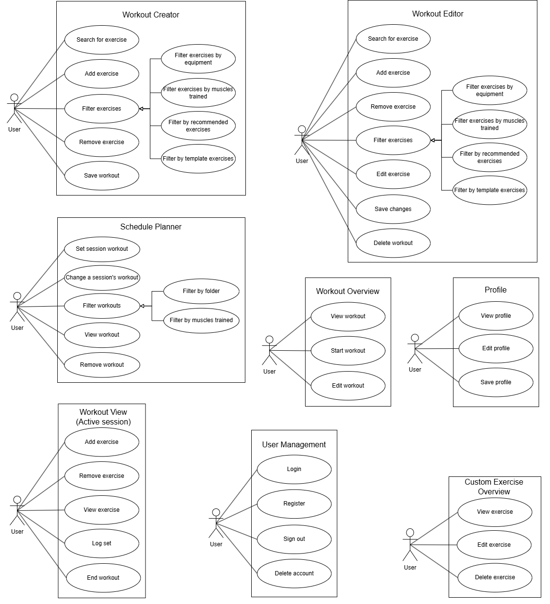
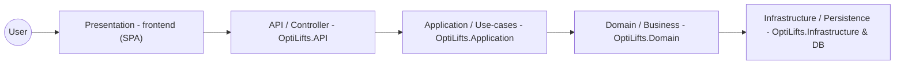

## Introduction

Traditional fitness applications act as passive digital notebooks, leaving the complex calculations of progressive overload and recovery entirely up to the user. Without systematic management and athletic science knowledge, users frequently encounter frustrating training plateaus or inefficient workouts disrupted by busy schedules. OptiLifts bridges the gap between raw data collection and actionable athletic intelligence, OptiLifts utilises historical performance data and real-time Rate of Perceived Exertion(RPE) to guide users through optimised training cycles. The system is highly context-aware; dynamically reprioritising exercises to accommodate time constraints in order to promote continuous progress.

## Index

- [User Stories / User Characteristics](#user-stories--user-characteristics)
- [Use Cases](#use-cases)
- [Functional Requirements](#functional-requirements)
- [High-level Use Case Diagrams](#high-level-use-case-diagrams)
- [API Service Contracts](#api-service-contracts)
- [Domain Model](#domain-model)
- [Architectural Requirements](#architectural-requirements)
	- [Quality Requirements](#quality-requirements)
	- [Architectural Patterns](#architectural-patterns)
	- [Design Patterns](#design-patterns)
	- [Constraints](#constraints)
- [Technology Requirements](#technology-requirements)

## User Stories / User Characteristics

### Workout Creator & Editor
* As a user, I want to enter a search query into the exercise database search bar so that the system displays a list of exercises that match my query.
* As a user, I want to apply filter criteria like equipment or muscles trained so that the system updates the displayed list to show only matching items.
* As a user, I want to select an exercise from the database so that it is successfully added to my new workout draft or appended to my existing workout.
* As a user, I want to select the delete option for an exercise in my draft or saved workout so that it is successfully removed from the workout's sequence.
* As a user, I want to select a specific exercise within a workout to modify its parameters, such as sets, reps, or rest time, so that the new parameters are updated in the editor.
* As a user, I want to click the save button after finalising or editing my workout routine so that the system successfully stores the new workout or overwrites the old data in my profile.
* As a user, I want to choose the delete option for an entire saved workout so that it is permanently removed from my account.

### Schedule Planner
* As a user, I want to select a date in the schedule to assign a workout so that it is successfully mapped to the selected block.
* As a user, I want to select an existing scheduled session to change the session's date so that I can keep to my routine.
* As a user, I want to select an existing scheduled session to swap its assigned workout so that the new workout replaces the old one in the schedule.
* As a user, I want to apply filter criteria by folder or muscles trained so that I can find a specific saved workout.
* As a user, I want to tap on a scheduled workout so that I can see its summary and exercise list.
* As a user, I want to select a scheduled workout and choose to unschedule it so that it is successfully cleared from the calendar planner.

### Workout Overview & Active Session
* As a user, I want to navigate to a specific workout's overview page so that I can see its high-level details, estimated time, and exercise list.
* As a user, I want to click the "Start" button from the overview screen so that the system transitions into the active mode and begins tracking the session.
* As a user, I want to click the "Edit" button on the overview screen so that the system opens the chosen workout inside the editor.
* As a user, I want to select "Add" to perform an extra exercise during an active workout so that the new exercise is dynamically added to the current session.
* As a user, I want to select the remove option to skip an exercise so that it is dropped from the active session without affecting the saved template.
* As a user, I want to click on an exercise to see instructions, history, or a video demonstration so that the system displays the educational details.
* As a user, I want to input the completed reps and weight for a specific set and mark it as done so that the system records the data and highlights the set as completed.
* As a user, I want to press the button to finish my current active training session so that the system saves the completed data and displays a post-workout summary.

### Custom Exercises
* As a user, I want to select a custom-made exercise from my personal library so that the system displays its details, notes, and tracking history.
* As a user, I want to choose to modify the name, instructions, or primary muscles of my custom exercise so that the updated parameters are successfully saved.
* As a user, I want to select a custom exercise to permanently remove from my library so that it is deleted and no longer appears in search results.

### User Management & Profile
* As a user, I want to enter my credentials and hit submit so that the system authenticates me and grants access to my dashboard.
* As a user, I want to fill out the registration form so that the system creates my new user profile in the database and logs me in.
* As a user, I want to select the log-out option from the app menu so that the system securely ends my active session and returns me to the login screen.
* As a user, I want to request account deletion and confirm the action so that the system permanently wipes all my personal data and credentials from the database.
* As a user, I want to navigate to the profile section so that the system displays my personal details, stats, and settings.
* As a user, I want to modify my profile information and submit the details so that the system enables input fields and securely updates and stores my new data.

### Use Cases

### Workout Creator

**Search for exercise**
* TUCBW the user enters a search query into the exercise database search bar.
* TUCEW the system displays a list of exercises that match the user's query.

**Add exercise**
* TUCBW the user selects an exercise from the database to include in their new workout.
* TUCEW the selected exercise is successfully added to the current workout draft.

**Filter exercises**
* TUCBW the user applies one or more filter criteria (e.g., equipment, muscles trained, recommended, or template).
* TUCEW the system updates the displayed exercise list to show only items matching the selected filters.

**Remove exercise**
* TUCBW the user selects an exercise currently in their workout draft and chooses the delete option.
* TUCEW the exercise is successfully removed from the workout draft.

**Save workout**
* TUCBW the user clicks the save button after finalising their workout routine.
* TUCEW the system successfully stores the new workout to the user's profile.

### Workout Editor

**Search for exercise**
* TUCBW the user enters a search query while editing an existing workout.
* TUCEW the system displays matching exercises available to add to the workout.

**Add exercise**
* TUCBW the user selects a new exercise to add to an already saved workout.
* TUCEW the exercise is appended to the workout being edited.

**Remove exercise**
* TUCBW the user selects an exercise to delete from the saved workout.
* TUCEW the exercise is removed from the workout's sequence.

**Filter exercises**
* TUCBW the user applies filters to narrow down the exercise list within the editor.
* TUCEW the list refreshes to reflect the filtered criteria.

**Edit exercise**
* TUCBW the user selects a specific exercise within the workout to modify its parameters (e.g., changing sets, reps, or rest time).
* TUCEW the new parameters for that specific exercise are updated in the editor.

**Save changes**
* TUCBW the user clicks the save button to finalise their edits.
* TUCEW the system overwrites the old workout data with the updated information.

**Delete workout**
* TUCBW the user chooses the delete option for the entire saved workout.
* TUCEW the workout is permanently removed from the user's account.

### Schedule Planner

**Set session workout**
* TUCBW the user selects a date or time block in the schedule to assign a workout.
* TUCEW the chosen workout is successfully mapped to the selected schedule block.

**Change a session's workout**
* TUCBW the user selects an existing scheduled session to swap its assigned workout.
* TUCEW the new workout replaces the old one in the schedule.

**Filter workouts**
* TUCBW the user applies filter criteria (by folder or muscles trained) to find a specific saved workout.
* TUCEW the system displays the user's saved workouts that match the filter.

**View workout**
* TUCBW the user taps on a scheduled workout to see its contents.
* TUCEW the system displays the summary and exercise list for that specific workout.

**Remove workout**
* TUCBW the user selects a scheduled workout and chooses to unschedule it.
* TUCEW the workout is successfully cleared from the calendar planner.

### Workout Overview

**View workout**
* TUCBW the user navigates to a specific workout's overview page.
* TUCEW the system displays the high-level details, estimated time, and exercise list.

**Start workout**
* TUCBW the user clicks the "Start" button from the overview screen.
* TUCEW the system transitions into the active "Workout View" mode and begins tracking the session.

**Edit workout**
* TUCBW the user clicks the "Edit" button on the overview screen.
* TUCEW the system opens the chosen workout inside the "Workout Editor."

### Profile

**View profile**
* TUCBW the user navigates to the profile section of the application.
* TUCEW the system displays the user's personal details, stats, and settings.

**Edit profile**
* TUCBW the user taps the option to modify their profile information.
* TUCEW the system enables input fields, allowing the user to type in new personal data.

**Save profile**
* TUCBW the user submits their updated profile details.
* TUCEW the system securely updates and stores the new profile data.

### Workout View (Active Session)

**Add exercise**
* TUCBW the user realises they want to perform an extra exercise during an active workout and selects "Add."
* TUCEW the new exercise is dynamically added to the current active session.

**Remove exercise**
* TUCBW the user decides to skip an exercise and selects the remove option.
* TUCEW the exercise is dropped from the active session without affecting the saved template.

**View exercise**
* TUCBW the user clicks on an exercise to see instructions, past history, or a video demonstration.
* TUCEW the system displays the requested educational details for that exercise.

**Log set**
* TUCBW the user inputs the completed reps and weight for a specific set and marks it as done.
* TUCEW the system records the data and highlights the set as completed.

**End workout**
* TUCBW the user presses the button to finish their current active training session.
* TUCEW the system saves the completed session data and displays a post-workout summary.

### User Management

**Login**
* TUCBW the user enters their credentials (username/email and password) and hits submit.
* TUCEW the system authenticates the credentials and grants access to the user's dashboard.

**Register**
* TUCBW the user fills out the registration form to create a new account.
* TUCEW the system creates the new user profile in the database and logs them in.

**Sign out**
* TUCBW the user selects the log-out option from the app menu.
* TUCEW the system securely ends the active session and returns the user to the login screen.

**Delete account**
* TUCBW the user requests account deletion and confirms the irreversible action.
* TUCEW the system permanently wipes all of the user's personal data and credentials from the database.

### Custom Exercise Overview

**View exercise**
* TUCBW the user selects a custom-made exercise from their personal library.
* TUCEW the system displays the details, notes, and tracking history for that custom movement.

**Edit exercise**
* TUCBW the user chooses to modify the name, instructions, or primary muscles of their custom exercise.
* TUCEW the updated custom exercise parameters are successfully saved.

**Delete exercise**
* TUCBW the user selects a custom exercise to permanently remove from their library.
* TUCEW the custom exercise is successfully deleted and will no longer appear in search results.

***

## High-level Use Case Diagrams

## Functional Requirements

### FR1: Workout Management

#### FR1.1: Exercise discovery and filtering
1. FR1.1.1: The system will allow the user to view all available exercises, including template and custom exercises.
2. FR1.1.2: The system will allow the user to view a list of recommended exercises.
3. FR1.1.3: The system will provide search functionality for the user to find a specific exercise by name.
4. FR1.1.4: The system will allow the user to filter exercises by the equipment required.
5. FR1.1.5: The system will allow the user to filter exercises by the specific muscles trained.

#### FR1.2: Workout construction and editing
1. FR1.2.1: The system will allow the user to create or edit a workout routine.
2. FR1.2.2: The system will allow the user to add an exercise to their workout routine.
3. FR1.2.3: The system will allow the user to remove an exercise from their workout routine.
4. FR1.2.4: The system will allow the user to change the set type for an exercise.
5. FR1.2.5: The system will allow the user to add rest time to a specific exercise.
6. FR1.2.6: The system will provide "Undo" functionality to revert changes made during the creation or editing process.
7. FR1.2.7: The system will allow the user to save the workout to the database.
8. FR1.2.8: The system will allow the user to delete a saved workout routine from the database.

### FR2: Custom Exercise Creation

#### FR2.1: Exercise details
1. FR2.1.1: The system will allow the user to add or edit a name for a custom exercise.
2. FR2.1.2: The system will allow the user to add or change an image for the custom exercise.
3. FR2.1.3: The system will allow the user to select or change the exercise type.
4. FR2.1.4: The system will allow the user to select or change the required equipment.
5. FR2.1.5: The system will allow the user to cancel the creation process without saving.

#### FR2.2: Muscle group assignment
1. FR2.2.1: The system will allow the user to select or change the primary muscle group targeted.
2. FR2.2.2: The system will allow the user to select or change secondary muscle groups.
3. FR2.2.3: The system will allow the user to save the completed exercise profile to the database.
4. FR2.2.4: The system will allow the user to delete a custom exercise from the library.

### FR3: Workout and Exercise Information

#### FR3.1: Workout summary display
1. FR3.1.1: The system will display the name and detailed information of the selected workout.
2. FR3.1.2: The system will display a summary of targeted muscles for the entire workout.
3. FR3.1.3: The system will allow the user to filter workouts by folders or targeted muscles.

#### FR3.2: Exercise information display
1. FR3.2.1: The system will display detailed exercise information, including images and assigned muscle groups.
2. FR3.2.2: The system will allow the user to set or edit the weight (kg) and reps for an exercise set.

### FR4: User Management and Profile

#### FR4.1: Authentication
1. FR4.1.1: The system will allow the user to register a new account.
2. FR4.1.2: The system will allow the user to log in to an existing account.
3. FR4.1.3: The system will allow the user to delete their account.
4. FR4.1.4: The system will allow the user to log out of their active session.

#### FR4.2: Profile customisation
1. FR4.2.1: The system will display the user's personal information.
2. FR4.2.2: The system will allow the user to add or edit their weight.
3. FR4.2.3: The system will allow the user to specify their gender.
4. FR4.2.4: The system will allow the user to add or edit their age.
5. FR4.2.5: The system will allow the user to save profile changes.

### FR5: Scheduling and Session Tracking

#### FR5.1: Schedule management
1. FR5.1.1: The system will display the user's workout schedule.
2. FR5.1.2: The system will allow the user to set, change, or remove a workout for a specific session.
3. FR5.1.3: The system will allow the user to save the updated schedule.

#### FR5.2: Active workout tracking
1. FR5.2.1: The system will allow the user to start an active workout session.
2. FR5.2.2: The system will allow the user to log weight (kg) and reps for each set in real-time.
3. FR5.2.3: The system will allow the user to mark a set as complete or uncomplete.
4. FR5.2.4: The system will allow the user to add or remove exercises during an active session.
5. FR5.2.5: The system will allow the user to end and save the workout or cancel the session.

## API Service Contracts

(All the contracts for the API services)

## Domain Model

(Domain model diagrams and entity descriptions go here.)

## Architectural Requirements

### Quality Requirements

Quality requirments dictate the holistic quality of OptiLifts by specifying the performance, reliability, scalability, security, and maintainability expectations.
#### 1. Performance

* API Response Time: Standard CRUD operations in the ASP.NET Core API, such as fetching user profiles, loading a saved workout, and updating session data, must return a response within 200 milliseconds under normal server load.
* Algorithmic Efficiency: Core AI and scheduling tasks, specifically progressive overload recommendations and dynamic scheduling calculations, must execute and return results to the client within 2 seconds.
* Client-Side Rendering: The React SPA must achieve a Time to Interactive (TTI) of under 1.5 seconds on broadband connections to preserve a responsive, app-like experience.

#### 2. Reliability

* System Uptime: The Azure-hosted core backend services must be designed for 95% availability, using built-in redundancy and failover features where applicable.
* Offline Resilience: The SPA's PWA layer must cache active session state locally using browser storage and service-worker-backed caching. If the user loses connectivity during a workout, the system must allow the current workout to continue without data loss and synchronise the session payload within 1 minute of connection restoration.

#### 3. Scalability

* Elasticity: The backend must support auto-scaling or equivalent horizontal scaling controls to handle peak usage periods and support at least 500 concurrent active workout sessions without degrading the 200 millisecond API response baseline.
* Data Volume: The database must remain performant as historical workout logs, scheduling data, and analytics records grow, using efficient indexing, pagination, and query design.

#### 4. Security

* Data Encryption: Sensitive user data at rest, including passwords, email addresses, and personal health metrics, must be protected using industry-standard encryption and hashing approaches.
* Authentication: The system must use secure token-based authentication, such as JWT, with token expiry and refresh handling to prevent unauthorised access.
* Anonymisation: In line with POPIA, personally identifiable information must be isolated from aggregate analytics data. Any data used for model improvements or reporting must be anonymised before use.

#### 5. Maintainability

* Architecture Standard: The backend must follow clean code and Domain-Driven Design principles so that workout-building, scheduling, and AI-assisted logic remain modular and testable.
* Test Coverage: Core algorithmic modules, including plateau detection and scheduling, must maintain at least 80% unit test coverage.
* Automated Deployment: Infrastructure must be defined using Infrastructure as Code, and all production deployments must pass through automated CI/CD checks, including successful test execution, before release.

### Architectural Patterns

For this project we model a 5-tier N architecture that maps to the existing codebase:

- Presentation (frontend SPA)
- API / Controller (OptiLifts.API)
- Application / Use-case layer (OptiLifts.Application)
- Domain / Business objects (OptiLifts.Domain)
- Infrastructure / Persistence (OptiLifts.Infrastructure & DB)

Mermaid diagram (N = 5):

This diagram shows how requests flow from the client (frontend) through the API and application layers into the domain and persistence layers.

### Design Patterns

(Common design patterns used across the codebase go here.)

### Constraints

**1. Financial and Budget Constraints**
* **Zero-Cost Implementation:** The project must be designed and implemented without incurring any costs. 
* **Infrastructure Limitations:** The system architecture should consist of open-source technologies and free-tier cloud services, such as our Azure for Students sponsorship.

**2. LLM Cost Constraints**
* **Cost Management:** API calls to any used LLM must be carefully managed and must make use of cost-saving strategies such as caching and rate limiting.
* **Bot Behavior:** The application must account for the ethical implications of AI-generated content. We must ensure the AI operates within safe boundaries and that bot content does not negatively affect the accuracy of the models or the user's physical training.

**3. Availability Constraints**
* **System Uptime:** The OptiLifts platform must ensure an uptime of approximately 90%.

**4. Security & Regulatory Constraints**
* **Data Privacy (POPIA):** User health and fitness data must be handled responsibly and in strict compliance with privacy best practices and the POPI Act.
* **Anonymity & Encryption:** The system must implement encrypted authentication and data storage. User anonymity must be prioritized, and data obfuscation must be enforced.

## Technology Requirements

The technologie were chosen to fulfill specific architectural and quality requirements, with a strong focus on performance, zero-budget cost constraints, and maintainability.

#### Frontend & Presentation Layer
| Component | Technology | Justification |
| :--- | :--- | :--- |
| **Framework** | React + React Router | Component-based structure ensures a highly responsive Single Page Application (SPA). |
| **Build Tool & PWA** | Vite + vite-plugin-pwa | Fast hot-module replacement for ease of development and built-in support for offline Progressive Web App capabilities. |
| **Design System** | Shadcn/ui + Tailwind CSS | Provides an easily customizable, and responsive UI whilst still keeping the application lightweight. |

#### Core API & Application Layer
| Component | Technology | Justification |
| :--- | :--- | :--- |
| **Core Framework** | .NET ASP.NET Core | High-performance framework utilizing strong typing and robust built-in authorization mechanisms to ensure secure endpoints. It naturally supports Domain-Driven Design (DDD) principles, allowing for clear domain models to handle complex hierarchical workout data. |
| **Data Access** | Entity Framework (EF) Core | Object-Relational Mapper (ORM) that makes database interactions and migrations easier to manage accross the team. |
| **Architecture Pattern** | MediatR | Implements logical CQRS to decouple services, separating read queries from write commands allowing for easier backend decoupling and maintainability. |
| **Caching** | Redis | Caching ensures high-speed retrieval of session data and minimizes database hits . |

#### AI & Machine Learning Layer
| Component | Technology | Justification |
| :--- | :--- | :--- |
| **API Framework** | Python + FastAPI | Lightweight and highly performant with extensive libararies, ideal for serving machine learning models and AI endpoints. |
| **Machine Learning** | XGBoost | Efficienct gradient boosting library for structured, tabular data. Chosen to analyze training history, predict performance thresholds, and back the plateau detection sub-system. |
| **LLM Provider** | Azure OpenAI (GPT-4o mini) | Azure LLM to translate structured engine analytics into human-readable text summaries and conversational feedback. |
| **LLM Gateway & Observability** | LiteLLM & Langfuse | Used to  manage key access, track prompt latency, and monitor token costs to adhere to zero-budget. |

#### Persistence Layer
| Component | Technology | Justification |
| :--- | :--- | :--- |
| **Relational Database** | PostgreSQL | Open-source relational database perfectly suited for the complex, hierarchical structures of workout plans and historical logs. |

#### Infrastructure, DevOps & CI/CD
| Component | Technology | Justification |
| :--- | :--- | :--- |
| **Cloud Hosting** | Microsoft Azure | Centralizes services under the Azure for Students tier, targeting 90%+ availability. |
| **Infrastructure as Code** | Pulumi | Automates the provisioning and tear-down of Azure resources, ensuring a reproducible deployment environment. |
| **CI/CD Pipeline** | GitHub Actions | Automates the testing and deployment pipelines directly from the repository. |
| **Containerization** | Docker Compose | Ensures environment parity between local development and end-to-end testing environments. |
| **Package Manager** | pnpm | Efficient dependency management with strong monorepo workspace support. |

#### Quality Assurance & Testing
| Testing Scope | Technologies Used |
| :--- | :--- |
| **.NET Backend** | xUnit (unit tests), Moq (interface mocking), TestContainers (shortlived PostgreSQL test containers), FluentAssertions. |
| **React Frontend** | Vitest (unit testing), React Testing Library (component interactions). |
| **Python AI API** | pytest (unit tests), httpx (simulating web requests). |
| **End-to-End (E2E)** | Playwright (browser simulation) integrated with Docker Compose. |
| **Code Coverage** | Coveralls. |