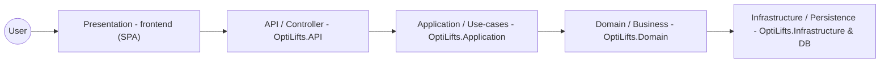

## Introduction

(Intro stub)

## Index

- [User Stories / User Characteristics](#user-stories--user-characteristics)
- [Use Cases](#use-cases)
- [Functional Requirements](#functional-requirements)
- [High-level Use Case Diagrams](#high-level-use-case-diagrams)
- [API Service Contracts](#api-service-contracts)
- [Domain Model](#domain-model)
- [Architectural Requirements](#architectural-requirements)
	- [Quality Requirements](#quality-requirements)
	- [Architectural Patterns](#architectural-patterns)
	- [Design Patterns](#design-patterns)
	- [Constraints](#constraints)
- [Technology Requirements](#technology-requirements)

## User Stories / User Characteristics

### Workout Creator & Editor
* As a user, I want to enter a search query into the exercise database search bar so that the system displays a list of exercises that match my query.
* As a user, I want to apply filter criteria like equipment or muscles trained so that the system updates the displayed list to show only matching items.
* As a user, I want to select an exercise from the database so that it is successfully added to my new workout draft or appended to my existing workout.
* As a user, I want to select the delete option for an exercise in my draft or saved workout so that it is successfully removed from the workout's sequence.
* As a user, I want to select a specific exercise within a workout to modify its parameters, such as sets, reps, or rest time, so that the new parameters are updated in the editor.
* As a user, I want to click the save button after finalising or editing my workout routine so that the system successfully stores the new workout or overwrites the old data in my profile.
* As a user, I want to choose the delete option for an entire saved workout so that it is permanently removed from my account.

### Schedule Planner
* As a user, I want to select a date in the schedule to assign a workout so that it is successfully mapped to the selected block.
* As a user, I want to select an existing scheduled session to change the session's date so that I can keep to my routine.
* As a user, I want to select an existing scheduled session to swap its assigned workout so that the new workout replaces the old one in the schedule.
* As a user, I want to apply filter criteria by folder or muscles trained so that I can find a specific saved workout.
* As a user, I want to tap on a scheduled workout so that I can see its summary and exercise list.
* As a user, I want to select a scheduled workout and choose to unschedule it so that it is successfully cleared from the calendar planner.

### Workout Overview & Active Session
* As a user, I want to navigate to a specific workout's overview page so that I can see its high-level details, estimated time, and exercise list.
* As a user, I want to click the "Start" button from the overview screen so that the system transitions into the active mode and begins tracking the session.
* As a user, I want to click the "Edit" button on the overview screen so that the system opens the chosen workout inside the editor.
* As a user, I want to select "Add" to perform an extra exercise during an active workout so that the new exercise is dynamically added to the current session.
* As a user, I want to select the remove option to skip an exercise so that it is dropped from the active session without affecting the saved template.
* As a user, I want to click on an exercise to see instructions, history, or a video demonstration so that the system displays the educational details.
* As a user, I want to input the completed reps and weight for a specific set and mark it as done so that the system records the data and highlights the set as completed.
* As a user, I want to press the button to finish my current active training session so that the system saves the completed data and displays a post-workout summary.

### Custom Exercises
* As a user, I want to select a custom-made exercise from my personal library so that the system displays its details, notes, and tracking history.
* As a user, I want to choose to modify the name, instructions, or primary muscles of my custom exercise so that the updated parameters are successfully saved.
* As a user, I want to select a custom exercise to permanently remove from my library so that it is deleted and no longer appears in search results.

### User Management & Profile
* As a user, I want to enter my credentials and hit submit so that the system authenticates me and grants access to my dashboard.
* As a user, I want to fill out the registration form so that the system creates my new user profile in the database and logs me in.
* As a user, I want to select the log-out option from the app menu so that the system securely ends my active session and returns me to the login screen.
* As a user, I want to request account deletion and confirm the action so that the system permanently wipes all my personal data and credentials from the database.
* As a user, I want to navigate to the profile section so that the system displays my personal details, stats, and settings.
* As a user, I want to modify my profile information and submit the details so that the system enables input fields and securely updates and stores my new data.

### Use Cases

### Workout Creator

**Search for exercise**
* TUCBW the user enters a search query into the exercise database search bar.
* TUCEW the system displays a list of exercises that match the user's query.

**Add exercise**
* TUCBW the user selects an exercise from the database to include in their new workout.
* TUCEW the selected exercise is successfully added to the current workout draft.

**Filter exercises**
* TUCBW the user applies one or more filter criteria (e.g., equipment, muscles trained, recommended, or template).
* TUCEW the system updates the displayed exercise list to show only items matching the selected filters.

**Remove exercise**
* TUCBW the user selects an exercise currently in their workout draft and chooses the delete option.
* TUCEW the exercise is successfully removed from the workout draft.

**Save workout**
* TUCBW the user clicks the save button after finalizing their workout routine.
* TUCEW the system successfully stores the new workout to the user's profile.

### Workout Editor

**Search for exercise**
* TUCBW the user enters a search query while editing an existing workout.
* TUCEW the system displays matching exercises available to add to the workout.

**Add exercise**
* TUCBW the user selects a new exercise to add to an already saved workout.
* TUCEW the exercise is appended to the workout being edited.

**Remove exercise**
* TUCBW the user selects an exercise to delete from the saved workout.
* TUCEW the exercise is removed from the workout's sequence.

**Filter exercises**
* TUCBW the user applies filters to narrow down the exercise list within the editor.
* TUCEW the list refreshes to reflect the filtered criteria.

**Edit exercise**
* TUCBW the user selects a specific exercise within the workout to modify its parameters (e.g., changing sets, reps, or rest time).
* TUCEW the new parameters for that specific exercise are updated in the editor.

**Save changes**
* TUCBW the user clicks the save button to finalize their edits.
* TUCEW the system overwrites the old workout data with the updated information.

**Delete workout**
* TUCBW the user chooses the delete option for the entire saved workout.
* TUCEW the workout is permanently removed from the user's account.

### Schedule Planner

**Set session workout**
* TUCBW the user selects a date or time block in the schedule to assign a workout.
* TUCEW the chosen workout is successfully mapped to the selected schedule block.

**Change a session's workout**
* TUCBW the user selects an existing scheduled session to swap its assigned workout.
* TUCEW the new workout replaces the old one in the schedule.

**Filter workouts**
* TUCBW the user applies filter criteria (by folder or muscles trained) to find a specific saved workout.
* TUCEW the system displays the user's saved workouts that match the filter.

**View workout**
* TUCBW the user taps on a scheduled workout to see its contents.
* TUCEW the system displays the summary and exercise list for that specific workout.

**Remove workout**
* TUCBW the user selects a scheduled workout and chooses to unschedule it.
* TUCEW the workout is successfully cleared from the calendar planner.

### Workout Overview

**View workout**
* TUCBW the user navigates to a specific workout's overview page.
* TUCEW the system displays the high-level details, estimated time, and exercise list.

**Start workout**
* TUCBW the user clicks the "Start" button from the overview screen.
* TUCEW the system transitions into the active "Workout View" mode and begins tracking the session.

**Edit workout**
* TUCBW the user clicks the "Edit" button on the overview screen.
* TUCEW the system opens the chosen workout inside the "Workout Editor."

### Profile

**View profile**
* TUCBW the user navigates to the profile section of the application.
* TUCEW the system displays the user's personal details, stats, and settings.

**Edit profile**
* TUCBW the user taps the option to modify their profile information.
* TUCEW the system enables input fields, allowing the user to type in new personal data.

**Save profile**
* TUCBW the user submits their updated profile details.
* TUCEW the system securely updates and stores the new profile data.

### Workout View (Active Session)

**Add exercise**
* TUCBW the user realizes they want to perform an extra exercise during an active workout and selects "Add."
* TUCEW the new exercise is dynamically added to the current active session.

**Remove exercise**
* TUCBW the user decides to skip an exercise and selects the remove option.
* TUCEW the exercise is dropped from the active session without affecting the saved template.

**View exercise**
* TUCBW the user clicks on an exercise to see instructions, past history, or a video demonstration.
* TUCEW the system displays the requested educational details for that exercise.

**Log set**
* TUCBW the user inputs the completed reps and weight for a specific set and marks it as done.
* TUCEW the system records the data and highlights the set as completed.

**End workout**
* TUCBW the user presses the button to finish their current active training session.
* TUCEW the system saves the completed session data and displays a post-workout summary.

### User Management

**Login**
* TUCBW the user enters their credentials (username/email and password) and hits submit.
* TUCEW the system authenticates the credentials and grants access to the user's dashboard.

**Register**
* TUCBW the user fills out the registration form to create a new account.
* TUCEW the system creates the new user profile in the database and logs them in.

**Sign out**
* TUCBW the user selects the log-out option from the app menu.
* TUCEW the system securely ends the active session and returns the user to the login screen.

**Delete account**
* TUCBW the user requests account deletion and confirms the irreversible action.
* TUCEW the system permanently wipes all of the user's personal data and credentials from the database.

### Custom Exercise Overview

**View exercise**
* TUCBW the user selects a custom-made exercise from their personal library.
* TUCEW the system displays the details, notes, and tracking history for that custom movement.

**Edit exercise**
* TUCBW the user chooses to modify the name, instructions, or primary muscles of their custom exercise.
* TUCEW the updated custom exercise parameters are successfully saved.

**Delete exercise**
* TUCBW the user selects a custom exercise to permanently remove from their library.
* TUCEW the custom exercise is successfully deleted and will no longer appear in search results.

***

## High-level Use Case Diagrams

## Functional Requirements

(FRs stub)

## API Service Contracts

(All the contracts for the API services)

## Domain Model

(Domain model diagrams and entity descriptions go here.)

## Architectural Requirements

### Quality Requirements

(Performance, scalability, security, maintainability requirements go here.)

### Architectural Patterns

For this project we model a 5-tier N architecture that maps to the existing codebase:

- Presentation (frontend SPA)
- API / Controller (OptiLifts.API)
- Application / Use-case layer (OptiLifts.Application)
- Domain / Business objects (OptiLifts.Domain)
- Infrastructure / Persistence (OptiLifts.Infrastructure & DB)

Mermaid diagram (N = 5):

This diagram shows how requests flow from the client (frontend) through the API and application layers into the domain and persistence layers.

### Design Patterns

(Common design patterns used across the codebase go here.)

### Constraints

(Deployment, regulatory, platform constraints, etc.)

## Technology Requirements

(List of required technologies, minimum versions, and rationale.)