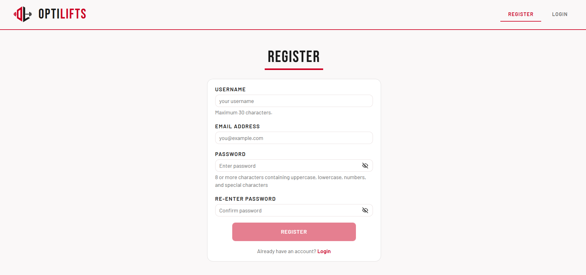
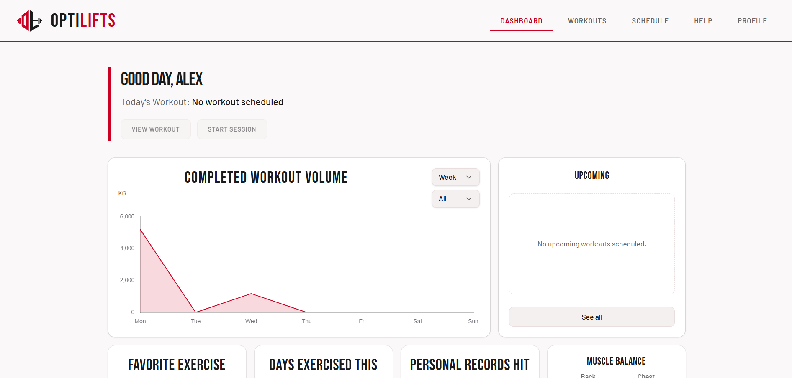
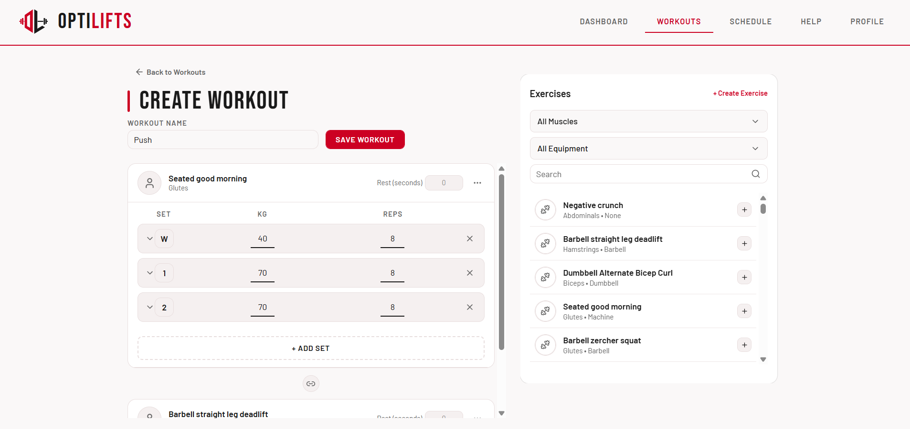
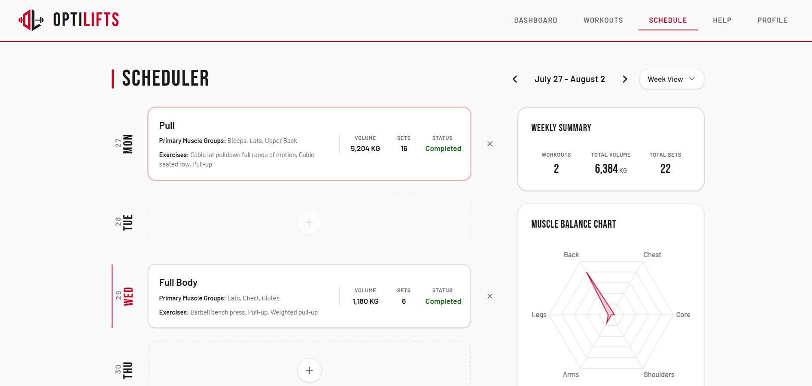
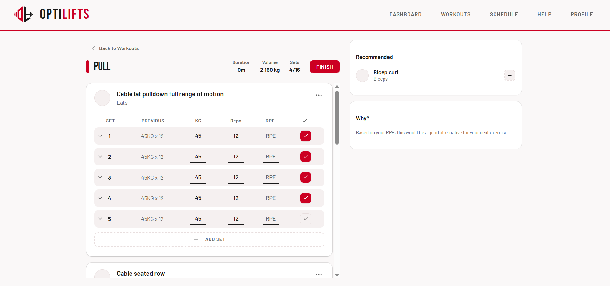
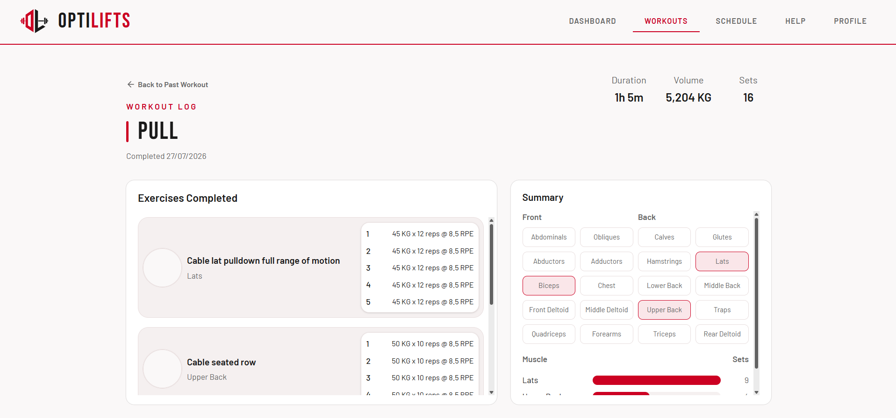
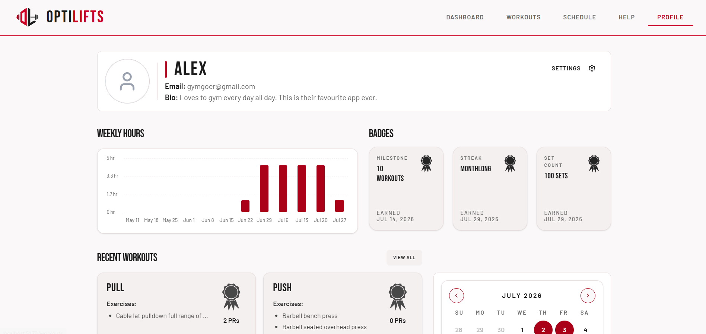

# User Manual

## Table of Contents
* [What is OptiLifts?](#what-is-optilifts)
    * [A Smart Personal Trainer](#a-smart-personal-trainer)
    * [Why Use OptiLifts?](#why-use-optilifts)
    * [Who is OptiLifts For?](#who-is-optilifts-for)
* [1. Getting Started](#1-getting-started)
    * [Creating an Account](#creating-an-account)
    * [Logging in](#logging-in)
* [2. Navigating your Dashboard](#2-navigating-your-dashboard)
* [3. Building and Managing Workouts](#3-building-and-managing-workouts)
    * [Creating a New Workout](#creating-a-new-workout)
* [4. Scheduling your Workouts](#4-scheduling-your-workouts)
    * [Planning your Week](#planning-your-week)
* [5. Training Live (Active Session)](#5-training-live-active-session)
    * [Logging Sets and Reps](#logging-sets-and-reps)
    * [Completing a Session](#completing-a-session)
* [6. Profile Management](#6-profile-management)
    * [Configuring Settings](#configuring-settings)

## What is OptiLifts?

### A Smart Personal Trainer
Imagine going to the gym with an expert personal trainer standing right beside you. They keep track of every weight you lift, every kilometre you run, tell you exactly when you're ready to lift heavier, and adjust your plan on the spot if you're having an off day or feeling tired.

That is **OptiLifts** in a nutshell.

### Why Use OptiLifts?

Most traditional gym apps are just digitial notebooks where you write down numbers and sets, but **you** still have to figure out all the math, planning and estimated.

**OptiLifts solves this by doing the thinking for you:**
1. **Guides your weight increase:** Instead of guessing when to lift heavier, OptiLifts will analyse your history and tell you when it's time to add a small amount of weight or do an extra rep.
3. **Adjusts in real time:** If a set feels unusually heavy or tiring, you can mark it as an effort rating of 10. OptiLifts will make use of a fatigue tracker to lighten your load, suggesting alternative exercises.

### Who is OptiLifts For?

**Regular Lifters** who want a personal tracker that does the science behind progressive overload for them.

## 1. Getting Started

### Creating an Account
To begin using OptiLifts, navigate to the web application home page.

1. Click **Register** on the login screen.
2. Enter your **Email**, *8Username**, and a secure **Password**.
3. Click **Register** to enter the app.

### Logging in
If you already have an account, enter your credentials on the login screen and click **Log In**.

> TIP: OptiLifts can be installed on your desktop home screen as Progressive Web App (PWA) for fast, offline-friendly access in the gym!

---

## 2. Navigating your Dashboard

Your **Dashboard** is the central hub for all of your training activity.

### Key Sections:
* **Quick Start Bar**: Start your scheduled workout immediately
* **Upcoming Workouts**: Displays workouts planned for the future.
* **Insight Cards**: Highlights strength trends, favourite exercises, record, etc.
* **Weekly Volume Summary**: Gives you a snapshot of total sets and weight lifted this week.

---

## 3. Building and Managing Workouts

### Creating a New Workout
1. From the navigation menu, select **Workouts** and click **+**.
2. Give your workout a clear name (e.g., `Upper Body`)
3. Click **+** on an exercise to add it to the workout.
4. Click on the searchbar or filters to find a specific exercise
5. Define your base **Sets**, **Reps**, and initial **Weight** or **Duration**, etc., for each movement
6. Click **Save Workout**

---

## 4 Scheduling your Workouts

OptiLifts features an intelligent calendar that keeps your training structured while remaining flexible.

### Planning your Week
1. Go to the **Schedule** tab from the navigation menu
2. Click on the day to open the workouts popup
3. Select the workout you wish to schedule and configure repeating.

---

## 5. Training Live (Active Session)

When you step into the gym, tap **Start WOrkout** on your dashboard or schedule to enter **Active Session** mode.

### Logging Sets and Reps
1. As you finish a set, adjust the actual **Reps** and **Weight** lifted if they differed from your target.
2. Tap the **Checkmark** icon next to the set row to mark a set as completed.

### Completing a Session
1. Once all your exercises are logged, tap **Finish** at the top right.
2. View your **Workout Log Details** via the **Profile** page.

## 6. Profile Management

Go to the **Profile** page to view your historical workouts and progress. 

### Configuring Settings
1. Click on the **Settings** button on the top right of the page.
2. Click on the dropdowns to change your preferred theme and metrics.
3. Click **Save Changes**

