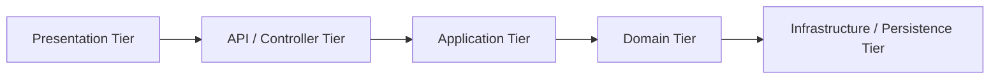
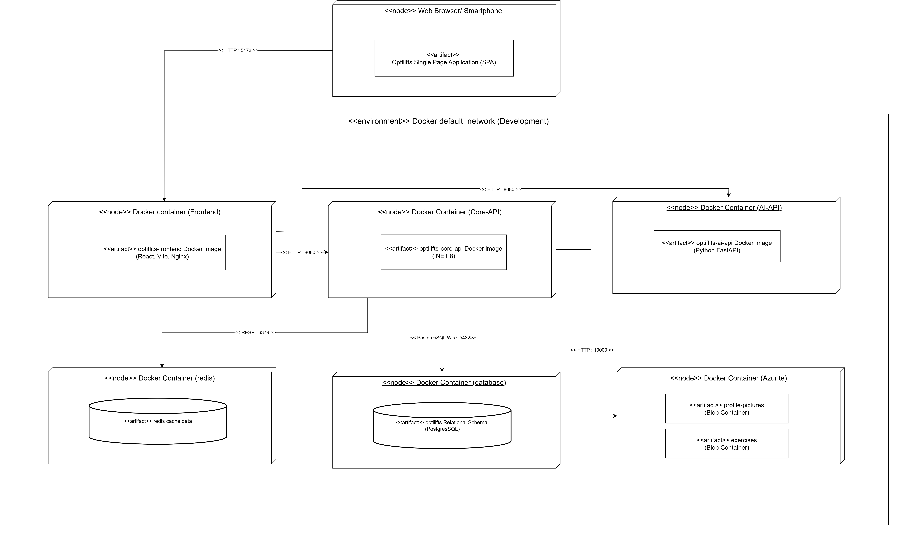
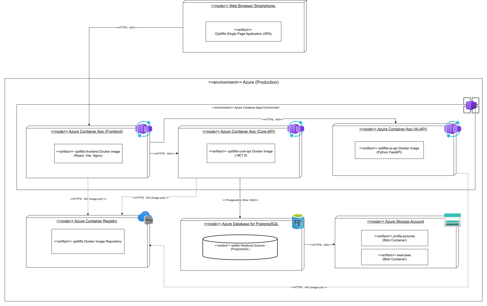
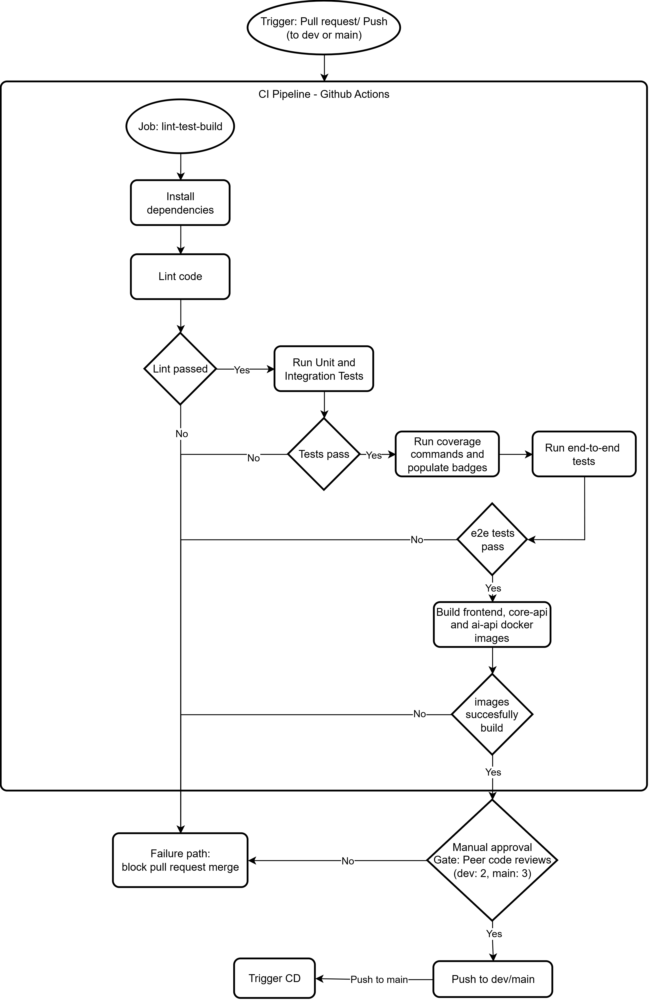
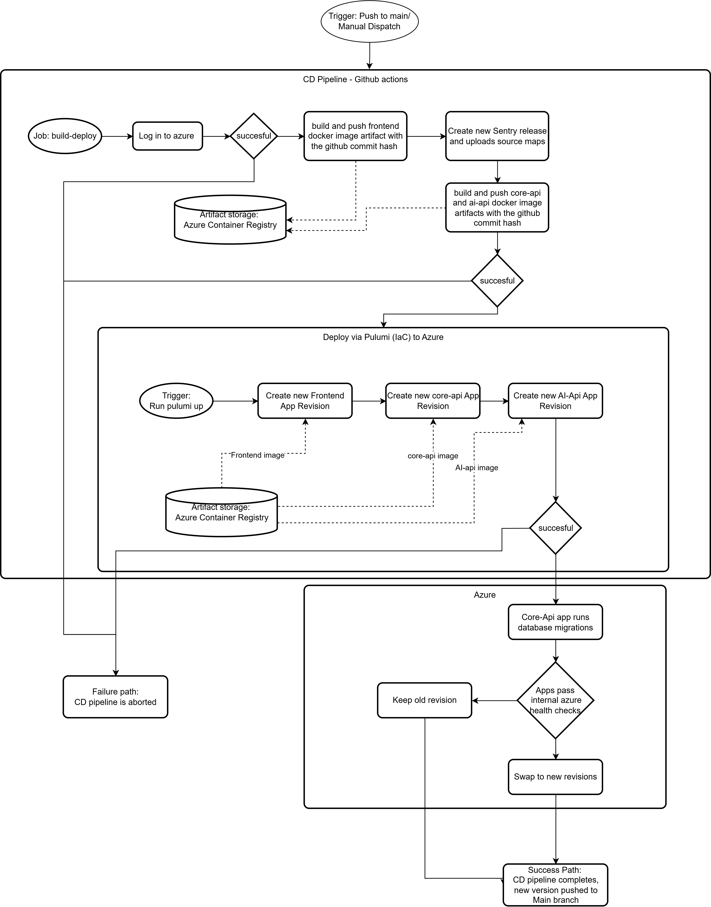

## Introduction

This document is a Software Architecture Specification for OptiLifts, a workout management platform that adapts by using the user's previous training sessions and current session in order to create curated suggestions to ensure progressive overloading takes place.

OptiLifts is composed of three independent deployable services behind a shared PostgreSQL database. They are the React singe-page frontend application, ASP.NET Core Web API which does all non-AI data functionality through CQRS-style command/query layer and a Python FastAPI which is responsible for any AI service. All containerised and hosted in Azure via Pulumi-managed infrastructure.

Whilst the SRS document explains *what* the system must do, the SAS document defines *how* the system is structured in order to satisfy those requirements.

## Index

- [Architectural Requirements](#architectural-requirements)
	- [Quality Requirements](#quality-requirements)
	- [Architectural Patterns](#architectural-patterns)
	- [Design Patterns](#design-patterns)
	- [NFR Traceability Matrix](#nfr-traceability-matrix)
	- [Constraints](#constraints)

- [Technology Requirements](#technology-requirements)
- [API Service Contracts](#api-service-contracts)
	- [Authentication and User Management](#authentication-and-user-management)
	- [Exercise Management](#exercise-management)
	- [Workouts](#workouts)
	- [Workout Exercises & Sets](#workout-exercises-and-sets)
	- [Scheduling](#scheduling)
	- [Dynamic Scheduling](#dynamic-scheduling)
	- [Google Calendar](#google-calendar)
	- [User Profile and Analytics](#user-profile-and-analytics)
- [Deployment](#deployment)
	- [Deployment Diagrams](#deployment-diagrams)
	- [CI/CD Pipeline Diagrams](#cicd-pipeline-diagrams)
	- [Rollback Strategy](#rollback-strategy)


## Architectural Requirements

### Architectural Patterns

For this project we model an explicit 5-tier architecture:

- Presentation Tier
- API / Controller Tier
- Application Tier
- Domain Tier
- Infrastructure / Persistence Tier

---

#### Application Tier vs. Domain Tier Separation

Clean Architecture strictly separates the **Application Tier** from the **Domain Tier**:

- **Domain Tier (`OptiLifts.Domain`)**: Core enterprise business logic, entities, and calculation rules. Framework-agnostic and invariant. *(Answers: "What are the core domain rules?")*
- **Application Tier (`OptiLifts.Application`)**: Use-case orchestration, CQRS command/query handling, Mediator dispatching, and infrastructure interfaces. *(Answers: "How does the system execute a user operation?")*

This separation ensures domain rules remain 100% testable in isolation, protected from framework, database, or API changes.

---

#### System Architecture Diagram



### Design Patterns

The following design patterns are applied in OptiLifts, grouped by the GoF (Gang of Four) categories: Creational, Structural, and Behavioural. Patterns planned for future implementation are listed separately.

---

#### Currently Used

##### Builder

Where: Backend - Database layer

Instead of having to setup database mapping, the Builder pattern lets the system configure each column and key step-by-step. Each call will set one rule.

```csharp
builder.HasKey(u => u.Id);
builder.Property(u => u.Email).IsRequired().HasMaxLength(255);
builder.HasIndex(u => u.Email).IsUnique();
```

---

##### Facade

Where: Backend - API layer

Controller hide the underlying complexity of endpoints. The user will simply send a request and get a response without ever getting knowledge of the handlers, database queries or validation logic that runs behind the scenes.

```csharp
[HttpPost]
public async Task<IActionResult> CreateWorkout(CreateWorkoutRequest request)
{
    var result = await _mediator.Send(command);
    return Created(..., result);
}
```

---

##### Strategy

Where: Backend - Authentication

The password hashing algorithm is defined behind an interface so we are able to swap it out in case of any vulnerabilities, without affecting other code. 

```csharp
public interface IPasswordHasher
{
    string Hash(string password);
    bool Verify(string hash, string password);
}
```

---

##### Mediator

Where: Backend - Application layer

Instead of having all different parts of the system calling on each other directly, all requests must communicate through a  central object called the mediator. Controllers have no idea which handler is processing their request and the handler has no idea which controller sent the request.

```csharp
var result = await _mediator.Send(new CreateWorkoutCommand(...));

public class CreateWorkoutHandler : IRequestHandler<CreateWorkoutCommand, CreateWorkoutResult>
```

---

##### Observer

Where: Frontend - Auth state management

One object holds the login state to know the current login status of the user. Any screen or component that needs to know whether an user is logged in or not will subscribe to the object (Observer). When an user access the screen or components, the observer will instantly notify the pages and update/rerender them.

```tsx
// One place holds the auth state
const [session, setSession] = React.useState(...)

// Any component can subscribe to it
const { isAuthenticated, user } = useAuth()
```

---

#### Patterns to Adopt

##### Decorator

This pattern could be applied to our algorithms and formulas. We have base formulas that could have additional calculations and layers which are optional to the user. An example of this is RPE. Adding RPE can just add additional calculation rather than duplicate code.

---

##### Template Method

This design pattern can be applied to any sort of component that has a simular structure to others. Our frontend has tons of components with similar use and could be templated.

---

##### Chain of Responsibility

This pattern can be used if we have a request that needs to pass through multiple independent checks before being allowed tobe processed. Stages such as authentication, authorisation, rate limiting or input sanitisation. Each check is isolated and can be reorder or adjusted in anyways, making it more loosely coupled.

---

##### State

This pattern applies wherever an object behaves differently depending on what phase it is in. In OptiLifts, our active session page can use it as you go through multiple different states whilst in a workout. For example you have busy, resting or complete. State design pattern can be used anywhere in which we need to track the user's current state in order to re-render or adapt our pages.

### NFR Traceability Matrix

| ID | Quantified requirement | Tactic in SAS | Test / tool | Target / actual |
| :--- | :--- | :--- | :--- | :--- |
| **NFR1.1** | p95 `GET /workouts` latency at 100 concurrent users < 1.5s | MediatR Caching + Asynchronous non-blocking I/O | k6 | < 1500ms / TBD |
| **NFR1.3** | < 10% average latency increase at 100 concurrent users | MediatR Caching | k6 | < 10% increase / TBD |
| **NFR2.1** | Scale from 100 to 300 users with < 10% latency decrease | Azure Container Apps with Horizontal Scaling | k6 | < 10% decrease / TBD |
| **NFR3.1** | AES-256 encryption at rest for sensitive data | EF Core Value Converters (`AesEncryptionProvider`) with a translation middleware between the database and backend | xUnit (`DatabaseEncryptionIntegrationTests`) | Test Passes / Pass |
| **NFR3.4** | Prevent unauthorized access to resources | HttpOnly JWT + Endpoint Claims Validation | xUnit (`AuthEndpointIntegrationTests`) | Test Passes / Pass |
| **NFR3.2** | Bcrypt password hashing with salt factor 12 | `BcryptPasswordHasher` algorithm | xUnit (`BcryptPasswordHasherTests`) | Test Passes / Pass |
| **NFR4.1** | CI/CD pipeline completes within 30 minutes | Pipeline setup caching and IaC Pulumi deployment in CD | GitHub Actions Logs | < 30 mins / CI(11 minutes) + CD(4 minutes) |
| **NFR4.2** | Automated line coverage of at least 80% | Extensive Testing policy | CI pipeline | ≥ 80% / 85.7% |
| **NFR5.2** | WCAG 2.1 AA Accessibility | Accessible UI Component Library & Tested Design Tokens | Google Lighthouse | ≥ 90% accessibility for all pages/ All pages are above 90% |

### Constraints

**1. Financial and Budget Constraints**
* **Zero-Cost Implementation:** The project must be designed and implemented without incurring any costs. 
* **Infrastructure Limitations:** The system architecture should consist of open-source technologies and free-tier cloud services, such as our Azure for Students sponsorship.

**2. AI Implementation Constraints**
* **Model Behavior:** The application must account for the ethical implications of AI-generated content. We must ensure the AI operates within safe boundaries and that bot content does not negatively affect the accuracy of the models or the user's physical training.

**3. Security & Regulatory Constraints**
* **Data Privacy (POPIA):** User health and fitness data must be handled responsibly and in strict compliance with privacy best practices and the POPI Act.
* **Anonymity & Encryption:** The system must implement encrypted authentication and data storage. User anonymity must be prioritized, and data obfuscation must be enforced.

**4. Deployment Constraints**
* **Deployment Methodology:** The system must be deployable via Infrastructure as Code (IaC) and a CI/CD pipeline, "Click Ops" deployment is not permitted.

## Technology Requirements

#### Frontend & Presentation Layer
| Component | Technology | Justification |
| :--- | :--- | :--- |
| **Framework** | React + React Router | Component-based structure ensures a highly responsive Single Page Application (SPA). |
| **Build Tool & PWA** | Vite + vite-plugin-pwa | Fast hot-module replacement for ease of development and built-in support for offline Progressive Web App capabilities. |
| **Design System** | Shadcn/ui + Tailwind CSS | Provides an easily customizable, and responsive UI whilst still keeping the application lightweight suporting ease of development. |

#### Core API & Application Layer
| Component | Technology | Justification |
| :--- | :--- | :--- |
| **Core Framework** | .NET ASP.NET Core | High-performance framework that handles CRUD operations well within a 2-second timeframe and utilizes robust built-in authorization mechanisms to ensure secure endpoints. |
| **Data Access** | Entity Framework (EF) Core | Object-Relational Mapper (ORM) that makes database interactions and migrations easier to manage accross the team. |
| **Architecture Pattern** | MediatR | Implements logical CQRS to decouple services, separating read queries from write commands allowing for easier backend decoupling and maintainability. |
| **Caching** | Redis | Caching ensures high-speed retrieval of session data and minimizes database hits . |

#### AI Layer
| Component | Technology | Justification |
| :--- | :--- | :--- |
| **API Framework** | Python + FastAPI | Lightweight and highly performant with extensive libararies, ideal for serving machine learning models and AI endpoints. |
| **Dynamic scheduler Engine** | Google ORTools | Provides a deterministic, light weight constraint solver solution for the dynamic scheduler and integrates with the FastAPI backend.  |


#### Persistence Layer
| Component | Technology | Justification |
| :--- | :--- | :--- |
| **Relational Database** | PostgreSQL | Open-source relational database perfectly suited for the complex, hierarchical structures of workout plans and historical logs. |
| **Object Storage** | Azure Blob Storage | Provides a scalable storage for our exercise images and profile pictures. Is included in the Azure student package ensuring zero-cost storage. |

#### Infrastructure, DevOps & CI/CD
| Component | Technology | Justification |
| :--- | :--- | :--- |
| **Cloud Hosting** | Microsoft Azure | Centralizes services under the Azure for Students tier, targeting 90%+ availability. Built in load balancing and resource allocation support the need for scalability. |
| **Infrastructure as Code** | Pulumi | Automates the provisioning and tear-down of Azure resources, ensuring a reproducible deployment environment directly improving maintainability and ease of development. |
| **CI/CD Pipeline** | GitHub Actions | Automates the testing and deployment pipelines directly from the repository. |
| **Containerization** | Docker Compose | Ensures environment parity between local development and end-to-end testing environments improving ease of development. |
| **Package Manager** | pnpm | Efficient dependency management with strong monorepo workspace support. |

#### Quality Assurance & Testing
| Testing Scope | Technologies Used |
| :--- | :--- |
| **.NET Backend** | xUnit (unit tests), Moq (interface mocking), TestContainers (shortlived PostgreSQL test containers),Respawn (Integration test database rollback) , FluentAssertions. |
| **React Frontend** | Vitest (unit testing), React Testing Library (component interactions). |
| **Python AI API** | pytest (unit tests), httpx (simulating web requests). |
| **End-to-End (E2E)** | Playwright (browser simulation) integrated with Docker Compose. |
| **Code Coverage** | Coveralls. |

# Testing Methodology

OptiLifts uses an multi-tiered testing strategy integrated into the CI/CD pipeline via GitHub Actions.

## Types of Testing

*   **Unit Testing**
*   **Integration Testing** 
*   **End-to-End (E2E) Testing** 
*   **User Acceptance Testing (UAT)** doen through iterative sprint reviews and scheduled demos with the industry client and mentors.

#### 4.3.2 Integration Strategy

We are using a**Bottom-Up Integration Strategy**. 

Testing begins at the low level modules of the architecture. specifically starting at the data access layers before moving progressively upward. By first writing integration tests for the core logic that reads, writes and persists relational workout data we ensure the foundation is solid. 

Once the persistence and data access layers are fully validated, integration testing moves up to the business logic handlers, followed by the API controllers, and ultimately concludes at the frontend presentation layer. This method allows us to catch fundamental data-handling defects early and allows the commonly used shared modules to be thoroughly tested befor they are used in higher-level logic.

# API Service Contracts

## Authentication and User Management

### POST /api/auth/register
**Service Name:** User Registration Service

**Description:**
Creates a new user account, establishes a secure session via HttpOnly cookies and returns the new user profile details.

**Inputs:**

- `displayName`: string - The user's display name.
- `email`: string - The user's email address.
- `password`: string - The user's chosen password.

**Outputs:**

- Headers:
	- Set-cookie: `access_token`
	- Set-cookie: `refresh_token`
- Body: 
	- `user`: `AuthUserDto` - The authenticated user profile.

AuthUserDto fields:

- `id`: Guid - Unique user identifier.
- `displayName`: string - User display name.
- `email`: string - User email address.
- `createdAt`: datetime - Account creation timestamp.

**Usage / Interaction Rules:**

- Clients must send a POST request to `/api/auth/register` with JSON data.
- This endpoint is anonymous and does not require an existing token.
- `email` and `password` are required; empty values return `400 Bad Request`.
- If the email already exists, the service returns `409 Conflict`.

**Example Response:**

Headers:
```
HTTP/1.1 200 OK
Set-Cookie: access_token=eyJhbG...; HttpOnly; Path=/; SameSite=Strict
Set-Cookie: refresh_token=d7f8a...; HttpOnly; Path=/; SameSite=Strict
```

Body
```json
{
	"id": "string", 
	"email": "user@example.com", 
	"displayName": "Optional Name",
	"createdAt": "2026-06-19T10:00:00Z"
}
```
---

### POST /api/auth/login
**Service Name:** User Login Service

**Description:**
Authenticates an existing user, establishes a secure session via HttpOnly cookies, and returns the user's profile details.

**Inputs:**

- `email`: string - The user's email address.
- `password`: string - The user's password.

**Outputs:**

- Headers:
	- Set-cookie: `access_token`
	- Set-cookie: `refresh_token`
- Body: 
	- `user`: `AuthUserDto` - The authenticated user profile.

AuthUserDto fields:

- `id`: Guid - Unique user identifier.
- `displayName`: string - User display name.
- `email`: string - User email address.
- `createdAt`: datetime - Account creation timestamp.

**Usage / Interaction Rules:**

- Clients must send a POST request to `/api/auth/login` with JSON data.
- This endpoint is anonymous and does not require an existing token.
- `email` and `password` are required; empty values return `400 Bad Request`.
- Invalid credentials return `401 Unauthorized`.

**Example Response:**

Headers:
```
HTTP/1.1 200 OK
Set-Cookie: access_token=eyJhbG...; HttpOnly; Path=/; SameSite=Strict
Set-Cookie: refresh_token=d7f8a...; HttpOnly; Path=/; SameSite=Strict
```

Body
```json
{
	"id": "string", 
	"email": "user@example.com", 
	"displayName": "Optional Name",
	"createdAt": "2026-06-19T10:00:00Z"
}
```

---

### POST /api/auth/google
**Service Name:** Google Authentication Service

**Description:**
Authenticates a user via Google OAuth ID token or One Tap credential. If the user account does not exist, it automatically creates a new account linked to their Google profile. If an account already exists with the same email, it links the Google account. Establishes a session via HttpOnly cookies and returns the authenticated user profile details.

**Inputs:**

- `idToken`: string | null - Google OAuth ID token (either `idToken` or `credential` is required).
- `credential`: string | null - Google One Tap / Sign-In credential token.

**Outputs:**

- Headers:
	- Set-Cookie: `access_token`
	- Set-Cookie: `refresh_token`
- Body:
	- `user`: `AuthUserDto` - The authenticated user profile.

AuthUserDto fields:

- `id`: Guid - Unique user identifier.
- `displayName`: string - User display name.
- `email`: string - User email address.
- `createdAt`: datetime - Account creation timestamp.
- `metric`: boolean - Preferred measurement unit (true for metric, false for imperial).
- `lightTheme`: boolean - Preferred UI theme (true for light theme, false for dark).

**Usage / Interaction Rules:**

- Clients must send a POST request to `/api/auth/google` with JSON data containing `idToken` or `credential`.
- This endpoint is anonymous and does not require an existing session token.
- If neither `idToken` nor `credential` is provided, the service returns `400 Bad Request` with `{ title: "ID Token is required", status: 400 }`.
- If Google token verification fails or the token is invalid, returns `401 Unauthorized` with `{ title: "Invalid Google token", detail: ..., status: 401 }`.
- Sets `access_token` and `refresh_token` as HttpOnly cookies upon success.

**Example Response:**

Headers:
```
HTTP/1.1 200 OK
Set-Cookie: access_token=eyJhbG...; HttpOnly; Path=/; SameSite=Lax
Set-Cookie: refresh_token=d7f8a...; HttpOnly; Path=/; SameSite=Lax
```

Body:
```json
{
	"id": "3fa85f64-5717-4562-b3fc-2c963f66afa6",
	"email": "user@example.com",
	"displayName": "Google User",
	"createdAt": "2026-08-18T10:00:00Z",
	"metric": true,
	"lightTheme": false
}
```

---

### GET /api/auth/me
**Service Name:** Current user service.

**Description:**
Gets the details of the currently logged in, authenticated user to hydrate the auth context.

**Inputs:**
- `access_token` cookie: string - HTTP-only cookie passed by the browser identifying the current user.

**Outputs:**

- `user`: `AuthUserDto` - The authenticated user profile.

AuthUserDto fields:

- `id`: Guid - Unique user identifier.
- `displayName`: string - User display name.
- `email`: string - User email address.
- `createdAt`: datetime - Account creation timestamp.


**Usage / Interaction Rules:**

- Clients must send a GET request to `/api/auth/me`.
- The user must have a valid access token.
- If the cookie is missing or invalid the endpoint retunrs a `401 unauthorized` error.
- A user account no longer existing returns a `404 Not Found` error. 

**Example Response:**

```json
{
    "id": "string", 
	"email": "user@example.com", 
	"displayName": "Optional Name",
	"createdAt": "2026-06-19T10:00:00Z"
}
```

---

### POST /api/auth/refresh
**Service Name:** Refresh token service. 

**Description:**
Exchanges a valid HTTP-Only refresh cookie for a new access and refresh cookie.

**Inputs:**
- `refresh_token` cookie: string - HTTP-only cookie passed by the browser.

**Outputs:**

- Headers: 
	- Set-Cookie: `access_token`
	- Set-Cookie: `refresh_token`

**Usage / Interaction Rules:**

- Clients must send a POST request to `/api/auth/refresh`.
- A missing/invalid refresh token will result in a `401 Unauthorized` response.
- If the cookie is missing or invalid the endpoint retunrs a `401 unauthorized` error.
- Should be called automatically by the frontend when normal requests encounter a `401 unauthorized`. 

**Example Response:**

Headers:
```
HTTP/1.1 200 OK
Set-Cookie: access_token=eyJhbG...; HttpOnly; Path=/; SameSite=Strict
Set-Cookie: refresh_token=d7f8a...; HttpOnly; Path=/; SameSite=Strict
```

---

### POST /api/auth/logout
**Service Name:** User logout service

**Description:**
Logs out the user and ends their session. 

**Inputs:**
- `access_token` cookie: string - HTTP-only cookie passed by the browser identifying the current user.

**Outputs:**
- 200 OK

**Usage / Interaction Rules:**

- Clients must send a POST request to `/api/auth/logout`

---

### GET /api/users/me/settings
**Service Name:** User Settings Query Service

**Description:** Retrieves all user settings for the authenticated user.

**Inputs:**
- `access_token` cookie: string - HTTP-only cookie passed by the browser identifying the current user.

**Outputs:** 
- `profile`: `ProfileDto` - The user's profile details.
- `preferences`: `PreferencesDto` - The user's application preferences.

`ProfileDto` fields:
- `displayName`: string - The user's display name.
- `bio`: string - The user's biography description.
- `sex`: string - The user's sex ("Male", "Female", "Other", or "PreferNotToSay").
- `dateOfBirth`: datetime | null - The user's birthdate.
- `weight`: double | null - The user's body weight.
- `height`: double | null - The user's height.
- `profilePictureUrl`: string | null - The storage URL of the user's uploaded profile image.

`PreferencesDto` fields:
- `theme`: string - The application UI theme ("light" or "dark").
- `units`: string - The default units of measurement ("metric" or "imperial").


**Usage / Interaction Rules:**
- Clients must send a GET request to `/api/users/me/settings`.
- The browser automatically attaches the `access_token` cookie.
- Returns `401` if the cookie is missing or invalid.
- If the user database record cannot be found, it returns `404`.

**Example Response:**
```json
{
	"profile": {
		"displayName": "Jordan",
		"bio": "Example",
		"sex": "Male",
		"dateOfBirth": "2005-11-22T00:00:00Z",
		"weight": 10.5,
		"height": 194.2,
		"profilePictureUrl": "https://storage.optilifts.com/profile-pictures/goat.jpg"
	},
	"preferences": {
		"theme": "dark",
		"units": "metric"
	}
}
```
---

### PATCH /api/users/me/profileDetails
**Service Name:** User Profile Update Service

**Description:** Updates the display name, bio, sex, birthdate, weight, and height of the authenticated user if they are changed.

**Inputs:**
- `access_token` cookie: string - HTTP-only cookie passed by the browser identifying the current user.
- `displayName`: string - The user's display name.
- `bio`: string | null - Optional biography text.
- `sex`: string | null - Optional sex designation.
- `dateOfBirth`: string | null - Optional birthdate.
- `weight`: double | null - Optional body weight.
- `height`: double | null - Optional height.

**Outputs:**
- No content on success (`204 No Content`).

**Usage / Interaction Rules:**
- Clients must send a PATCH request to `/api/users/me/profileDetails` with JSON data.
- The browser automatically attaches the `access_token` cookie.
- Returns `401` if the cookie is missing or invalid.
- Returns `404` if the user does not exist in the database.

**Example Response:**
HTTP/1.1 204 No Content

---

### PATCH /api/users/me/profilePicture
**Service Name:** Profile Picture Upload Service

**Description:** Uploads the updated user profile image.

**Inputs:**
- `profilePicture`: file - The image binary file sent as multipart form-data.
- `access_token` cookie: string - HTTP-only cookie passed by the browser identifying the current user.

**Outputs:**
- `profilePictureUrl`: string - The newly generated storage URL of the profile image.

**Usage / Interaction Rules:**
- Clients must send a PATCH request to `/api/users/me/profilePicture` with `multipart/form-data` encoding.
- The browser automatically attaches the `access_token` cookie.
- The request must contain a valid, non-empty image file. Non-image files or missing payloads return `400 Bad Request`.
- Returns `401` if the cookie is missing or invalid.

**Example Response:**
```json
{
	"profilePictureUrl": "https://storage.optilifts.com/profile-pictures/example.png"
}
```

---

### DELETE /api/users/me/deleteProfilePicture
**Service Name:** Profile Picture Removal Service

**Description:** Removes the current user's profile picture.

**Inputs:**
- `access_token` cookie: string - HTTP-only cookie passed by the browser identifying the current user.

**Outputs:**
- No content on success (`204 No Content`).

**Usage / Interaction Rules:**
- Clients must send a DELETE request to `/api/users/me/deleteProfilePicture`.
- The browser automatically attaches the `access_token` cookie.
- Returns `401` if the cookie is missing or invalid.
- Returns `404` if the user record does not exist.

**Example Response:**
HTTP/1.1 204 No Content

---

### PATCH /api/users/me/preferences
**Service Name:** User Preferences Update Service

**Description:** Updates the theme and units of the authenticated user.

**Inputs:**
- `theme`: string - The theme preference ("light" or "dark", required).
- `units`: string - The units preference ("metric" or "imperial", required).
- `access_token` cookie: string - HTTP-only cookie passed by the browser identifying the current user.

**Outputs:**
- No content on success (`204 No Content`).

**Usage / Interaction Rules:**
- Clients must send a PATCH request to `/api/users/me/preferences` with JSON data.
- The browser automatically attaches the `access_token` cookie.
- Both input fields are required; empty or missing fields return `400 Bad Request`.
- Returns `401` if the cookie is missing or invalid.

**Example Response:**
HTTP/1.1 204 No Content

---

### POST /api/users/me/updatePassword
**Service Name:** User Password Update Service

**Description:** Updates the password of the authenticated user.

**Inputs:**
- `currentPassword`: string - The user's current password (required).
- `newPassword`: string - The user's new password (required).
- `access_token` cookie: string - HTTP-only cookie passed by the browser identifying the current user.

**Outputs:**
- No content on success (`204 No Content`).

**Usage / Interaction Rules:**
- Clients must send a POST request to `/api/users/me/updatePassword` with JSON data.
- The browser automatically attaches the `access_token` cookie.
- Empty passwords return `400 Bad Request`.
- Providing an incorrect current password returns `400 Bad Request`.
- The `newPassword` must meet complexity requirements otherwise it will return `400 Bad Request`.
- Returns `401` if the cookie is missing or invalid.

**Example Response:**
HTTP/1.1 204 No Content

---

### POST /api/users/me/setPassword
**Service Name:** Set Initial User Password Service

**Description:** Sets an initial password for the authenticated user account (specifically for users who registered via third-party OAuth such as Google Sign-In and do not currently have a password set).

**Inputs:**
- `newPassword`: string - The user's new password (required).
- `access_token` cookie: string - HTTP-only cookie passed by the browser identifying the current user.

**Outputs:**
- No content on success (`204 No Content`).

**Usage / Interaction Rules:**
- Clients must send a POST request to `/api/users/me/setPassword` with JSON data.
- The browser automatically attaches the `access_token` cookie.
- Returns `401 Unauthorized` if the cookie is missing or invalid.
- Empty or whitespace `newPassword` returns `400 Bad Request`.
- The `newPassword` must meet complexity requirements (minimum 8 characters, at least one lowercase letter, one uppercase letter, one digit, and one special character); failure returns `400 Bad Request` with `{ error: "New password does not meet complexity requirements." }`.
- If the user already has a password set on their account, returns `400 Bad Request` with `{ error: "User already has a password set. Use update password instead." }`.
- If the user record cannot be found, returns `404 Not Found`.

**Example Response:**
HTTP/1.1 204 No Content

---

### DELETE /api/users/me
**Service Name:** User Account Deletion Service

**Description:** Deletes the authenticated user's account and all associated data.

**Inputs:**
- `access_token` cookie: string - HTTP-only cookie passed by the browser identifying the current user.

**Outputs:**
- No content on success (`204 No Content`).

**Usage / Interaction Rules:**
- Clients must send a DELETE request to `/api/users/me`.
- The browser automatically attaches the `access_token` cookie.
- Returns `401` if the cookie is missing or invalid.
- Returns `404` if the user record does not exist.
- Because the authentication cookies are expired by the response, the frontend will automatically redirect the user to the landing page.

**Example Response:**
HTTP/1.1 204 No Content

## Exercise Management

### POST /api/exercises/custom
**Service Name:** Custom Exercise Creation Service

**Description:**
Creates a user-defined exercise and assigns it to the authenticated user.

**Inputs:**

- `access_token` cookie: string - HTTP-only cookie passed by the browser identifying the current user.
- `name`: string - Required exercise name.
- `mechanic`: string | null - Optional exercise mechanic.
- `equipment`: string | null - Optional equipment name.
- `category`: string - Required exercise type/category (for example, `WeightReps`, `Duration`, `DistanceDuration`).
- `primaryMuscles`: array of string - Required list containing at least one primary muscle (muscle name or GUID).
- `secondaryMuscles`: array of string - Optional list of secondary muscles (muscle names or GUIDs).
- `image`: file | null - Optional exercise image file.

**Outputs:**

- `id`: Guid - The newly created exercise identifier.

**Usage / Interaction Rules:**

- Clients must send a POST request to `/api/exercises/custom` as `multipart/form-data`.
- The browser automatically attaches the `access_token` cookie.
- The endpoint returns `401 Unauthorized` if the cookie is missing or invalid.
- Invalid or unsupported exercise category/type values return `400 Bad Request`.
- Missing/unknown primary muscle values return `400 Bad Request`.

**Example Response:**

```json
{
	"id": "string"
}
```
---
### GET /api/exercises/{exerciseId}
**Service Name:** Exercise Detail Service

**Description:**
Returns full detail for an exercise. Used by the Exercise Details popup.

**Inputs:**

- `exerciseId`: Guid - the exercise to fetch (path parameter).
- `access_token` cookie: string - HTTP-only cookie for the current user.

**Outputs:**

`ExerciseDto` fields:

- `id`: Guid, `name`: string.
- `mechanic`: string | null, `equipment`: string | null.
- `category`: string - the exercise type.
- `primaryMuscles`: array of string, `secondaryMuscles`: array of string.
- `isCustom`: boolean, `imageUrl`: string | null.

**Usage / Interaction Rules:**

- Clients must send a GET request to `/api/exercises/{exerciseId}` with the `access_token` cookie attached.
- Returns `401` if the cookie is missing or invalid.
- Returns `404` if exercise doesn't exist or soft-deleted exercise doesn't belong to the user.

**Example Response:**
```json
{
	"id": "string",
	"name": "Barbell Bench Press",
	"mechanic": "compound",
	"equipment": "Barbell",
	"category": "WeightReps",
	"primaryMuscles": ["Chest"],
	"secondaryMuscles": ["Triceps", "Shoulders"],
	"isCustom": false,
	"imageUrl": "http://127.0.0.1:10000/devstoreaccount1/exercises/bench-press.png"
}
```
---


### PUT /api/exercises/custom/{exerciseId}
**Service Name:** Custom Exercise Update Service

**Description:**
Updates an existing custom exercise owned by an user. But only updates exercises that names or images changes. Structural changes do soft-deletes and new creations.

**Inputs:**

- `exerciseId`: Guid - the custom exercise to update (path parameter).
- `Name`: string - the exercise name (required, non-blank).
- `Image`: file | null - optional replacement image.
- `RemoveImage`: boolean - if true, clears the existing image.
- `access_token` cookie: string - HTTP-only cookie for the current user.

**Outputs:**

- `204 No Content` on success.
- `400 Bad Request` with `error` if `Name` is blank.
- `404 Not Found` if the exercise doesn't exist or isn't owned by the user or was already been deleted.

**Usage / Interaction Rules:**

- Clients must send a PUT request to `/api/exercises/custom/{exerciseId}` as `multipart/form-data`.
- Only custom exercises owned by this user can use this service, trying to delete built-in exercises will return `404`.
- If `Image` is supplied, it replaces the stored blob. 
- If `RemoveImage` is true, the blob is deleted and `imageUrl` is cleared.
- Returns `401` if the cookie is missing or invalid.


**Example Response:**
HTTP/1.1 204 No Content

---

### DELETE /api/exercises/custom/{exerciseId}
**Service Name:** Custom Exercise Deletion Service

**Description:**
Soft-deletes a user's custom exercise. Used by the Delete button in the Exercise Details popup. Done for any structural changes to the exercise.

**Inputs:**

- `exerciseId`: Guid - the custom exercise to delete (path parameter).
- `access_token` cookie: string - HTTP-only cookie for the current user.

**Outputs:**

- `204 No Content` for success.
- `404 Not Found` if the exercise doesn't exist or isn't owned by the user or has already been deleted.
- `409 Conflict` with `{ "error": "..." }` if deletion is blocked.

**Usage / Interaction Rules:**

- Clients must send a DELETE request to `/api/exercises/custom/{exerciseId}` with the `access_token` cookie attached.
- The exercise is marked `IsDeleted` and doesn't remove it from the database so `WorkoutLogs` still keep it's history.
- Once deleted, the exercise won't appear in `GET /api/exercises` 
- `GET /api/exercises/{exerciseId}` returns `404` for it's `exerciseId`.
- Returns `401` if the cookie is missing or invalid.


**Example Response:**
HTTP/1.1 204 No Content
---


### GET /api/exercises
**Service Name:** Exercise Catalog Service

**Description:**
Returns the authenticated user's exercise catalog, including built-in and custom exercises.

**Inputs:**

- `search`: string | null - Optional text search filter.
- `muscle`: string | null - Optional primary muscle filter.
- `equipment`: string | null - Optional equipment filter.
- `access_token` cookie: string - HTTP-only cookie passed by the browser identifying the current user.

**Outputs:**

- Array of `ExerciseDto` - The list of exercises available to the user.

ExerciseDto fields:

- `id`: Guid - Unique exercise identifier.
- `name`: string - Exercise name.
- `mechanic`: string | null - Exercise mechanic, if defined.
- `equipment`: string | null - Equipment required, if defined.
- `category`: string - Exercise category.
- `primaryMuscles`: array of string - Primary muscles trained.
- `secondaryMuscles`: array of string - Secondary muscles assisted.
- `isCustom`: boolean - Indicates whether the exercise was created by the user.
- `imageUrl`: string | null - URL of the exercise image if present.

**Usage / Interaction Rules:**

- Clients must send a GET request to `/api/exercises`.
- The browser automatically attaches the `access_token` cookie.
- The endpoint is authenticated and returns `401 Unauthorized` if the cookie is missing or invalid.
- The response is a JSON array of exercise objects (not a paginated wrapper object).

**Example Response:**

```json
[
	{
		"id": "string",
		"name": "Bench Press",
		"mechanic": "Compound",
		"equipment": "Barbell",
		"category": "WeightReps",
		"primaryMuscles": ["Chest"],
		"secondaryMuscles": ["Triceps", "Front Delts"],
		"isCustom": false,
		"imageUrl": "https://storage.optilifts.com/exercises/bench-press.png"
	}
]
```

---

### POST /api/exercises/images
**Service Name:** Exercise Images Service

**Description:** Retrieves a dictionary mapping exercise names to their corresponding Azure Blob Storage image URLs. 

**Inputs:**
- `access_token` cookie: string - HTTP-only cookie passed by the browser identifying the current user.
- `exerciseIds`: array of GUIDs - A list of exercise ids to fetch images.

**Outputs:**
- A JSON dictionary (`Record<string, string>`) where:
  - Key: string - The exercise id.
  - Value: string - The image URL in the database.

**Usage / Interaction Rules:**
- Clients must send a POST request to `/api/exercises/images`.
- The browser automatically attaches the `access_token` cookie.
- The endpoint is authenticated and returns `401 Unauthorized` if the cookie is missing or invalid.

**Example Response:**
```json
{
	"Bench Press": "http://127.0.0.1:10000/devstoreaccount1/exercises/bench-press.png",
	"Squat": "http://127.0.0.1:10000/devstoreaccount1/exercises/squat.png",
	"Deadlift": "http://127.0.0.1:10000/devstoreaccount1/exercises/deadlift.png"
}
```
---

## Workouts

### GET /api/workouts
**Service Name:** Workout List Service

**Description:**
Returns the authenticated user's workouts as summary cards.

**Inputs:**

- None in the request body.
- `access_token` cookie: string - HTTP-only cookie passed by the browser identifying the current user.

**Outputs:**

- `workouts`: array of `WorkoutCardDto` - The list of workout summaries.

WorkoutCardDto fields:

- `id`: Guid - Unique workout identifier.
- `name`: string - Workout name.
- `primaryMuscleGroups`: array of string - Main muscle groups used by the workout.
- `exerciseCount`: integer - Number of exercises in the workout.
- `exercisePreview`: array of string - Short preview of exercise names.
- `createdAt`: datetime - When the workout was created.

**Usage / Interaction Rules:**

- Clients must send a GET request to `/api/workouts`
- The browser automatically attaches the `access_token` cookie.
- The endpoint is authenticated and returns `401 Unauthorized` if the cookie is missing or invalid.
- The response is a JSON object containing a `workouts` array of workout summary objects.

**Example Response:**

```json
{
	"workouts": [
		{
			"id": "string",
			"name": "string",
			"folder": "string",
			"estimatedTimeMinutes": 30,
			"exercises": [
				{ "id": "string", "name": "string", "sets": 3, "reps": 8 }
			]
		}
	],
	"total": 0,
	"page": 1,
	"limit": 25
}
```
---

### POST /api/workouts
**Service Name:** Workout Creation Service

**Description:**
Creates a new workout for the user which including its exercises, sets, and groupings. This is what the Create Workout page uses when you click *Save Workout*.

**Inputs:**

- `folderId`: Guid | null - Optional folder to put the workout in.
- `name`: string - Workout name.
- `exercises`: array of `CreateWorkoutExerciseRequest` - `exerciseId` (Guid), `orderIndex` (int), `groupKey` (string, null if not grouped), `sets` (array of `CreateWorkoutSetRequest`: `type`, `reps`, `weight`, `duration`, `distance`, `orderIndex`, `restTime`).
- `groups`: array of `CreateWorkoutGroupRequest` - `groupKey` (string), `type` (`Superset` | `Circuit`), `restTime` (int, seconds).
- `access_token` cookie: string - HTTP-only cookie for the current user.

**Outputs:**

- `201 Created` with `CreateWorkoutResult` - `workoutId`, `name`, `folderId`, `createdAt`.
- `400 Bad Request` with an `errors` array if validation fails. Examples of this are duplicate group key, invalid group type, a superset that doesn't have exactly two members and negative rest time.

**Usage / Interaction Rules:**

- Clients must send a POST request to `/api/workouts` with JSON data and the `access_token` cookie attached.
- Validation is done by `CreateWorkoutValidator` before the workout is created.
- Returns `401` if cookie is missing or invalid.
- On success, the `Location` header points to `GET /api/workouts`.

**Example Response:**
```json
{
	"workoutId": "string",
	"name": "Push Day A",
	"folderId": null,
	"createdAt": "2026-07-16T10:00:00Z"
}
```
---

### GET /api/workouts/{workoutId}
**Service Name:** Workout Detail Service

**Description:**
Returns full details of a workout that is owned by an user. This includes everything to do with the set such as exercises, sets and groupings. This is used for both the Edit Workout page and the Active Session Page when loading a workout.

**Inputs:**

- `workoutId`: Guid - The workout to fetch (path parameter).
- `access_token`: cookie: string - HTTP-only cookie for the current user.

**Outputs:**

WorkoutDetailDto fields:

- `id`: Guid, `name`: string, `folderId`: Guid | null, `dayIndex`: int | null, `createdAt`: datetime.
- `primaryMuscleGroups`: array of string, `exercisePreview`: array of string.
- `exercises`: array of `WorkoutExerciseDetailDto` - `id`, `exerciseId`, `name`, `primaryMuscle`, `exerciseType`, `orderIndex`, `sets` (array of `WorkoutSetDto`), `groupId`, `groupType`, `groupRestTime`, `imageUrl`.


**Usage / Interaction Rules:**

- Clients must send a GET request to `/api/workouts/{workoutId}` with the `access_token` cookie attached.
- Returns `401` if the cookie is missing or invalid.
- Returns `404` if the workout does not exist or is not owned by the user.


**Example Response:**

```json
{
	"id": "string",
	"name": "My Push Day",
	"folderId": null,
	"dayIndex": null,
	"createdAt": "2026-07-16T10:00:00Z",
	"primaryMuscleGroups": ["Chest", "Quadriceps"],
	"exercisePreview": ["Barbell bench press", "Barbell Back Squat"],
	"exercises": [
		{
			"id": "string",
			"exerciseId": "string",
			"name": "Barbell bench press",
			"primaryMuscle": "Chest",
			"exerciseType": "WeightReps",
			"orderIndex": 0,
			"sets": [
				{ "id": "string", "type": "Normal", "reps": 6, "weight": 80, "duration": null, "distance": null, "orderIndex": 0, "restTime": 60 }
			],
			"groupId": null,
			"groupType": null,
			"groupRestTime": null,
			"imageUrl": null
		}
	]
}

```
---

### DELETE /api/workouts/{workoutId}
**Service Name:** Workout Deletion Service

**Description:**
Deletes an existing workout owned by the authenticated user

**Inputs:**
- `workoutId`: Guid - the workout to delete
- `access_token` cookie: string - HTTP-only cookie for current user

**Outputs:**
- `200 OK` on success
- Returns `404` if the workout does not exist or is not owned by the user

**Usage / Interaction Rules:**
- Clients must send a DELETE request to `/api/workouts/{workoutId}`
- The browser automatically attaches the `access_token` cookie
- Returns `401` if the cookie is missing or it is invalid

**Example Response:**
```json
{
	"message": "Workout deleted successfully."
}
```
---

### POST /api/workouts/{workoutId}/exercises
**Service Name:** Workout Exercise Assignment Service

**Description:**
Adds an existing exercise to a specific workout owned by the authenticated user.

**Inputs:**

- `workoutId`: Guid - The workout to update (path parameter).
- `exerciseId`: Guid - The exercise to add to the workout (request body).
- Authentication token: string - Bearer token identifying the current user.

**Outputs:**

- No content on success.
- `404` response if the workout or exercise cannot be added.

**Usage / Interaction Rules:**

- Clients must send a POST request to `/api/workouts/{workoutId}/exercises` with JSON data and a valid Bearer token.
- The endpoint is authenticated and returns `401` if the user cannot be identified from the token.
- The request body must contain a valid `exerciseId` value.
- A successful add returns `204 No Content`; a failed add returns `404 Not Found`.

**Example Response:**
HTTP/1.1 204 No Content

---

### PUT /api/workouts/{workoutId}/exercises/{exerciseId}
**Service Name:** Workout Exercise Replacement Service

**Description:**
Replaces an exercise within a specific workout owned by the authenticated user with a different exercise, updating every matching template row in that workout.

**Inputs:**

- `workoutId`: Guid - The workout containing the exercise to replace (path parameter).
- `exerciseId`: Guid - The exercise being replaced (path parameter).
- `newExerciseId`: Guid - The exercise to replace it with (request body).
- `access_token` cookie: string - HTTP-only cookie for the current user.

**Outputs:**

- No content on success.
- `404` response if the workout is not owned by the user, the new exercise does not exist, or the exercise being replaced is not present in that workout.

**Usage / Interaction Rules:**

- Clients must send a PUT request to `/api/workouts/{workoutId}/exercises/{exerciseId}` with JSON data.
- The browser automatically attaches the `access_token` cookie.
- Returns `401` if the cookie is missing or invalid.
- A successful replacement returns `204 No Content`; a failed replacement returns `404 Not Found`.

**Example Response:**
HTTP/1.1 204 No Content

---

### POST /api/workouts/{workoutId}/duplicate
**Service Name:** Workout Duplication Service

**Description:**
Creates a duplicate of an existing workout owned by the authenticated user

**Inputs:**
- `workoutId`: Guid - the workout to duplicate
- `access_token` cookie: string - HTTP-only cookie for current user

**Outputs:**
- `workout`: `DuplicateWorkoutResult` - the duplicated workout summary

`DuplicateWorkoutResult` fields:
- `workoutId`: Guid - Newly created duplicated workout identifier.
- `name`: string - Workout name.
- `folderId`: Guid | null - Folder identifier, if any.
- `createdAt`: datetime - Creation timestamp.

**Usage / Interaction Rules:**
- Clients must send a POST request to `/api/workouts/{workoutId}/duplicate`
- The browser automatically attaches the `access_token` cookie
- Returns `401` if the cookie is missing or it is invalid
- Returns `404` if the workout does not exist or is not owned by the user

**Example Response:**
```json
{
	"workout": {
		"workoutId": "string",
		"name": "Push Day Copy",
		"folderId": "string",
		"createdAt": "2026-07-16T10:00:00Z"
	}
}
```

---

### PUT /api/workouts/{workoutId}
**Service Name:** Workout Update Service

**Description:**
Updates an existing workout owned by the authenticated user

**Inputs:**
- `workoutId`: Guid - the workout to update
- `folderId`: Guid | null - Optional folder identifier
- `name`: string - workout name
- `exercises`: array of workout exercise objects - The updated exercise list
- `groups`: array of workout group objects | null - Optional grouped exercise structure
- `access_token` cookie: string - HTTP-only cookie for current user

**Outputs:**
- No content on success
- Returns `404` if the workout does not exist or is not owned by the user

**Usage / Interaction Rules:**
- Clients must send a PUT request to `/api/workouts/{workoutId}` with JSON data
- The browser automatically attaches the `access_token` cookie
- Returns `401` if the cookie is missing or it is invalid

**Example Response:**
```http
HTTP/1.1 200 OK
```

---

## Workout Exercises and Sets

### GET /api/workouts/{workoutId}/logs/{logId}
**Service Name:** Workout Log Detail Service

**Description:**
Returns full detail of a completed WorkoutLog. Used by the Workout Log Detail page and the Profile page's recent workouts view.

**Inputs:**

- `workoutId`, `logId`: Guid - path parameters.
- `access_token` cookie: string - HTTP-only cookie for the current user.

**Outputs:**

`WorkoutLogDetailDto` fields:

- `workoutId`, `logId`: Guid, `name`: string, `folderId`: Guid | null, `dayIndex`: int | null.
- `createdAt`: datetime, `startedAt`: datetime, `completedAt`: datetime | null, `duration`: string | null.
- `primaryMuscleGroups`: array of string, `exercisePreview`: array of string.
- `exercises`: array of `WorkoutLogExerciseDetailDto` - `id`, `exerciseId`, `name`, `primaryMuscle`, `exerciseType`, `orderIndex`, `imageUrl`, `sets` (array of `WorkoutLogSetDto`: `id`, `setId`, `type`, `reps`, `weight`, `orderIndex`, `duration`, `distance`, `restTime`, `groupNumber`, `rpe`).

**Usage / Interaction Rules:**

- Clients must send a GET request to `/api/workouts/{workoutId}/logs/{logId}` with the `access_token` cookie attached.
- Returns `401` if the cookie is missing or invalid.
- Returns `404` if there is no log linked to the `logId` or it doesn't belong to user.

**Example Response:**
```json
{
	"workoutId": "string",
	"logId": "string",
	"name": "Push Day A",
	"folderId": null,
	"dayIndex": null,
	"createdAt": "2026-07-16T10:00:00Z",
	"startedAt": "2026-07-16T09:39:00Z",
	"completedAt": "2026-07-16T11:02:00Z",
	"duration": "1h 23m",
	"primaryMuscleGroups": ["Chest", "Quadriceps"],
	"exercisePreview": ["Barbell bench press", "Barbell Back Squat"],
	"exercises": [
		{
			"id": "string",
			"exerciseId": "string",
			"name": "Barbell bench press",
			"primaryMuscle": "Chest",
			"exerciseType": "WeightReps",
			"orderIndex": 0,
			"imageUrl": null,
			"sets": [
				{ 
					"id": "string", "setId": "string", "type": "Normal", "reps": 10, "weight": 85, "orderIndex": 0, "duration": null, "distance": null, "restTime": 60, "groupNumber": 0, "rpe": 9 
				}
			]
		}
	]
}
```
---

### POST /api/workouts/{workoutId}/logs
**Service Name:** WorkoutLog Creation Service 

**Description:**
Creates a completed workout log entry. This when the user hits **Finish** on the active session page. It is idempotent by `logId`meaning it is safe to retry after reconnecting after being offline (retries using the offline queue). 

**Inputs:**

- `workoutId`: Guid - the workout being logged (path parameter).
- `logId`: Guid - Identifier for this specific log
- `entryId`: Guid | null - a scheduled entry this session fulfils. If session started ad-hoc then will create a new identifier.
- `notes`: string | null.
- `startedAt` / `completedAt`: datetime.
- `exercises`: array of `CreateWorkoutLogExerciseReq` - `exerciseId`, `workoutExerciseId` (null for exercises added in the session), `orderIndex`, `groupNumber`, `sets` (array of `CreateWorkoutLogSetReq`: `setId`, `type`, `reps`, `weight`, `duration`, `distance`, `restTime`, `rpe`, `orderIndex`, `groupNumber`). Only sets that you checkmark as done are included.
- `access_token` cookie: string - HTTP-only cookie for the current user.

**Outputs:**

- `201 Created` with a `CreateWorkoutLogRes` (`logId`, `entryId`, `alreadyExisted: false`) on first submission.
- `200 OK` with the same shape and `alreadyExisted: true` if this `logId` was already submitted - the original log is returned unchanged, nothing is duplicated.
- `404` if the workout is not found or owned by an user, or if the `entryId` doesn't belong to this user and workout.

**Usage / Interaction Rules:**

- Clients must send a POST request to `/api/workouts/{workoutId}/logs` with the `access_token` cookie attached.
- If `entryId` isn't included (in the cases of ad-hoc workouts)a new `ScheduledEntry` is created and marked `Completed`.
- If `entryId` is included, that existing scheduled entry is marked `Completed`.
- Returns `401` if the cookie is missing or invalid.

**Example Response:**
```json
{
	"logId": "string",
	"entryId": "string",
	"alreadyExisted": false
}
```
---

### PUT /api/workouts/{workoutId}/logs/{logId}
**Service Name:** WorkoutLog Update Service

**Description:**
Updates an existing completed workout log entry. Used when editing a completed past workout from the workout log detail page or past workouts page. Re-evaluates exercise personal records (PRs) based on updated sets.

**Inputs:**

- `workoutId`, `logId`: Guid - path parameters.
- `notes`: string | null - optional notes for the workout log.
- `startedAt` / `completedAt`: datetime | null - optional updated start and completion timestamps.
- `exercises`: array of `UpdateWorkoutLogExerciseReq` - `exerciseId`, `workoutExerciseId` (null for exercises added in editing), `orderIndex`, `groupNumber`, `sets` (array of `UpdateWorkoutLogSetReq`: `setId`, `type`, `reps`, `weight`, `duration`, `distance`, `restTime`, `rpe`, `orderIndex`, `groupNumber`).
- `access_token` cookie: string - HTTP-only cookie for the current user.

**Outputs:**

- `200 OK` with `{ "message": "Workout log updated successfully." }`.
- `404 Not Found` if the workout log is not found or not owned by the user.
- `401 Unauthorized` if the cookie is missing or invalid.

**Usage / Interaction Rules:**

- Clients must send a PUT request to `/api/workouts/{workoutId}/logs/{logId}` with JSON data and the `access_token` cookie attached.
- Replaces existing logged sets and exercises for the specified `logId` and updates corresponding exercise PRs.

**Example Request:**
```json
{
	"notes": "Updated notes",
	"startedAt": "2026-08-10T10:00:00Z",
	"completedAt": "2026-08-10T11:15:00Z",
	"exercises": [
		{
			"exerciseId": "3fa85f64-5717-4562-b3fc-2c963f66afa6",
			"workoutExerciseId": null,
			"orderIndex": 1,
			"groupNumber": 0,
			"sets": [
				{
					"setId": null,
					"type": "Normal",
					"reps": 10,
					"weight": 100,
					"duration": null,
					"distance": null,
					"restTime": 90,
					"rpe": 8,
					"orderIndex": 1,
					"groupNumber": 0
				}
			]
		}
	]
}
```

**Example Response:**
```json
{
	"message": "Workout log updated successfully."
}
```
---

## Training

### GET /api/training/plateau-page
**Service Name:** Plateau & Regression Diagnosis Service

**Description:**
Returns the authenticated user's exercises currently showing a Plateau, Regressing, or Progressing trend within the last 30 days, each with a recommendation, whether the exercise is eligible to be swapped, and which of the user's current workouts contain it.

**Inputs:**

- `access_token` cookie: string - HTTP-only cookie for the current user.

**Outputs:**

- Body: array of `ExerciseDiagnosisDto`.

`ExerciseDiagnosisDto` fields:

- `exerciseId`: Guid - Exercise identifier.
- `exerciseName`: string - Exercise name.
- `muscleGroup`: string - Primary muscle group.
- `status`: string enum (`Progressing` | `Regressing` | `Plateau`) - Current trend classification.
- `slopePctPerWeek`: number - Estimated 1RM trend, percent change per week.
- `recommendation`: string | null - Suggested next step, or `null` when progressing normally.
- `canSwapExercise`: boolean - Whether the exercise is eligible for a swap suggestion.
- `computedAt`: datetime - When the trend was last computed.
- `workouts`: array of `WorkoutRefDto` - The user's current workouts containing this exercise.

`WorkoutRefDto` fields:

- `workoutId`: Guid - Workout identifier.
- `workoutName`: string - Workout name.

**Usage / Interaction Rules:**

- Clients must send a GET request to `/api/training/plateau-page`.
- The browser automatically attaches the `access_token` cookie.
- Returns `401` if the cookie is missing or invalid.
- Returns an empty array if the user has no exercises with enough recent training data.

**Example Response:**
```json
[
	{
		"exerciseId": "string",
		"exerciseName": "Barbell Bench Press",
		"muscleGroup": "Chest",
		"status": "Plateau",
		"slopePctPerWeek": 0.0,
		"recommendation": "Only your progress is stalling. Try changing this exercise or adjusting your rep range for a change of stimulus",
		"canSwapExercise": true,
		"computedAt": "2026-09-02T09:00:00Z",
		"workouts": [
			{ "workoutId": "string", "workoutName": "Push Day" }
		]
	}
]
```
---

## Scheduling

### GET /api/users/me/schedule
**Service Name:** User Schedule Query Service

**Description:**
Returns the user's scheduled workout entries between a date range

**Inputs:**
- `startDate`: datetime | null - Optional start of schedule range
- `endDate`: datetime | null - Optional end of the schedule range
- `status`: string | null - Optional schedule status filter
- `access_token` cookie: string - HTTP-only cookie for current user

**Outputs:**
- `schedule`: array of `ScheduledEntryDto` - The user's scheduled workout entries:
    - `id`: Guid - Scheduled entry identifier
    - `workoutId`: Guid - Linked workout identifier
    - `workoutName`: string - Workout name
    - `scheduled`: datetime - Scheduled date and time
    - `status`: string - Entry status
    - `primaryMuscleGroups`: array of string - Primary muscle groups
    - `exerciseCount`: integer - Number of exercises in the workout
    - `exercisePreview`: array of string - Preview of exercise names
    - `totalVolume`: float - Total volume for the workout
    - `totalSets`: integer Total
	- `startedAt`: datetime | null - Start timestamp if session has started
	- `completedAt`: datetime | null - Completion timestamp is the session has been finished
	- `recordCount`: integer | null - Number of personal records for the session
	- `logId`: Guid | null - Linked workout log identifer

**Usage / Interaction Rules:**
- Clients must send a GET request to `/api/users/me/schedule`
- The browser automatically attaches the `access_token` cookie
- Returns `401` if the cookie is missing or it is invalid

**Example Response:**

```json
{
    "schedule": [
		{
			"id": "string",
			"workoutId": "string",
			"workoutName": "Push Day",
			"scheduled": "2026-07-16T10:00:00Z",
			"status": "Scheduled",
			"primaryMuscleGroups": ["Chest", "Triceps"],
			"exerciseCount": 5,
			"exercisePreview": ["Bench Press", "Incline Press"],
			"totalVolume": 10250,
			"totalSets": 18,
			"startedAt": null,
			"completedAt": null,
			"recordCount": 0,
			"logId": null
		}
	]
}
```

---

### GET /api/users/me/schedule/analytics
**Service Name:** Schedule Analytics Query Service

**Description:**
Returns summary analytics for the user's scheduled workouts over a date range

**Inputs:**
- `startsDate`: datetime | null - Optional start of analytics range
- `endDate`: datetime | null - Optional end of the analytics range
- `status`: string | null - Optional schedule status filtering
- `access_token` cookie: string - HTTP-only cookie for current user 

**Outputs:**
- `analytics`: `ScheduleAnalyticsDto` - Summary analytics for the filtered schedule

`ScheduleAnalyticsDto` fields:
- `totalWorkouts`: integer - Total number of workouts in the result set.
- `totalVolume`: float - Total training volume.
- `totalSets`: integer - Total number of sets.
- `muscleDistribution`: array of `MuscleDistributionDto` - Muscle group breakdown.

`MuscleDistributionDto` fields:
- `muscleGroup`: string - Muscle group name.
- `setCount`: integer - Number of sets for the muscle group.
- `percentage`: float - Percentage share of total sets.

**Usage / Interaction Rules:**
- Client must send GET request to `/api/users/me/schedule/analytics`
- The browser automatically attaches the `access_token` cookie
- Returns `401` if the cookie is missing or it is invalid

**Example Response:**
```json
{
	"analytics": {
		"totalWorkouts": 12,
		"totalVolume": 45230,
		"totalSets": 188,
		"muscleDistribution": [
			{
				"muscleGroup": "Chest",
				"setCount": 42,
				"percentage": 22.3
			}
		]
	}
}
```

---

### POST /api/users/me/schedule/sessions
**Service Name:** Scheduled Session Creation Service

**Description:**
Creates a scheduled workout session for the authenticated user

**Inputs:**
- `workoutId`: Guid - The workout to schedule
- `scheduledAt`: datetime - The scheduled date for the session
- `status`: string - The initial schedule status
- `repeat`: string | null - Optional repeat field
- `interval`: integer | null - Optional repeat interval
- `until`: datetime | null - Optional repeat end date
- `access_token` cookie: string - HTTP-only cookie for current user 

**Outputs:**
- `session`: `CreateScheduledSessionResult` - The created scheduled session

`CreateScheduledSessionResult` fields:
- `id`: Guid - Scheduled session identifier.
- `workoutId`: Guid - Linked workout identifier.
- `scheduledAt`: datetime - Scheduled date and time.
- `status`: string - Session status.

**Usage / Interaction Rules:**
- Clients must send a POST request to `/api/users/me/schedule/sessions` with JSON data
- The browser automatically attaches the `access_token` cookie
- Returns `401` if the cookie is missing or it is invalid
- Returns `404` if the workout does not exist or is not owned by the user

**Example Response:**
```json
{
	"session": {
		"id": "string",
		"workoutId": "string",
		"scheduledAt": "2026-07-16T10:00:00Z",
		"status": "Scheduled"
	}
}
```

---

### DELETE /api/users/me/schedule/sessions/{sessionId}
**Service Name:** Scheduled Session Removal Service

**Description:**
Deletes a scheduled workout session for the authenticated user

**Inputs:**
- `sessionId`: Guid - The scheduled workout session to delete
- `access_token` cookie: string - HTTP-only cookie for current user

**Outputs:**
- No content on success
- Returns `404` if the workout does not exist or is not owned by the user

**Usage / Interaction Rules:**
- Clients must send a DELETE request to `/api/users/me/schedule/sessions/{sessionId}`
- The browser automatically attaches the `access_token` cookie
- Returns `401` if the cookie is missing or it is invalid

**Example Response:**
```http
HTTP/1.1 204 No Content
```

---

### PATCH /api/users/me/schedule/sessions/{sessionId}
**Service Name:** Scheduled Session Status Update Service

**Description:**
Update the status of an existing scheduled workout session

**Inputs:**
- `sessionId`: Guid - the scheduled session to update
- `status`: string - The new schedule status
- `access_token` cookie: string - HTTP-only cookie for current user

**Outputs:**
- `session`: `UpdateScheduledSessionStatusResult` - The updated scheduled session
`UpdateScheduledSessionStatusResult` fields:
- `id`: Guid - Scheduled session identifier.
- `workoutId`: Guid - Linked workout identifier.
- `scheduledAt`: datetime - Scheduled date and time.
- `status`: string - Updated session status.

**Usage / Interaction Rules:**
- Clients must send a PATCH request to `/api/users/me/schedule/sessions/{sessionId}` with JSON data
- The browser automatically attaches the `access_token` cookie
- Returns `401` if the cookie is missing or it is invalid
- Returns `404` if the workout does not exist or is not owned by the user

**Example Response:**
```json
{
	"session": {
		"id": "string",
		"workoutId": "string",
		"scheduledAt": "2026-07-16T10:00:00Z",
		"status": "Completed"
	}
}
```
---
### POST /api/users/me/schedule/missed
**Service Name:** Missed Sessions Status Update Service

**Description:**
Evaluates all past scheduled entries of the user that are still marked as `Scheduled`, and makes their status `Missed`

**Inputs:**
- `access_token` cookie: string - HTTP-only cookie for current user

**Outputs:**
- `updatedCount`: integer - number of scheduled workout entries whose status was updated to be Missed

**Usage/Interaction Rules:**
- Clients must send a POST request to `/api/users/me/schedule/missed`
- The browser automatically attaches the `access_token` cookie
- Returns `401 Unauthorised` if the cookie is missing or it is invalid

**Example Response:**
```json
{
	"updatedCount": 2
}
```

---

## Dynamic Scheduling

### POST /ai-api/reschedule 
**Service Name:** Dynamic AI schedular service

**Description:** 
Evaluates a list of missed and scheduled workouts and calculates an optimal new schedule with cascading two-tier system. Tier 1 is a fasth path single workout shifter and tier 2 is a OR-Tools constraint solver for multiple workouts. 

**Inputs:**
- `user_id`: string - Unique identifier for the user.
- `planning_window_start`: datetime - The start of the scheduling window.
- `planning_window_end`: datetime - The end of the scheduling window.
- `preferences`: object - The user's scheduling constraints.
- `max_workouts_per_day`: integer - Maximum allowed workouts on a single day.
- `min_muscle_rest_hours`: integer - Minimum rest hours required between workouts targeting the same primary muscles.
- `fixed_rest_days`: string array - Days of the week (e.g. ["Sunday"]) where no workouts can be scheduled.

**Outputs:**
- `user_id`: string - The user's identifier.
- `execution_tier`: string - Indicates which solver handled the request ("Tier1_FastPath" or "Tier2_CPSAT").
- `execution_time_ms`: integer - The compute time taken by the solver in milliseconds.
- `rescheduled_entries`: entry array - Workouts that were successfully assigned new dates.
- `entry_id`: string - The unique entry identifier.
- `workout_id`: string - The workout identifier.
- `workout_name`: string - The workout name.
- `original_scheduled_at`: datetime - The original scheduled date.
- `new_scheduled_at`: datetime - The newly scheduled date.
- `action`: string - The action performed (e.g., "Shifted").
- `dropped_entries`: entity array - Workouts that could not be scheduled due to mathematically infeasible constraints.

**Usage/Interaction Rules:**
- Clients must send a POST request to /ai-api/reschedule with JSON data.
- If constraints make the schedule mathematically impossible (e.g. 4 workouts with 48-hour rest gaps within 3 days), the service returns the "Failed" execution tier and populates the dropped_entries array.
- Missing required fields will return a `422` Unprocessable Entity Pydantic validation error.

**Example Response:**

HTTP/1.1 200 OK

Body:
```json
{
  "user_id": "3fa85f64-5717-4562-b3fc-2c963f66afa6",
  "execution_tier": "Tier2_CPSAT",
  "execution_time_ms": 12,
  "rescheduled_entries": [
    {
      "entry_id": "e1111111-1111-1111-1111-111111111111",
      "workout_id": "w1111",
      "workout_name": "Chest & Triceps",
      "original_scheduled_at": "2026-08-31T08:00:00Z",
      "new_scheduled_at": "2026-09-05T08:00:00Z",
      "action": "Shifted"
    }
  ],
  "dropped_entries": []
}
```

---

### POST /api/users/me/schedule/reschedule
**Service Name:** AI Reschedule Trigger Service

**Description:**
Triggers an AI rescheduling calculation for selected missed entries by taking the user's constraints, upcoming scheduled workouts, and triggering the AI engine solver service. It returns proposed new workout dates and any dropped entries that could not be rescheduled

**Inputs:**
- `access_token` cookie: string - HTTP-only cookie for current user
- `selectedMissedEntryIds`: array of guids - list of missed scheduled entry ids that the user wishes to reschedule

**Outputs:**
- `userId`: Guid - unique user identifier
- `executionTier`: string - the solver tier used
- `executionTimeMs`: integer - computation time in milliseconds
- `rescheduledEntries`: array of `RescheduledEntryDto`:
  - `entryId`: Guid - scheduled entry ID
  - `workoutId`: Guid - workout ID
  - `workoutName`: string - workout name
  - `originalScheduledAt`: datetime - original scheduled date
  - `newScheduledAt`: datetime - proposed new scheduled date
  - `action`: string - action performed (e.g. `"Shifted"`)
- `droppedEntries`: array of `RescheduleEntryDetailDto`:
  - `id`: Guid - scheduled entry ID
  - `workoutId`: Guid - workout ID
  - `workoutName`: string - workout name
  - `scheduledAt`: datetime - scheduled date
  - `status`: string - entry status
  - `primaryMuscles`: array of string - primary muscle groups

**Usage/Interaction Rules:**
- Clients must send a POST request to `/api/users/me/schedule/reschedule` with JSON payload
- The browser automatically attaches the `access_token` cookie
- Returns `401 Unauthorised` if the cookie is missing or it is invalid

**Example Response:**
```json
{
	"userId": "userid1234",
	"executionTier": "Tier2_CPSAT",
	"executionTimeMs": 18,
	"rescheduledEntries": [
		{
			"entryId": "e1111111-1111-1111-1111-111111111111",
			"workoutId": "w1111111-1111-1111-1111-111111111111",
			"workoutName": "Chest & Triceps",
			"originalScheduledAt": "2026-08-31T08:00:00Z",
			"newScheduledAt": "2026-09-03T08:00:00Z",
			"action": "Shifted"
		}
	],
	"droppedEntries": []
}
```

---

### POST /api/users/me/schedule/reschedule/confirm
**Service Name:** Confirm Reschedule Service

**Description:**
Confirms and applies the proposed rescheduled dates for the workout entries. Updates their scheduled timestamps and their status (to now be `Scheduled`)

**Inputs:**
- `access_token` cookie: string - HTTP-only cookie for current user
- Request body: array of `ConfirmRescheduleItemDto`:
  - `entryId`: Guid - scheduled entry ID to update
  - `newScheduledAt`: datetime - confirmed new scheduled date and time

**Outputs:**
- `message`: string - success confirmation message

**Usage/Interaction Rules:**
- Clients must send a POST request to `/api/users/me/schedule/reschedule/confirm` with an array of objects containing `entryId` and `newScheduledAt`
- The browser automatically attaches the `access_token` cookie
- Returns `401 Unauthorised` if the cookie is missing or it is invalid

**Example Response:**
```json
{
	"message": "Schedule updated successfully"
}
```

---

### GET /api/users/me/schedule/config
**Service Name:** User Schedule Configuration Query Service

**Description:**
Retrieves user's dynamic scheduler configuation, including max workouts per day, minimum rest hours, preferred rest days, cycle window length and start date

**Inputs:**
- `access_token` cookie: string - HTTP-only cookie for current user

**Outputs:**
- `dynamicSchedulerEnabled`: boolean - whether dynamic AI rescheduling is enabled or not
- `maxWorkoutsPerDay`: integer - maximum workouts allowed per day
- `minMuscleRestHours`: integer - minimum rest hours required before targeting the same primary muscle group once more
- `restDays`: array of strings - days of the week that workouts must not be scheduled on
- `cycleWindowLengthDays`: integer - length of the planning window in days
- `cycleStartDate`: datetime - start date of the current scheduling cycle

**Usage/Interaction Rules:**
- Clients must send a GET request to `/api/users/me/schedule/config`
- The browser automatically attaches the `access_token` cookie
- Returns `401 Unauthorised` if the cookie is missing or it is invalid

**Example Response:**
```json
{
	"dynamicSchedulerEnabled": true,
	"maxWorkoutsPerDay": 1,
	"minMuscleRestHours": 48,
	"restDays": ["Sunday"],
	"cycleWindowLengthDays": 7,
	"cycleStartDate": "2026-08-30T00:00:00Z"
}
```
---

### PUT /api/users/me/schedule/config
**Service Name:** User Schedule Configuration Update Service

**Description:**
Updates the user's dynamic AI scheduler preferences and settings

**Inputs:**
- `access_token` cookie: string - HTTP-only cookie for current user
- `dynamicSchedulerEnabled`: boolean - whether dynamic AI rescheduling is enabled or not
- `maxWorkoutsPerDay`: integer - maximum workouts allowed per day
- `minMuscleRestHours`: integer - minimum rest hours required before targeting the same primary muscle group once more
- `restDays`: array of strings - days of the week that workouts must not be scheduled on
- `cycleWindowLengthDays`: integer - length of the planning window in days
- `cycleStartDate`: datetime - start date of the current scheduling cycle

**Outputs:**
- `dynamicSchedulerEnabled`: boolean - updated setting
- `maxWorkoutsPerDay`: integer - updated setting
- `minMuscleRestHours`: integer - updated setting
- `restDays`: array of strings - updated setting
- `cycleWindowLengthDays`: integer - updated setting
- `cycleStartDate`: datetime - updated setting

**Usage/Interaction Rules:**
- Clients must send a PUT request to `/api/users/me/schedule/config` with JSON payload
- The browser automatically attaches the `access_token` cookie
- Returns `401 Unauthorised` if the cookie is missing or it is invalid

**Example Response:**
```json
{
	"dynamicSchedulerEnabled": true,
	"maxWorkoutsPerDay": 1,
	"minMuscleRestHours": 48,
	"restDays": ["Sunday"],
	"cycleWindowLengthDays": 7,
	"cycleStartDate": "2026-08-30T00:00:00Z"
}
```

---

## Google Calendar

### GET /api/users/me/google-calendar/settings
**Service Name:** Google Calendar Settings Query Service

**Description:**
Retrieves the Google Calendar integration status for the authenticated user, showing whether a Google account is connected and whether the calendar synchronisation is currently enabled.

**Inputs:**
- `access_token` cookie: string - HTTP-only cookie for current user

**Outputs:**
- `isConnected`: boolean - True if the user has connected a Google Calendar account (has a stored Google refresh token).
- `syncEnabled`: boolean - True if automatic calendar synchronization is currently active.

**Usage/Interaction Rules:**
- Clients must send a GET request to `/api/users/me/google-calendar/settings`
- The browser automatically attaches the `access_token` cookie
- Returns `401 Unauthorised` if the cookie is missing or it is invalid
- Returns `404 Not Found` if the workout does not exist or is not owned by the user

**Example Response:**
```json
{
	"isConnected": true,
	"syncEnabled": true
}
```

---

### POST /api/users/me/google-calendar/connect
**Service Name:** Google Calendar Connection Service

**Description:**
Exchanges a Google OAuth authorisation code for a refresh token, gets or created a OPtiLifts Google Calendar, enables synchronisation, and syncs all upcoming scheduled workouts for the user

**Inputs:**
- `access_token` cookie: string - HTTP-only cookie for current user
- `code`: string - Google OAuth authorization code obtained from the frontend OAuth consent flow (required)
- `redirectUri`: string - The redirect URI specified during the Google OAuth flow (required)

**Outputs:**
- `connected`: boolean - True on successful connection.
- `syncEnabled`: boolean - True indicating sync is active.

**Usage/Interaction Rules:**
- Clients must send a POST request to `/api/users/me/google-calendar/connect` with JSON payload
- The browser automatically attaches the `access_token` cookie
- Returns `401 Unauthorised` if the cookie is missing or it is invalid
- Returns `400 Bad Request` if token exchange fails or returns an invalid token

**Example Response:**
```json
{
	"connected": true,
	"syncEnabled": true
}
```

---

### POST /api/users/me/google-calendar/disconnect
**Service Name:** Google Calendar Disconnect Service

**Description:**
Disconnects the user's Google Calendar account by clearing stored Google refresh tokens and calendar Ids. It also disables calendar synchronisation

**Inputs:**
- `access_token` cookie: string - HTTP-only cookie for current user

**Outputs:**
- `connected`: boolean - false for disconnected

**Usage/Interaction Rules:**
- Clients must send a POST request to `/api/users/me/google-calendar/disconnect`
- The browser automatically attaches the `access_token` cookie
- Returns `401 Unauthorised` if the cookie is missing or it is invalid

**Example Response:**
```json
{
	"connected": false
}
```

---

### POST /api/users/me/google-calendar/toggle
**Service Name:** Google Calendar Sync Toggle Service

**Description:**
Enables or disables automatic Google Calendar synchronisation for the user without disconnecting their account. If re-enabled while connected, it triggers an immediate sync of any future scheduled workouts.

**Inputs:**
- `access_token` cookie: string - HTTP-only cookie for current user
- `enabled`: boolean - sync status (true for enable and false for disabled)

**Outputs:**
- `syncEnabled`: boolean - updated synchronisation status

**Usage/Interaction Rules:**
- Clients must send a POST request to `/api/users/me/google-calendar/toggle` with JSON payload
- The browser automatically attaches the `access_token` cookie
- Returns `401 Unauthorised` if the cookie is missing or it is invalid

**Example Response:**
```json
{
	"syncEnabled": true
}
```

---

## User Profile and Analytics

### GET /api/profile/overview
**Service Name:** User Profile Overview Service

**Description:**
Retrieves comprehensive profile information for the authenticated user, including personal details, earned achievement badges, recent completed workout activity summaries with metrics (PRs, duration, volume, sets), and volume trend chart visualization data.

**Inputs:**
- `access_token` cookie: string - HTTP-only cookie passed by the browser identifying the current user.

**Outputs:**
- `ProfileOverviewDto`:
    - `profile`: `ProfileUserDto` - User profile details:
        - `name`: string - Display name.
        - `email`: string - Email address.
        - `bio`: string | null - User biography / about text.
        - `profileImageUrl`: string | null - Public URL to profile avatar.
    - `badges`: array of `ProfileBadgeDto` - Earned achievement badges:
        - `name`: string - Badge title.
        - `description`: string - Detailed description of the achievement.
        - `category`: string - Badge category (e.g., `"Consistency"`, `"Strength"`).
        - `earnedAt`: datetime - Timestamp when the badge was awarded.
    - `recentWorkouts`: array of `ProfileWorkoutDto` - Recent completed workout sessions:
        - `workoutId`: Guid - Workout template identifier.
        - `logId`: Guid | null - Completed log identifier.
        - `name`: string - Workout name.
        - `exercises`: array of string - List of exercise names performed.
        - `prs`: string - Formatted personal records achieved count or label.
        - `duration`: string - Formatted workout duration string.
        - `volume`: string - Formatted total volume string.
        - `sets`: string - Formatted total completed sets count.
    - `chartTitle`: string - Title describing the trend chart dataset.
    - `chartData`: array of `ProfileChartDatumDto` - Historical data points for charts:
        - `label`: string - Date or category bucket label.
        - `value`: float - Numeric metric value.

**Usage / Interaction Rules:**
- Clients must send a GET request to `/api/profile/overview`.
- The browser automatically attaches the `access_token` cookie.
- Returns `401 Unauthorized` if the cookie is missing or invalid.
- Returns `404 Not Found` if the user record does not exist.

**Example Response:**
```json
{
	"profile": {
		"name": "Alex Johnson",
		"email": "alex@example.com",
		"bio": "Powerlifting enthusiast",
		"profileImageUrl": "https://storage.example.com/profiles/avatar.png"
	},
	"badges": [
		{
			"name": "First Workout",
			"description": "Completed your first logged workout session",
			"category": "Milestone",
			"earnedAt": "2026-06-01T08:30:00Z"
		}
	],
	"recentWorkouts": [
		{
			"workoutId": "3fa85f64-5717-4562-b3fc-2c963f66afa6",
			"logId": "d3b07384-d113-4e89-8d39-e4d0d3d5f1d0",
			"name": "Push Day A",
			"exercises": ["Barbell Bench Press", "Incline Dumbbell Press", "Tricep Pushdown"],
			"prs": "2 PRs",
			"duration": "1h 15m",
			"volume": "12,450 kg",
			"sets": "16"
		}
	],
	"chartTitle": "Weekly Volume (kg)",
	"chartData": [
		{
			"label": "Week 32",
			"value": 34500.0
		},
		{
			"label": "Week 33",
			"value": 38200.0
		}
	]
}
```

---

### GET /api/profile/calendar
**Service Name:** Profile Calendar Query Service

**Description:**
Retrieves historical workout completion logs mapped by calendar date for a given month and year, enabling calendar visualization and streak tracking on the user's profile.

**Inputs:**
- `year`: integer | null - Query parameter for the calendar year (e.g., `2026`). Defaults to current UTC year if omitted.
- `month`: integer | null - Query parameter for the calendar month (`1` - `12`). Defaults to current UTC month if omitted.
- `access_token` cookie: string - HTTP-only cookie passed by the browser identifying the current user.

**Outputs:**
- `ProfileCalendarDto`:
    - `entries`: array of `ProfileCalendarEntryDto` - List of completed workout logs for the requested month:
        - `workoutId`: Guid - Identifier of the workout.
        - `logId`: Guid - Identifier of the completed workout log.
        - `date`: string - ISO date string in `"yyyy-MM-dd"` format.

**Usage / Interaction Rules:**
- Clients must send a GET request to `/api/profile/calendar` with optional `year` and `month` query parameters.
- The browser automatically attaches the `access_token` cookie.
- Returns `401 Unauthorized` if the cookie is missing or invalid.
- Returns `400 Bad Request` if `month` is outside the valid range of 1 to 12.

**Example Request:**
```http
GET /api/profile/calendar?year=2026&month=7 HTTP/1.1
```

**Example Response:**
```json
{
	"entries": [
		{
			"workoutId": "3fa85f64-5717-4562-b3fc-2c963f66afa6",
			"logId": "d3b07384-d113-4e89-8d39-e4d0d3d5f1d0",
			"date": "2026-07-16"
		},
		{
			"workoutId": "7ca241b1-2947-49f3-8b7a-6b45a34e0a91",
			"logId": "e1f18210-9b48-4e8a-bf90-349f50e7b892",
			"date": "2026-07-18"
		}
	]
}
```

---

# Deployment

## Deployment Diagrams

### Development Environment



### Production Environment



## CI/CD Pipeline Diagrams

### CI Pipeline


### CD Pipeline


### Rollback Strategy

#### During Deployment: Blue-Green Deployment
When new deployments are triggered in production, new revisioins of the apps are made ( the green images) whilst the current apps continue to run and have traffic routed to them (the blue images). Once the new revisions are fully deployed and health checks pass, traffic is routed to the new (green) images. If the new revisions were to crash or fail health checks then traffic would never be routed to them and the previous working revision (blue revision) continues to handle all traffic. 

#### After Deployment: Image Tag Pinning
If an error is noticed after deployment, rollbacks are done via Image tag pinning. All revisions of the apps are tagged with their git commit hash and stored in the Azure Container Registry. This means if a rollback is needed we are able change to a previous revision instantly via our rollback workflow that makes use of the image tag pinning and pulumi(IaC). The workflow can be triggered via github actions (manual trigger) or via the command line with the following command:

The command to rollback is as follows:
```bash
pnpm run rollback -- -f commit_sha=hash123 -f target_migration=MigrationName
```
- The database migration rollback parameter is optional, it will run a down migration of the database if a `target_migration` is specified.

#### Daily Database Backups
Azure Database for PostgresSQL provides automated continous backups for the database. The backups are run daily and streams transaction logs every 5 minutes. These backups are retained for 10 days. This allows us to restore the database to any point in time in the last 10 days allowing us to recover from accidental data loss and destructive migrations instantly via the azure portal. 