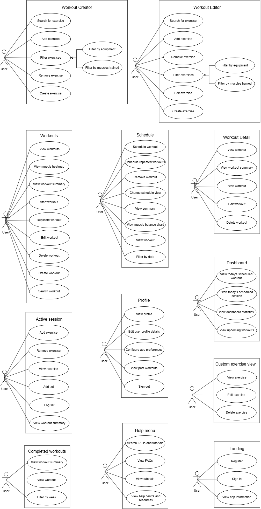
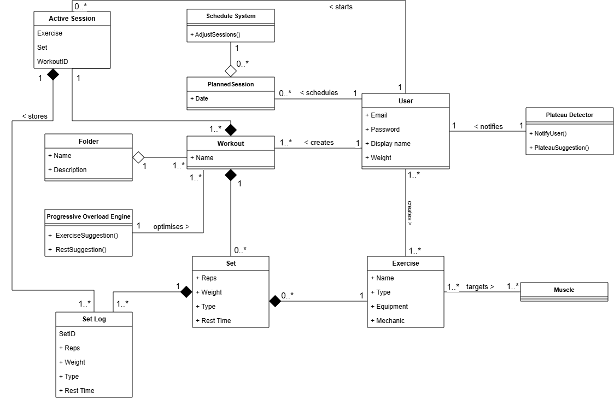

## Introduction

Traditional fitness applications act as passive digital notebooks, leaving the complex calculations of progressive overload and recovery entirely up to the user. Without systematic management and athletic science knowledge, users frequently encounter frustrating training plateaus or inefficient workouts disrupted by busy schedules. OptiLifts bridges the gap between raw data collection and actionable athletic intelligence, OptiLifts utilises historical performance data and real-time Rate of Perceived Exertion(RPE) to guide users through optimised training cycles. The system is highly context-aware; dynamically reprioritising exercises to accommodate time constraints in order to promote continuous progress.

## Index

- [User Stories / User Characteristics](#user-stories--user-characteristics)
- [Use Cases](#use-cases)
- [Functional Requirements](#functional-requirements)
- [Non-Functional Requirements](#non-functional-requirements)
- [High-level Use Case Diagrams](#high-level-use-case-diagrams)
- [Domain Model](#domain-model)

## User Stories / User Characteristics

### Workout Creator
*   **Search for exercise:** As a user, I want to enter a search query into the exercise database search bar so that the system displays a list of exercises that match my query.
*   **Add exercise:** As a user, I want to select an exercise from the database so that it is successfully added to my new workout draft.
*   **Filter exercises:** As a user, I want to apply filter criteria like equipment or muscles trained so that the system updates the displayed list to show only matching items.
*   **Remove exercise:** As a user, I want to select the remove option for an exercise in my draft so that it is successfully removed from the workout's sequence.
*   **Create exercise:** As a user, I want to define and save a custom movement so that I can add personalized exercises to my workout.

### Workout Editor
*   **Search for exercise:** As a user, I want to search for an exercise so that I can easily find new movements to append to my existing workout.
*   **Add exercise:** As a user, I want to select an exercise so that it is appended to my currently saved workout.
*   **Remove exercise:** As a user, I want to select the remove option for an exercise in my saved workout so that it is permanently removed from the sequence.
*   **Filter exercises:** As a user, I want to filter the exercise database by equipment or target muscles so that I can narrow down my choices while editing.
*   **Edit exercise:** As a user, I want to select a specific exercise within a workout to modify its parameters (such as sets, reps, or rest time) so that the new parameters are updated in the editor.
*   **Create exercise:** As a user, I want to create a brand-new custom exercise from within the editor so that I can immediately include it in the routine I am modifying.

### Workouts
*   **View workouts:** As a user, I want to view a comprehensive list of my saved workouts so that I can browse my available training routines.
*   **View muscle heatmap:** As a user, I want to view a muscle heatmap for my workouts so that I can visually analyze which muscle groups are being targeted most effectively.
*   **View workout summary:** As a user, I want to view a high-level summary of a specific workout so that I can quickly gauge its difficulty and duration.
*   **Start workout:** As a user, I want to click the start button on a workout so that I can begin logging my training session.
*   **Duplicate workout:** As a user, I want to duplicate an existing workout so that I can use it as a foundational template for a new routine.
*   **Edit workout:** As a user, I want to select the edit option for a workout so that I can adjust its structure and exercise list.
*   **Delete workout:** As a user, I want to choose the delete option for an entire saved workout so that it is permanently removed from my account.
*   **Create workout:** As a user, I want to click a creation button so that I can start building a new workout from scratch.
*   **Search workout:** As a user, I want to search through my workout library so that I can locate a specific routine by its name.

### Schedule
*   **Schedule workout:** As a user, I want to assign a saved workout to a specific date in the calendar so that I can plan my upcoming training.
*   **Schedule repeated workouts:** As a user, I want to set a workout to repeat on specified days so that I can establish a recurring training routine.
*   **Remove workout:** As a user, I want to remove a scheduled workout from my calendar so that I can adjust my schedule when my plans change.
*   **Change schedule view:** As a user, I want to toggle between different calendar views (e.g., daily, weekly, monthly) so that I can get an appropriate overview of my training timeline.
*   **View summary:** As a user, I want to view a summary of my scheduled training block so that I can assess my planned workload.
*   **View muscle balance chart:** As a user, I want to view a muscle balance chart based on my schedule so that I can ensure I am not overtraining or neglecting specific muscle groups.
*   **View workout:** As a user, I want to click on a calendar entry to view the full workout details so that I know exactly what is planned for that day.
*   **Filter by date:** As a user, I want to filter my schedule using date ranges so that I can quickly look at past or future training blocks.

### Profile
*   **View profile:** As a user, I want to navigate to my profile page so that I can review my personal fitness details and account information.
*   **Edit user profile details:** As a user, I want to update my profile details (like weight, height, or goals) so that the application maintains my most current metrics.
*   **Configure app preferences:** As a user, I want to access a settings menu to configure app preferences so that the platform behaves according to my personal needs (e.g., unit measurements, theme).
*   **View past workouts:** As a user, I want to browse a history log of my past workouts so that I can review my consistency over time.
*   **Sign out:** As a user, I want to select a sign-out button so that my account session is securely terminated on the device.

### Active Session
*   **Add exercise:** As a user, I want to add an exercise while a session is active so that I can adapt my training on the fly.
*   **Remove exercise:** As a user, I want to remove an exercise during an active session so that I can skip movements if necessary.
*   **View exercise:** As a user, I want to tap on the current exercise so that I can view detailed instructions and historical performance data for it.
*   **Add set:** As a user, I want to append an additional set to the current exercise so that I can increase my volume beyond the planned routine.
*   **Log set:** As a user, I want to enter the weight lifted and reps completed for a set so that the system records my actual performance.
*   **View workout summary:** As a user, I want to pull up a summary of my active session so that I can track my overall progress before finishing.

### Workout Detail
*   **View workout:** As a user, I want to open the detailed page for a workout so that I can inspect the full sequence of planned exercises and sets.
*   **View workout summary:** As a user, I want to read the high-level summary on the detail page so that I can quickly review total volume and estimated time.
*   **Start workout:** As a user, I want to launch the active session directly from the detail view so that I can jump straight into training.
*   **Edit workout:** As a user, I want to click the edit button from the detail view so that I can be redirected to the Workout Editor for modifications.
*   **Delete workout:** As a user, I want to select delete from the detail view so that the routine is permanently discarded from my library.

### Dashboard
*   **View today's scheduled workout:** As a user, I want to see the workout assigned for today immediately upon opening the app so that my immediate goal is clear.
*   **Start today's scheduled session:** As a user, I want a quick-start button on my dashboard so that I can begin today's training with a single tap.
*   **View dashboard statistics:** As a user, I want to see a snapshot of my fitness statistics on the main dashboard so that I can monitor my weekly progress at a glance.
*   **View upcoming workouts:** As a user, I want to see a brief list of the workouts scheduled for the next few days so that I can mentally prepare for my training week.

### Custom Exercise View
*   **View exercise:** As a user, I want to open the details of a custom exercise I previously created so that I can review its parameters.
*   **Edit exercise:** As a user, I want to edit a custom exercise's details (such as its name or target muscle group) so that I can correct or update the information.
*   **Delete exercise:** As a user, I want to delete a custom exercise from my personal database so that it no longer appears in my search results.

### Completed Workouts
*   **View workout summary:** As a user, I want to view the final summary of a past completed workout so that I can quickly gauge how well I performed.
*   **View workout:** As a user, I want to open a completed workout log so that I can review the exact weights and reps I achieved on that specific day.
*   **Filter by week:** As a user, I want to filter my completed workouts by week so that I can navigate my training history efficiently.

### Landing
*   **Register:** As a new user, I want to input my email and create a password on the landing page so that I can create a new account.
*   **Sign in:** As a returning user, I want to enter my credentials on the landing page so that I can authenticate and access my personalized dashboard.
*   **View app information:** As a visitor, I want to read information about the application's features on the landing page so that I can decide if it meets my fitness tracking needs.

### Help Menu *(Based on image_62a813.png)*
*   **Search FAQs and tutorials:** As a user, I want to enter a query to search FAQs and tutorials so that I can quickly find answers to my questions.
*   **View FAQs:** As a user, I want to view frequently asked questions so that I can read solutions to common inquiries.
*   **View tutorials:** As a user, I want to view tutorials so that I can learn how to navigate and best utilize the application's features.
*   **View help centre and resources:** As a user, I want to access the help centre and its resources so that I can find comprehensive support documentation and contact information.

## Use Cases

### Workouts Management

**View workouts**
*   TUCBW the user navigates to the Workouts management screen.
*   TUCEW the system displays the authenticated user's saved workouts.

**View muscle heatmap**
*   TUCBW the user requests a muscle heatmap for a selected workout or for their workout history.
*   TUCEW the system displays a visual heatmap highlighting targeted muscle groups and their relative emphasis based on exercises, sets, and assigned loads.

**View workout summary**
*   TUCBW the user selects a specific workout from the list to view its summary.
*   TUCEW the system displays the workout's high-level details, estimated time, targeted muscle groups, and the full exercise list with counts.

### Workout Creator

**Search for exercise**
*   TUCBW the user enters a search query into the exercise database search bar.
*   TUCEW the system displays a list of exercises that match the user's query.

**Add exercise**
*   TUCBW the user selects an exercise from the database to include in their new workout.
*   TUCEW the selected exercise is successfully added to the current workout draft.

**Filter exercises**
*   TUCBW the user applies one or more filter criteria (e.g., equipment, muscles trained, recommended, or template).
*   TUCEW the system updates the displayed exercise list to show only items matching the selected filters.

**Remove exercise**
*   TUCBW the user selects an exercise currently in their workout draft and chooses the delete option.
*   TUCEW the exercise is successfully removed from the workout draft.

**Save workout**
*   TUCBW the user clicks the save button after finalising their workout routine.
*   TUCEW the system successfully stores the new workout to the user's profile.

### Workout Editor

**Search for exercise**
*   TUCBW the user enters a search query while editing an existing workout.
*   TUCEW the system displays matching exercises available to add to the workout.

**Add exercise**
*   TUCBW the user selects a new exercise to add to an already saved workout.
*   TUCEW the exercise is appended to the workout being edited.

**Remove exercise**
*   TUCBW the user selects an exercise to delete from the saved workout.
*   TUCEW the exercise is removed from the workout's sequence.

**Filter exercises**
*   TUCBW the user applies filters to narrow down the exercise list within the editor.
*   TUCEW the list refreshes to reflect the filtered criteria.

**Edit exercise**
*   TUCBW the user selects a specific exercise within the workout to modify its parameters (e.g., changing sets, reps, or rest time).
*   TUCEW the new parameters for that specific exercise are updated in the editor.

**Save changes**
*   TUCBW the user clicks the save button to finalise their edits.
*   TUCEW the system overwrites the old workout data with the updated information.

**Delete workout**
*   TUCBW the user chooses the delete option for the entire saved workout.
*   TUCEW the workout is permanently removed from the user's account.

### Schedule Planner

**Set session workout**
*   TUCBW the user selects a date or time block in the schedule to assign a workout.
*   TUCEW the chosen workout is successfully mapped to the selected schedule block.

**Change a session's workout**
*   TUCBW the user selects an existing scheduled session to swap its assigned workout.
*   TUCEW the new workout replaces the old one in the schedule.

**Filter workouts**
*   TUCBW the user applies filter criteria (by folder or muscles trained) to find a specific saved workout.
*   TUCEW the system displays the user's saved workouts that match the filter.

**View workout**
*   TUCBW the user taps on a scheduled workout to see its contents.
*   TUCEW the system displays the summary and exercise list for that specific workout.

**Remove workout**
*   TUCBW the user selects a scheduled workout and chooses to unschedule it.
*   TUCEW the workout is successfully cleared from the calendar planner.

### Workout Overview

**View workout**
*   TUCBW the user navigates to a specific workout's overview page.
*   TUCEW the system displays the high-level details, estimated time, and exercise list.

**Start workout**
*   TUCBW the user clicks the "Start" button from the overview screen.
*   TUCEW the system transitions into the active "Workout View" mode and begins tracking the session.

**Edit workout**
*   TUCBW the user clicks the "Edit" button on the overview screen.
*   TUCEW the system opens the chosen workout inside the "Workout Editor."

### Profile

**View profile**
*   TUCBW the user navigates to the profile section of the application.
*   TUCEW the system displays the user's personal details, stats, and settings.

**Edit profile**
*   TUCBW the user taps the option to modify their profile information.
*   TUCEW the system enables input fields, allowing the user to type in new personal data.

**Save profile**
*   TUCBW the user submits their updated profile details.
*   TUCEW the system securely updates and stores the new profile data.

### Workout View (Active Session)

**Add exercise**
*   TUCBW the user realises they want to perform an extra exercise during an active workout and selects "Add."
*   TUCEW the new exercise is dynamically added to the current active session.

**Remove exercise**
*   TUCBW the user decides to skip an exercise and selects the remove option.
*   TUCEW the exercise is dropped from the active session without affecting the saved template.

**View exercise**
*   TUCBW the user clicks on an exercise to see instructions, past history, or a video demonstration.
*   TUCEW the system displays the requested educational details for that exercise.

**Log set**
*   TUCBW the user inputs the completed reps and weight for a specific set and marks it as done.
*   TUCEW the system records the data and highlights the set as completed.

**End workout**
*   TUCBW the user presses the button to finish their current active training session.
*   TUCEW the system saves the completed session data and displays a post-workout summary.

### User Management

**Login**
*   TUCBW the user enters their credentials (username/email and password) and hits submit.
*   TUCEW the system authenticates the credentials and grants access to the user's dashboard.

**Register**
*   TUCBW the user fills out the registration form to create a new account.
*   TUCEW the system creates the new user profile in the database and logs them in.

**Sign out**
*   TUCBW the user selects the log-out option from the app menu.
*   TUCEW the system securely ends the active session and returns the user to the login screen.

**Delete account**
*   TUCBW the user requests account deletion and confirms the irreversible action.
*   TUCEW the system permanently wipes all of the user's personal data and credentials from the database.

### Custom Exercise Overview

**View exercise**
*   TUCBW the user selects a custom-made exercise from their personal library.
*   TUCEW the system displays the details, notes, and tracking history for that custom movement.

**Edit exercise**
*   TUCBW the user chooses to modify the name, instructions, or primary muscles of their custom exercise.
*   TUCEW the updated custom exercise parameters are successfully saved.

**Delete exercise**
*   TUCBW the user selects a custom exercise to permanently remove from their library.
*   TUCEW the custom exercise is successfully deleted and will no longer appear in search results.

### Help Menu

**Search FAQs and tutorials**
*   TUCBW the user inputs a search query into the help menu's search function.
*   TUCEW the system presents a filtered list of FAQs and tutorials that match the user's query.

**View FAQs**
*   TUCBW the user selects the option to view FAQs.
*   TUCEW the system displays a list of frequently asked questions and their corresponding answers.

**View tutorials**
*   TUCBW the user navigates to the tutorials section.
*   TUCEW the system displays guides or instructional materials on how to use the application.

**View help centre and resources**
*   TUCBW the user clicks on the help centre and resources link.
*   TUCEW the system opens the main help hub containing comprehensive support documentation and contact channels.

***

## High-level Use Case Diagrams

## Functional Requirements

### Subsystem 1: Workout Management

#### FR1.1: Exercise discovery and filtering
1. FR1.1.1: The system will allow the user to view all available exercises, including template and custom exercises.
2. FR1.1.2: The system will allow the user to view a list of recommended exercises.
3. FR1.1.3: The system will provide search functionality for the user to find a specific exercise by name.
4. FR1.1.4: The system will allow the user to filter exercises by the equipment required.
5. FR1.1.5: The system will allow the user to filter exercises by the specific muscles trained.

#### FR1.2: Workout construction and editing
1. FR1.2.1: The system will allow the user to create or edit a workout routine.
2. FR1.2.2: The system will allow the user to add an exercise to their workout routine.
3. FR1.2.3: The system will allow the user to remove an exercise from their workout routine.
4. FR1.2.4: The system will allow the user to change the set type for an exercise.
5. FR1.2.5: The system will allow the user to add rest time to a specific exercise.
7. FR1.2.7: The system will allow the user to save the workout to the database.
8. FR1.2.8: The system will allow the user to delete a saved workout routine from the database.
9. FR1.2.9: The system will allow the user to duplicate an existing saved workout.

### Subsystem 2: Custom Exercise Creation

#### FR2.1: Exercise details
1. FR2.1.1: The system will allow the user to add or edit a name for a custom exercise.
2. FR2.1.2: The system will allow the user to add or change an image for the custom exercise.
3. FR2.1.3: The system will allow the user to select or change the exercise type.
4. FR2.1.4: The system will allow the user to select or change the required equipment.
5. FR2.1.5: The system will allow the user to cancel the creation process without saving.

#### FR2.2: Muscle group assignment
1. FR2.2.1: The system will allow the user to select or change the primary muscle group targeted.
2. FR2.2.2: The system will allow the user to select or change secondary muscle groups.
3. FR2.2.3: The system will allow the user to save the completed exercise profile to the database.
4. FR2.2.4: The system will allow the user to delete a custom exercise from the library.

### Subsystem 3: Workout and Exercise Information

#### FR3.1: Workout summary display
1. FR3.1.1: The system will display the name and detailed information of the selected workout.
2. FR3.1.2: The system will display a summary of targeted muscles for the entire workout.
3. FR3.1.3: The system will allow the user to filter workouts by folders or targeted muscles.
4. FR3.1.4: The system will provide search functionality for the user to find a specific saved workout by name.
5. FR3.1.5: The system will generate and display a muscle heatmap based on the selected workout or the user's workout history.

#### FR3.2: Exercise information display
1. FR3.2.1: The system will display detailed exercise information, including images and assigned muscle groups.
2. FR3.2.2: The system will allow the user to set or edit the weight (kg) and reps for an exercise set.

### Subsystem 4: User Management and Profile

#### FR4.1: Authentication
1. FR4.1.1: The system will allow the user to register a new account.
2. FR4.1.2: The system will allow the user to log in to an existing account.
3. FR4.1.3: The system will allow the user to delete their account.
4. FR4.1.4: The system will allow the user to log out of their active session.
5. FR4.1.5: The system will display application feature information and details to unauthenticated visitors on the landing page.

#### FR4.2: Profile customisation
1. FR4.2.1: The system will display the user's personal information.
2. FR4.2.2: The system will allow the user to add or edit their weight.
3. FR4.2.3: The system will allow the user to specify their gender.
4. FR4.2.4: The system will allow the user to add or edit their age.
5. FR4.2.5: The system will allow the user to save profile changes.

### Subsystem 5: Scheduling and Session Tracking

#### FR5.1: Schedule management
1. FR5.1.1: The system will display the user's workout schedule.
2. FR5.1.2: The system will allow the user to set, change, or remove a workout for a specific session.
3. FR5.1.3: The system will allow the user to save the updated schedule.
4. FR5.1.4: The system will allow the user to schedule a workout to repeat on specified days.
5. FR5.1.5: The system will allow the user to toggle the schedule view between daily, weekly, and monthly calendar formats.
6. FR5.1.6: The system will allow the user to filter their displayed schedule using specific date ranges.
7. FR5.1.7: The system will generate and display a muscle balance chart based on the user's scheduled training blocks.

#### FR5.2: Active workout tracking
1. FR5.2.1: The system will allow the user to start an active workout session.
2. FR5.2.2: The system will allow the user to log weight (kg) and reps for each set in real-time.
3. FR5.2.3: The system will allow the user to mark a set as complete or uncomplete.
4. FR5.2.4: The system will allow the user to add or remove exercises during an active session.
5. FR5.2.5: The system will allow the user to end and save the workout or cancel the session.
6. FR5.2.6: The system will allow the user to append additional sets to an exercise dynamically during an active session.

### Subsystem 6: Dashboard

1. FR6.1: The system will display the workout scheduled for the current day immediately upon the user navigating to the dashboard.
2. FR6.2: The system will provide a quick-start button on the dashboard to immediately launch today's scheduled active session.
3. FR6.3: The system will display a summary snapshot of the user's weekly fitness statistics on the dashboard.
4. FR6.4: The system will display a brief, chronological list of upcoming scheduled workouts for the next few days.

### Subsystem 7: Completed Workouts and History

1. FR7.1: The system will maintain and display a historical log of the user's past completed workouts.
2. FR7.2: The system will allow the user to filter their completed workout history by specific weeks.
3. FR7.3: The system will display a detailed post-workout summary containing the exact weights, reps, and total time achieved for any previously completed session.

### Subsystem 8: Preferences and Help Menu

1. FR8.1: The system will allow the user to configure app-wide preferences, including unit measurements and UI themes.
2. FR8.2: The system will provide a search function allowing the user to query FAQs and tutorials.
3. FR8.3: The system will display a list of frequently asked questions and their corresponding answers.
4. FR8.4: The system will display instructional tutorials and guides on how to utilize the application's features.
5. FR8.5: The system will provide access to a help centre containing comprehensive support documentation and contact resources.

## Non-Functional Requirements

### NFR1: Performance
1. NFR1.1: The system will respond to Core API requests within 1.5 seconds for 95% of requests.
2. NFR1.2: The system will respond to AI-API requests within 3 seconds for 95% of requests.
3. NFR1.3: The system will support 100 concurrent active users with less than a 10% increase in average response time compared to the single-user baseline.

### NFR2: Scalability
1. NFR2.1: The system will support a 200% increase in workload (scaling from a baseline of 100 up to 300 concurrent users) with no more than a 10% decrease in response time.

### NFR3: Security
1. NFR3.1: The system will encrypt sensitive user data (specifically  emails, usernames and bodily/health-orientated infromation) at rest using application-level AES-256 encryption via Entity Framework Core value converters before the data is stored in the database. 
2. NFR3.2: The system will hash user passwords when stored in the database using bcrypt with a salt factor of 12.
3. NFR3.3: The system will use HTTPS (TLS 1.2) for all data transmission between the client and server.
4. NFR3.4: The system will prevent unauthorized access to the business logic and data of the app by enforcing stateless JSON Web Token (JWT) authentication, transmitted via HttpOnly cookies, and applying resource-based authorization (ensuring users can only access and modify their own personal data).

### NFR4: Maintainability
1. NFR4.1: The automated CI/CD pipeline execution time (from code merge to production deployment) will complete within 30 minutes for new features or bug fixes.
2. NFR4.2: The system will have an automated test coverage of at least 80%.

### NFR5: Usability
1. NFR5.1: 95% of new users will be able to complete account registration and create their first workout within 5 minutes of first use during usability testing.
2. NFR5.2: The system's user interface will meet WCAG 2.1 Level AA accessibility standards, ensuring full keyboard navigability and objective compliance. 
3. NFR5.3: The system will achieve at least an 85% user satisfaction rating via a System Usability Scale (SUS) questionnaire across a minimum of 5 test users.

## Domain Model

