# Design Specification: OptiLifts

> For the full brand style guide see [docs/brand-style/brand-style-webpage.pdf](brand-style/brand-style-webpage.pdf)

---

## Theme Toggle

Theme state is managed via a `ThemeProvider` wrapping the app. shadcn's built-in dark mode support uses the `dark:` Tailwind variant. Theme tokens are defined as CSS custom properties in `globals.css` under `:root` (light) and `.dark` (dark), mapped to `tailwind.config.ts` via `theme.extend.colors`. The toggle uses shadcn's Switch or DropdownMenu component.

---

## Wireframes

The following wireframes represent the key screens for Demo 1. All screens are mid-fidelity - layout and component placement are finalised; final visual polish is applied in the live implementation.

---

### Navigation Flow

The navigation flow below reflects the actual routes defined in `App.tsx` and the nav links in `navbar.tsx`.

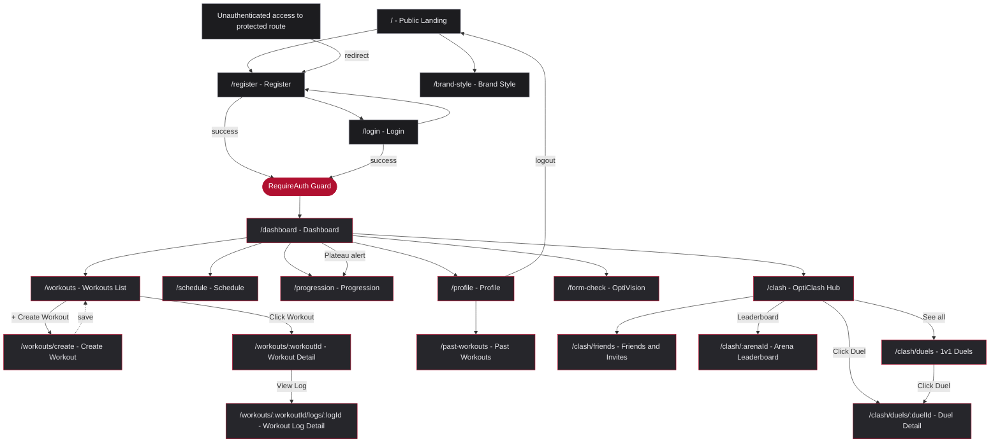
```mermaid
flowchart TD
    A["/ - Public Landing"]
    B["/register - Register"]
    C["/login - Login"]
    N["/brand-style - Brand Style"]
    J["Unauthenticated access to protected route"]
    GUARD(["RequireAuth Guard"])
    D["/dashboard - Dashboard"]
    E["/workouts - Workouts List"]
    F["/workouts/create - Create Workout"]
    K["/workouts/:workoutId - Workout Detail"]
    L["/workouts/:workoutId/logs/:logId - Workout Log Detail"]
    G["/schedule - Schedule"]
    H["/progression - Progression"]
    I["/profile - Profile"]
    M["/past-workouts - Past Workouts"]
    O["/form-check - OptiVision"]
    P["/clash - OptiClash Hub"]
    Q["/clash/friends - Friends and Invites"]
    R["/clash/:arenaId - Arena Leaderboard"]
    S["/clash/duels - 1v1 Duels"]
    T["/clash/duels/:duelId - Duel Detail"]

    A --> B
    A --> N
    B --> C
    C --> B
    B -->|"success"| GUARD
    C -->|"success"| GUARD
    J -->|"redirect"| B

    GUARD --> D
    D --> E
    D --> G
    D --> H
    D --> I
    D --> O
    D --> P
    D -->|"Plateau alert"| H
    P --> Q
    P -->|"Leaderboard"| R
    P -->|"See all"| S
    P -->|"Click Duel"| T
    S -->|"Click Duel"| T
    I --> M
    E -->|"Click Workout"| K
    E -->|"+ Create Workout"| F
    K -->|"View Log"| L
    F -.->|"save"| E
    I -->|"logout"| A

    classDef protected fill:#26262B,stroke:#B01030,color:#E8E8EC
    classDef public fill:#1C1C1F,stroke:#9A9AA8,color:#E8E8EC
    classDef guard fill:#B01030,stroke:#B01030,color:#FFFFFF

    class D,E,F,K,L,G,H,I,M,O,P,Q,R,S,T protected
    class A,B,C,J,N public
    class GUARD guard
```

**Auth behaviour:**
- Unauthenticated users see Register and Login in the navbar
- Authenticated users see Dashboard, Workouts, Schedule, Progression, OptiClash, OptiVision, a help icon and a profile avatar
- Any direct navigation to a protected route while unauthenticated redirects to `/register`, preserving the intended destination in `location.state.from`
- Logout clears the session and returns the user to the public nav state

---

### Screen Layouts

**Full navigation:** every signed-in screen uses the same header, with the logo on the left (links to the dashboard) and the full navigation on the right, in this order:
- Help icon (question mark) - opens the Help page
- DASHBOARD, WORKOUTS, SCHEDULE, PROGRESSION, OPTICLASH, OPTIVISION text links
- Profile avatar - opens the Profile page
- A SESSION link appears before the other links while the user has a workout session in progress
- The link for the current page is underlined (the profile avatar gets a ring instead)
- On mobile the links collapse into a menu button in the top right

Earlier wireframes (Screens 1-12) were made before PROGRESSION, OPTICLASH, OPTIVISION and the help icon were added, so they show an older version of the navigation.

#### Screen 1 - Register

Primary registration screen. Allows a new user to create an account.

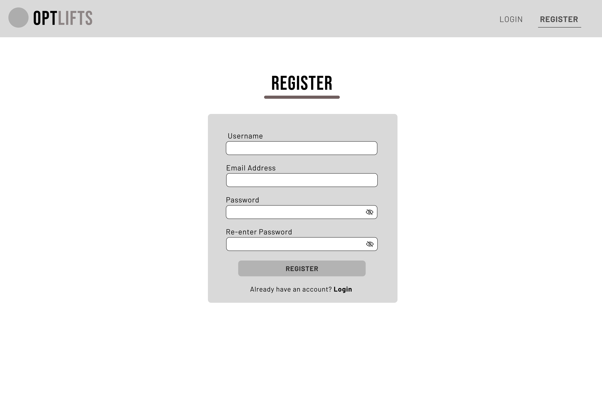

**Component Placement:**
- Header: logo left, LOGIN and REGISTER nav links right
- Body: centered card containing the registration form
- Form fields stacked vertically: Username, Email Address, Password, Re-enter Password
- REGISTER primary button below fields
- "Already have an account? Login" link below button

**User Interaction Points:**
- Username field - text input, validates on blur
- Email Address field - text input, validates format on blur
- Password field - text input with show/hide toggle
- Re-enter Password field - text input with show/hide toggle, validates match
- REGISTER button - submits form, disabled until all fields valid
- Login link - navigates to Login screen

**Annotations:**
- Password fields use eye icon toggle (Lucide `Eye` / `EyeOff`)
- Inline error appears directly below the relevant field on blur
- REGISTER button activates only when all fields pass validation
- On success: user is redirected to Dashboard

---

#### Screen 2 - Login

Allows an existing user to authenticate.

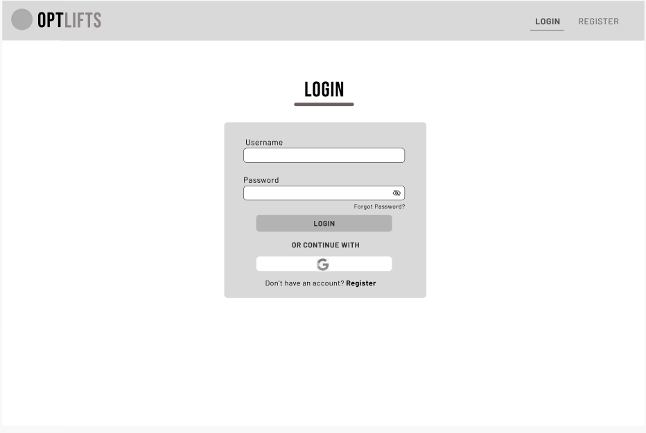

**Component Placement:**
- Header: logo left, LOGIN (active, underlined) and REGISTER nav links right
- Body: centered card containing the login form
- Form fields stacked vertically: Username, Password
- Forgot Password link right-aligned below password field
- LOGIN primary button below fields
- "Don't have an account? Register" link below button

**User Interaction Points:**
- Username field - text input
- Password field - text input with show/hide toggle
- Forgot Password link - initiates password reset flow
- LOGIN button - submits credentials
- Register link - navigates to Register screen

**Annotations:**
- Active nav link (LOGIN) shows 2px bottom border in accent colour
- Inline error displayed below fields on failed authentication attempt
- On success: user is redirected to Dashboard

---

#### Screen 3 - Create Workout

Allows the athlete to build a named workout by adding exercises with sets, reps, and weight.

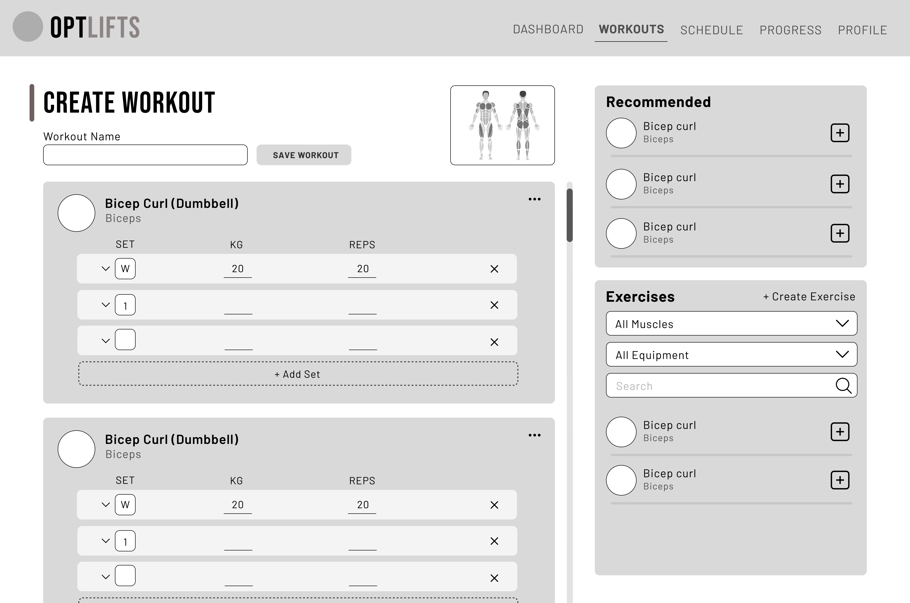

**Component Placement:**
- Header: logo left, full navigation right
- Left panel (70% width): workout name input + SAVE WORKOUT button at top, exercise cards below, each with set rows
- Right panel (30% width): muscle diagram at top, Recommended exercises section, Exercise library with filters and search below
- Each exercise card: exercise name + muscle group header, set rows with SET type / KG / REPS columns, "+ Add Set" at bottom
- Right panel exercise items: exercise name + muscle label + "+" add button

**User Interaction Points:**
- Workout Name field - text input, required for save to activate
- SAVE WORKOUT button - disabled until name + at least one exercise present
- Exercise card "..." menu - edit or remove exercise
- Set row fields - inline editable KG and REPS inputs
- Set row "x" button - removes that set row
- Set type dropdown - select set type (W = working, warmup, etc.)
- "+ Add Set" - appends a new set row to the exercise card
- Right panel "+" button - adds exercise to workout
- "+ Create Exercise" link - opens create exercise flow
- Muscle filter dropdown - filters exercise list by muscle group
- Equipment filter dropdown - filters exercise list by equipment
- Search field - searches exercise library by name

**Annotations:**
- Muscle diagram updates to highlight muscles targeted by added exercises
- Recommended section shows AI-suggested exercises based on current workout composition
- Save is disabled until workout has a name and at least one exercise
- Set rows are drag-reorderable within an exercise card
- Exercise cards are reorderable within the workout

---

#### Screen 4 - My Workouts

Shows the athlete's saved workouts as a scrollable list of cards.

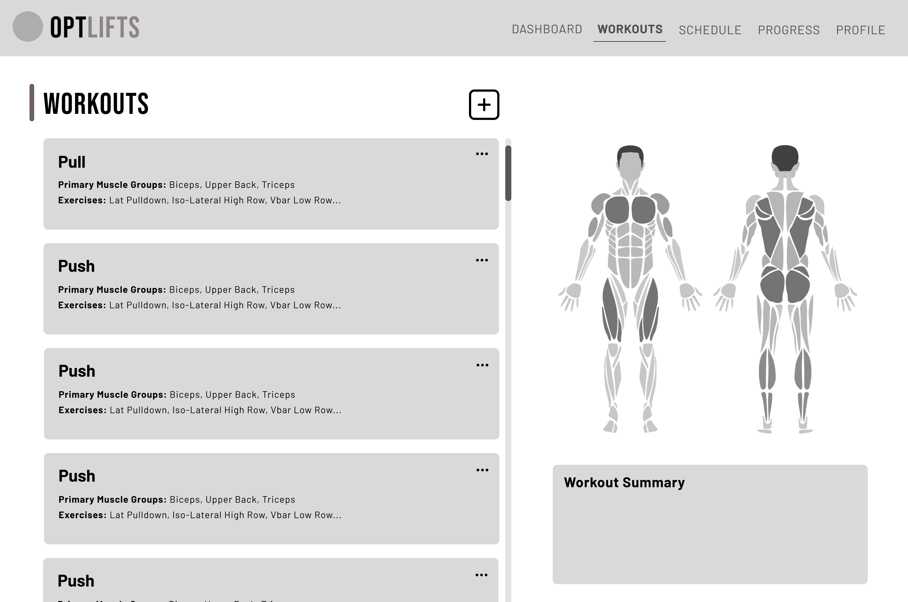

**Component Placement:**
- Header: logo left, full navigation right
- Page title "WORKOUTS" left-aligned with "+" icon button right-aligned
- Workout cards in a scrollable list, each spanning full width of the left panel
- Muscle diagram right panel showing combined muscle coverage
- Each card: workout name as heading, Primary Muscle Groups label + values, Exercises label + preview list

**User Interaction Points:**
- "+" button in header - navigates to Create Workout
- Workout card click - opens workout detail / edit view
- "..." menu on each card - reveals edit and delete options

**Annotations:**
- Muscle diagram highlights aggregate muscle groups across all visible workouts
- Exercise preview shows first 3 exercises then "..." to indicate more
- Cards use the standard card component styling (border, surface background, 22px padding)
- Delete option in "..." menu requires confirmation before removing the workout

---

#### Screen 5 - Dashboard

Shows a quick overiew of how the athlete is doing this week, what workouts are coming up, and recent milestones.

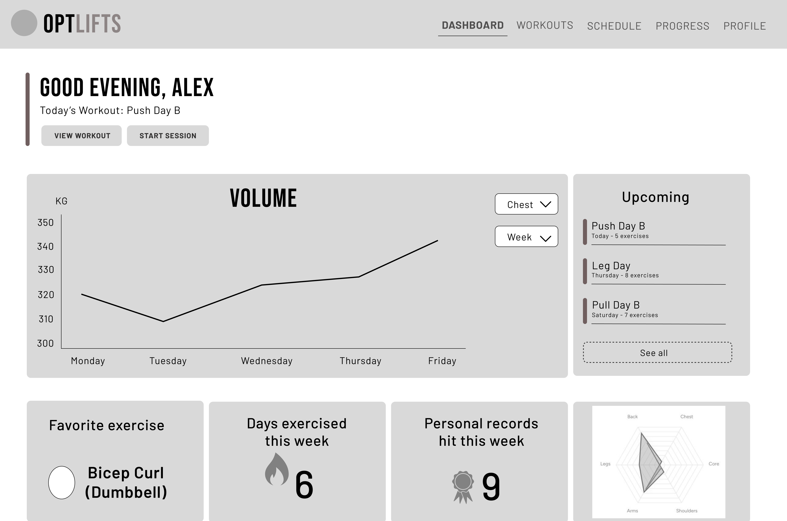

**Component Placement:**
- Header: logo on the left, full navigation right
- Upper section: left-aligned greeting header with a subtitle of today's scheduled workout. Below are two utility buttons, "VIEW WORKOUT" and "START SESSION".
- Mid left panel: 70% width, a large card displaying a line graph tracking the user's volume for the current week. Top right of the card contains dropdown menus for muscle group filtering and week/month duration.
- Mid right panel: an "Upcoming" sidebar card listing the scheduled workouts with exercise counts and days. A dashed "See all" action button is at the bottom.
- Bottom row: grid layout, four grid blocks:
    - "Favourite exercise": displays name and icon placeholder
    - "Days exercised this week": numerical value and fire icon
    - "Personal records hit thia week": numerical value and medal achievement icon
    - Interactive radar chart showing relative muscle group balance across key sections

**User Interaction Points:**
- VIEW WORKOUT / START SESSIOON buttons - navigates to the workout active session or the details page
- Volume chart filters - dropdown selection that modifies chart data arrays dynamically
- Upcoming sidebar items - clicking specific workout navigates straight to that specific scheduled workout
- "See all" button - redirects to schedule page

**Annotations:**
- The radar chart updates to visually captrue the weekly load balancing based on the user's completed workouts volume logs

---

#### Screen 6 - Edit Workout

Allows athlete to modify an existing workout by editing the names, set ranges, adding new exercises, etc.

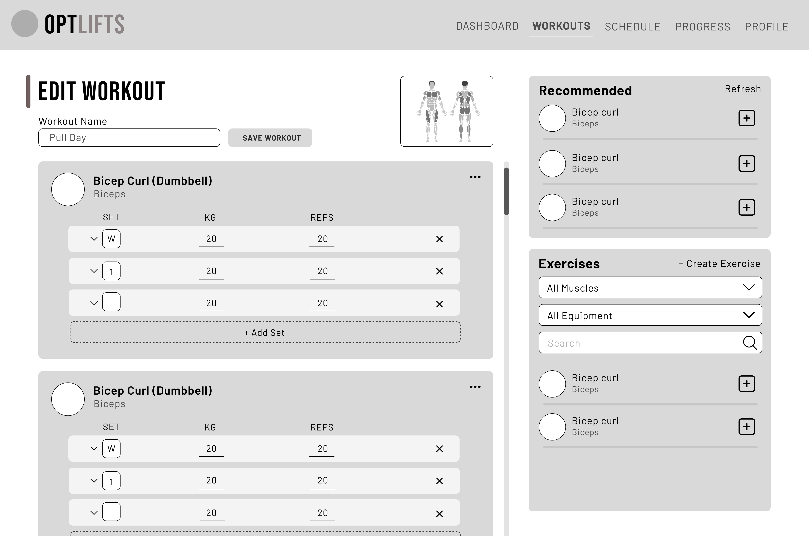

**Component Placement:**
- Header: logo left, full navigation right
- Left panel (70% width): workout name input + SAVE WORKOUT button at top, exercise cards below, each with set rows
- Right panel (30% width): muscle diagram at top, Recommended exercises section, Exercise library with filters and search below
- Each exercise card: exercise name + muscle group header, set rows with SET type / KG / REPS columns, "+ Add Set" at bottom
- Right panel exercise items: exercise name + muscle label + "+" add button

**User Interaction Points:**
- Workout Name field - text input
- SAVE WORKOUT button - update the existing workout with new edits
- Exercise card "..." menu - edit or remove exercise
- Set row fields - inline editable KG and REPS inputs
- Set row "x" button - removes that set row
- Set type dropdown - select set type (W = working, warmup, etc.)
- "+ Add Set" - appends a new set row to the exercise card
- Right panel "+" button - adds exercise to workout
- "+ Create Exercise" link - opens create exercise flow
- Muscle filter dropdown - filters exercise list by muscle group
- Equipment filter dropdown - filters exercise list by equipment
- Search field - searches exercise library by name

**Annotations:**
- Muscle diagram updates to highlight muscles targeted by added exercises
- Recommended section shows AI-suggested exercises based on current workout composition
- Set rows are drag-reorderable within an exercise card
- Exercise cards are reorderable within the workout

---
#### Screen 7 - Workout Detail

Displays the  details of a specific created workout, including set information and muscle distribution

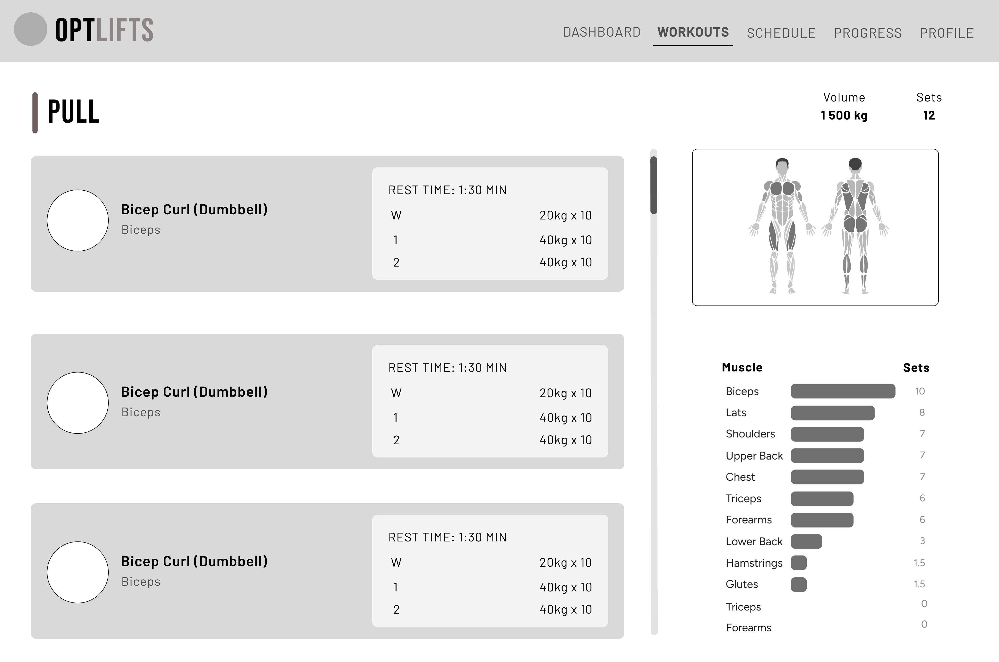

**Component Placement:**
- Header: logo left, full navigation right
- Page title of workout name "PULL" left-aligned with right aligned summary details
- Left column panel: Vertical scroll view displaying exercise cards, each with a exercise image, title and set and rep details
- Right column panel: muscle heatmap displaying highlight values across specific muscle groups, and a horizontal bar chart displaying the exact set count per muscle category

**User Interaction Points:**
- Card stack container - standard scrolling mechanics

**Annotations:**
- Heatmap shows a clean muscle distribution for easy viewing of the primary muscle groups a workout exercises

---
#### Screen 8 - Workout Log Detail

Displays the details of a completed workout session, including the exercises, set and rep counts, and muscle distribution

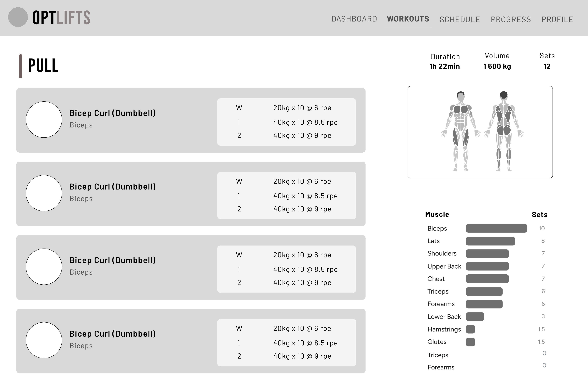

**Component Placement:**
- Header: logo left, full navigation right
- Page title of workout name "PULL" left-aligned with right aligned summary details
- Left container card: completed exercise cards with columns for sets, showing their types and details
- Right container card: muscle heatmap displaying highlight values across specific muscle groups, and a horizontal bar chart displaying the exact set count per muscle category

**User Interaction Points:**
- Card stack container - standard scrolling mechanics

**Annotations:**
- Heatmap shows a clean muscle distribution for easy viewing of the primary muscle groups a workout exercises
- RPE fields are shown next to the rep count

---
#### Screen 9 - Week Schedule

Calendar grid showing scheduled workout routines across a weekly context view, and displaying weekly summaries

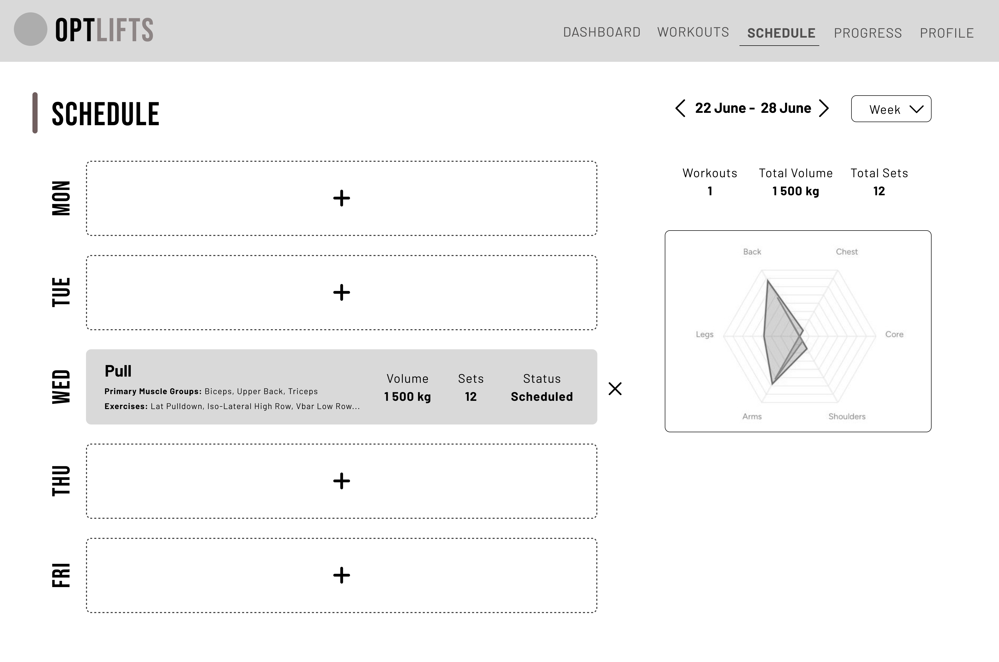

**Component Placement:**
- Header: logo left, full navigation right
- Page title "SCHEDULE" left-aligned with right date selector block with chevron toggles, and a dropdown menu for toggling Week/Month view
- Left column view: Vertical cards for each day of the week, with empty slots with centered "+" icon button, and active slots with the workout name, primary muscle groups, and workout summary and scheduled status
- Right column view: forecast panels with stats for that week, and a spider graph mapping muscle distribution over 6 main muscle groups

**User Interaction Points:**
- Chevron arrows - shifts data range backwards or forwards by a week
- Dropdown select - switches layout mode between Month and Week views
- Card "+" buttons - opens popup with created workouts to schedule them on specific days
- "X" buttons - removes the scheduled entry from the calendar

**Annotations:**
- The radar chart updates to visually capture the weekly load balancing based on the user's workouts set count
- Users are unable to schedule workouts on a day before the current day, so these cards are disabled

---
#### Screen 10 - Month Schedule

Calendar grid showing scheduled workout routines across a monthly context view

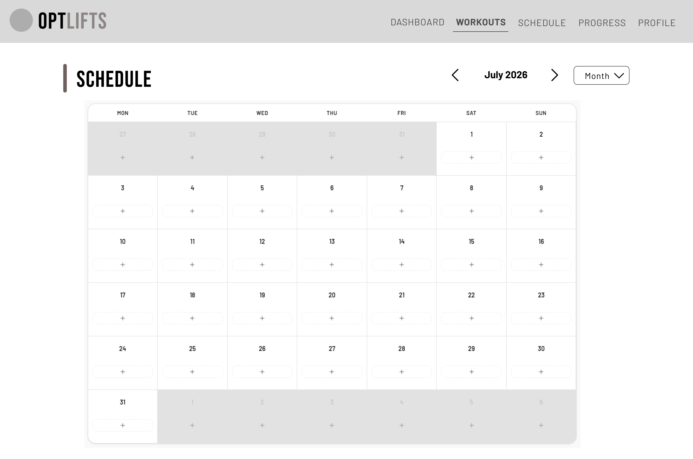

**Component Placement:**
- Header: logo left, full navigation right
- Page title "SCHEDULE" left-aligned with right date selector block with chevron toggles, and a dropdown menu for toggling Week/Month view
- Center section: a structures calendar grid mapping columns MON through to SUN.

**User Interaction Points:**
- Chevron arrows - shifts data range backwards or forwards between months
- Grid "+" buttons - opens popup with created workouts to schedule them on specific days

**Annotations:**
- Users are unable to schedule workouts on a day before the current day

---
#### Screen 11 - Past Workouts

Displays historical completed workouts

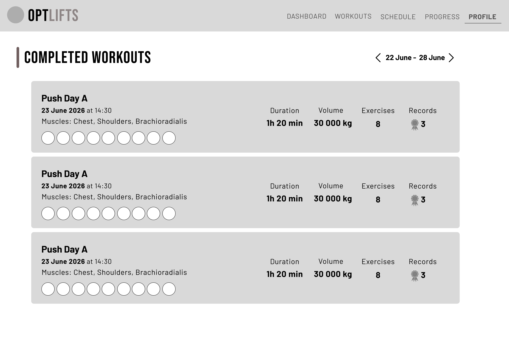

**Component Placement:**
- Header: logo left, full navigation right
- Page title "SCHEDULE" left-aligned with right date selector block with chevron toggles
- Main layout: centered vertical stack with completed workout cards, with the workout name, timestamp, targeted muscles, exercise images, as well as summaries of each workout including duration, volume, number of exercises and record

**User Interaction Points:**
- Chevron arrows - shifts data range backwards or forwards between weeks
- Workout cards - clicking any card redirects the user to the corresponding past log detail page

**Annotations:**
- The circle icons are the images of the exercises the user completed in their workout

---
#### Screen 12 - Profile

User detail page displaying their information, workout history and tracking. Provides easy access to past workouts and settings configuration

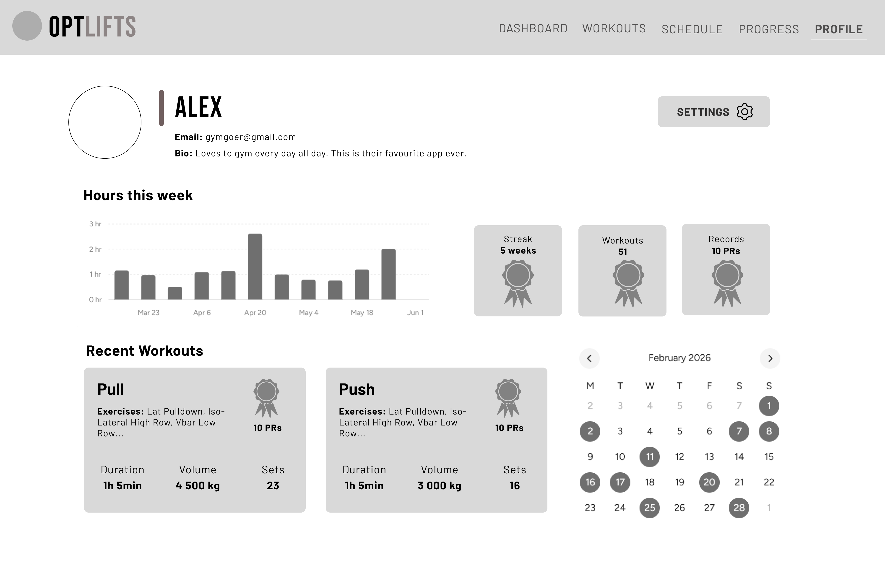

**Component Placement:**
- Header: logo left, full navigation right
- Page title user name "ALEX" left-aligned with right SETTINGS button
- Subtitle: Email and bio text blocks
- Top metric row: bar graph mapping out "Hours this week" against calendar axis, with right individual blocks with badges, including "Streak", "Workouts" and "Record"
- Bottom panel layout: 
    - Left region: 65% width, "Recent Workouts" card stack with detailed summary blocks including PR badge graphics and workout metrics
    - Right region: 35% width, mini-calendar widget displaying historical active training days

**User Interaction Points:**
- SETINGS button - opens user profile configuration popup
- Recent Workout cards - navigates to individual workout detail pages
- Calendar wigdet controls - page through months

**Annotations:**
- The bar graph and calendar update with the user's activity 

---
#### Screen 13 - Progression

Displays the kind of progress of each exercise, showing whether it is progressing, plateauing or regressing

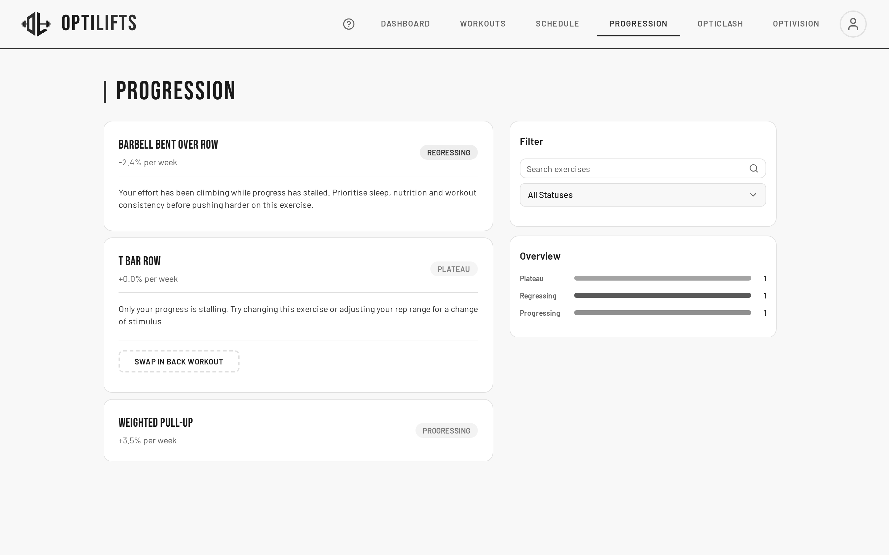

**Component Placement:**
- Header: logo left, full navigation right
- Page title "PROGRESSION" left-aligned
- Left column: exercise cards with the exercise name, weekly trend percentage, status tag and a recommendation
- Right column: filter card with a search bar and status dropdown, and an overview card with a bar for each status

**User Interaction Points:**
- Search bar and status dropdown - filters the exercise cards by name or type
- "SWAP IN" button - opens a popup to replace the current exercise in that workout with a new one

**Annotations:**
- Exercises need enough logged sessions before they appear as a card on this page

---
#### Screen 14 - OptiVision

The user can upload a video of their set for bench, squat and deadlift, then receive feedback on their form

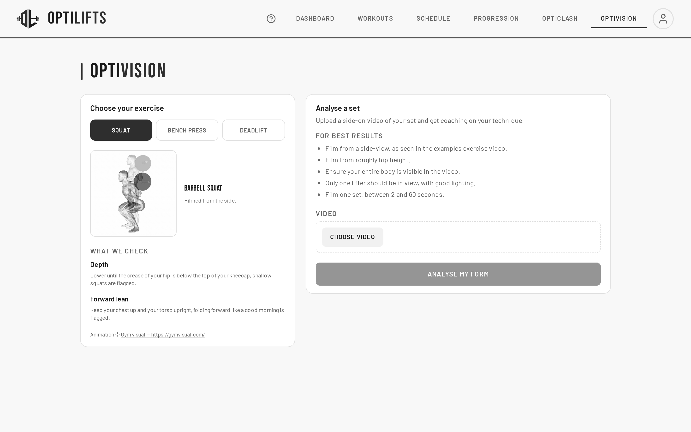

**Component Placement:**
- Header: logo left, full navigation right
- Page title "OPTIVISION" left-aligned
- Left card: exercise toggle buttons (SQUAT, BENCH PRESS, DEADLIFT), an example animation and a list of what is checked
- Right card: filming tips, a video upload area and an ANALYSE MY FORM button

**User Interaction Points:**
- Exercise buttons - switch between the selected exercise
- CHOOSE VIDEO button - opens the file picker on their system
- ANALYSE MY FORM button - uploads the video, begins processing and provides feedback when complete

**Annotations:**
- Videos must be filmed from the side and be between 2 and 60 seconds long

---
#### Screen 15 - OptiClash Hub

The main OptiClash page which shows the user's season standing, active duels and arenas they are participating in

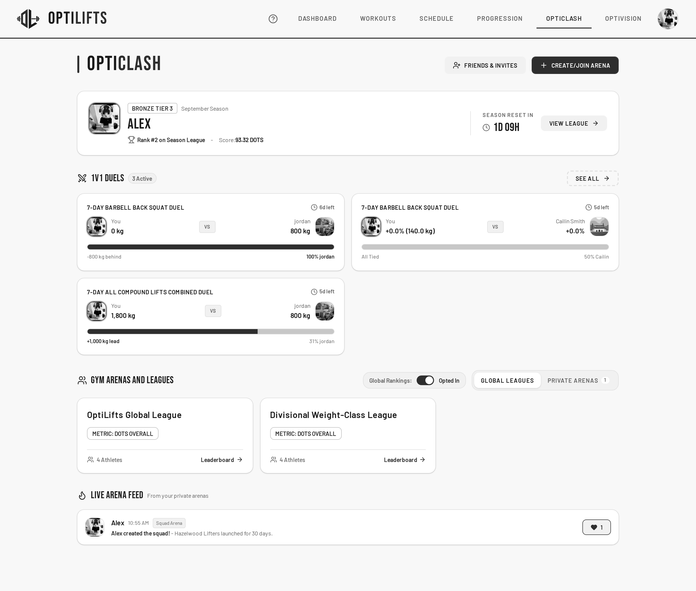

**Component Placement:**
- Header: logo left, full navigation right
- Page title "OPTICLASH" left-aligned with right FRIENDS & INVITES and CREATE/JOIN ARENA buttons
- Season card: user avatar, tier, rank, DOTS score and a season reset countdown
- "1V1 DUELS" section with active duel cards
- "GYM ARENAS AND LEAGUES" section with a opt-in toggle, Global Leagues/Private Arenas tabs and arena cards
- "LIVE ARENA FEED" section listing most recent activity in the user's arenas he is part of

**User Interaction Points:**
- FRIENDS & INVITES button - navigates to the user's Friends page
- CREATE/JOIN ARENA button - opens a popup to create or join an arena
- Duel cards and arena cards - navigate to the selected duel's details and leaderboard pages
- Heart buttons - send kudos to another user on feed activity

**Annotations:**
- Users must opt in to global rankings to appear on the global leaderboards

---
#### Screen 16 - Friends

Displays the user's friends, people who have requested to be the user's friends and invites the user has sent out

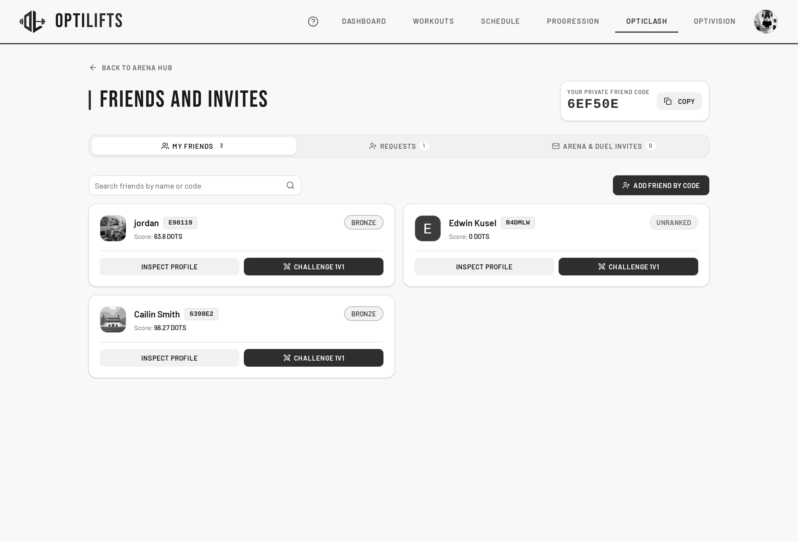

**Component Placement:**
- Header: logo left, full navigation right
- Page title "FRIENDS AND INVITES" left-aligned with the user's friend code on the right
- Tab bar: MY FRIENDS, REQUESTS and ARENA & DUEL INVITES
- Search bar with an ADD FRIEND BY CODE button, and friend cards showing name, code, DOTS score and tier

**User Interaction Points:**
- COPY button - copies the user's friend code that can be used by others
- ADD FRIEND BY CODE button - opens a popup to send a friend request by inputting an user's friend code
- INSPECT PROFILE and CHALLENGE 1V1 buttons - open the friend's profile or a popup that allows you to request a duel

**Annotations:**
- Friends can only be added with their friend code

---
#### Screen 17 - Leaderboards and Private Arenas

Ranks participating athletes in a global league or private arena

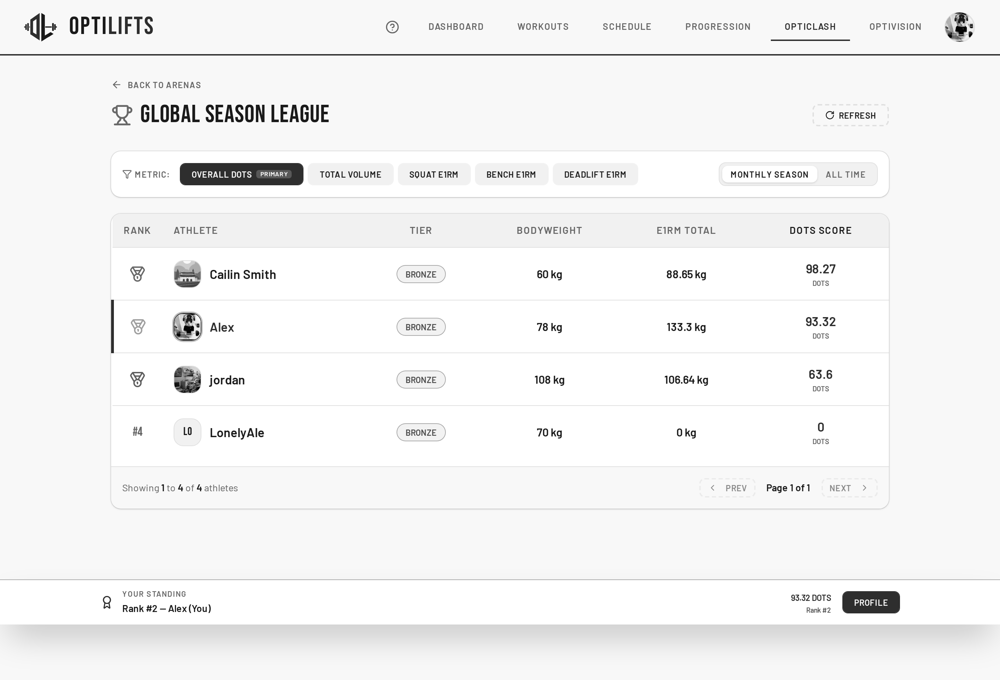

**Component Placement:**
- Header: logo left, full navigation right
- Page title of the arena name left-aligned with a right REFRESH button
- Filter card: metric buttons and a Monthly Season/All Time toggle
- Leaderboard table with rank, athlete, tier, bodyweight, e1RM total and score
- "YOUR STANDING" bar fixed to the bottom of the page

**User Interaction Points:**
- Metric buttons and toggle - change what metric is used to rank the athletes
- Table rows - open that selected athlete's profile
- SHARE ARENA AND INVITE and LEAVE ARENA buttons - buttons that appear on private arenas for addition or removal of athletes

**Annotations:**
- Private arenas are created by one user and can be joined via an arena code

---
#### Screen 18 - Duels

Displays all the 1v1 duels of the user

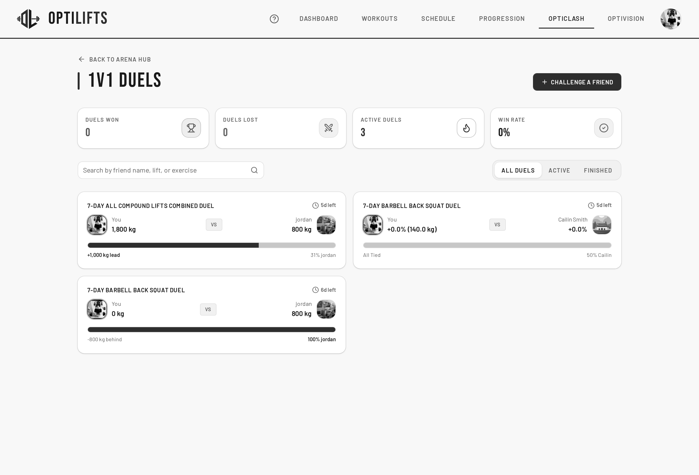

**Component Placement:**
- Header: logo left, full navigation right
- Page title "1V1 DUELS" left-aligned with a right CHALLENGE A FRIEND button
- Stats row: duels won, duels lost, active duels and win rate
- Search bar with All Duels/Active/Finished tabs, and duel cards showing both users' scores and a progress bar

**User Interaction Points:**
- CHALLENGE A FRIEND button - opens a popup to request a duel with a friend
- Search bar and tabs - filter the duel cards
- Duel cards - takes the user to the duel detail page

---
#### Screen 19 - Duel Detail

Displays the details of a duel and the progress of the duel between the user and their friend

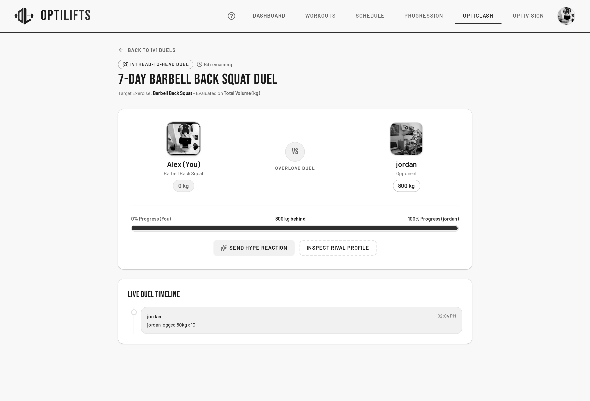

**Component Placement:**
- Header: logo left, full navigation right
- Duel title with the time remaining, target exercise and how it is scored
- Head-to-head card: both users' avatars and scores, a progress bar, and SEND HYPE REACTION and INSPECT RIVAL PROFILE buttons
- "LIVE DUEL TIMELINE" card listing the sets logged by both users

**User Interaction Points:**
- SEND HYPE REACTION button - sends a hype notification the the user's opponent
- INSPECT RIVAL PROFILE button - opens the opponent's profile

**Annotations:**
- The scores and timeline update live whenever either of the user's log a set

---
